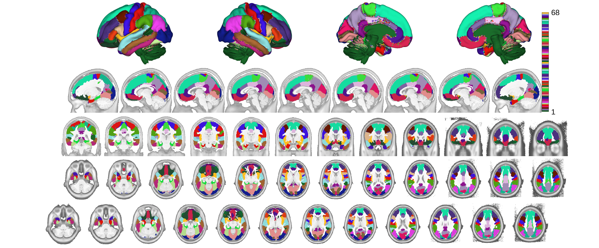
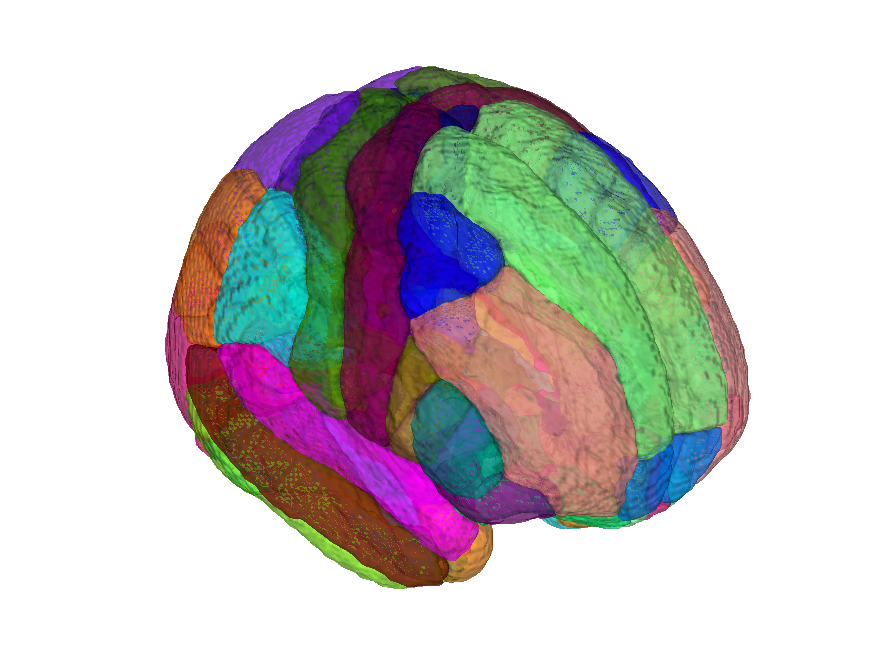

# Desikan-Killiany cortical atlas (Desikan et al. 2006) — CANlab volumetric build

## Overview

The **Desikan-Killiany (DK) atlas** is a coarse anatomical labelling of
cortical gyri and sulci (gyral bands include the adjacent sulcal banks)
originally distributed as a FreeSurfer cortical surface parcellation.
This folder distributes a **volumetric projection** built by CANlab via
**registration fusion** using the same three studies (SpaceTop N=88,
PainGen N=241, BMRK5 N=88) as the volumetric Glasser and Destrieux
builds. Unlike the Glasser HCP-MMP1 projection, here the interregional
boundaries (not only cortical folding) are individualised. The atlas is
distributed in two MNI templates:

- `desikan_killiany_fmriprep20_atlas_object.mat` — MNI152NLin2009cAsym
- `desikan_killiany_fsl6_atlas_object.mat` — MNI152NLin6Asym

> See [`README.md`](./README.md) for source notes and
> [`METHODS.md`](./METHODS.md) for the registration-fusion methodology.
> Build helpers live in [`src/`](./src) and the construction script is
> [`create_deskian_killiany_atlas.m`](./create_deskian_killiany_atlas.m).

## Primary reference

Desikan, R. S., Ségonne, F., Fischl, B., Quinn, B. T., Dickerson, B. C.,
Blacker, D., Buckner, R. L., et al. (2006). *An automated labeling
system for subdividing the human cerebral cortex on MRI scans into
gyral based regions of interest.* **NeuroImage, 31**(3), 968–980.
[doi:10.1016/j.neuroimage.2006.01.021](https://doi.org/10.1016/j.neuroimage.2006.01.021)

## Key images

| Axial+sagittal montage (fmriprep20) | 3-D isosurface (fmriprep20) |
| --- | --- |
|  |  |

The fmriprep20 (MNI152NLin2009cAsym) build. The MNI152NLin6Asym (FSL6)
build and template-named copies are also in `png_images/`; produced by
[`visualize_contents.m`](./visualize_contents.m).

## How to load

Use the CANlab Core
[`load_atlas`](https://github.com/canlab/CanlabCore/blob/master/CanlabCore/Data_extraction/load_atlas.m)
keywords:

```matlab
atl = load_atlas('desikan_killiany');             % default = fmriprep20
atl = load_atlas('desikan_killiany_fmriprep20');  % MNI152NLin2009cAsym
atl = load_atlas('desikan_killiany_fsl6');        % MNI152NLin6Asym
```

Or load the `.mat` directly:

```matlab
S = load('desikan_killiany_fmriprep20_atlas_object.mat');
atl = S.atlas_obj;
```

## File inventory

| File | Type | What it is |
| --- | --- | --- |
| `desikan_killiany_fmriprep20_atlas_object.mat` | MAT (`atlas`) | DK atlas in MNI152NLin2009cAsym space. `load_atlas('desikan_killiany_fmriprep20')`. |
| `desikan_killiany_fsl6_atlas_object.mat` | MAT (`atlas`) | DK atlas in MNI152NLin6Asym space. `load_atlas('desikan_killiany_fsl6')`. |
| `desikan_killiany_fmriprep20_atlas_regions.{img,hdr,mat}` | Analyze + MAT | Probabilistic region maps used to build the fmriprep20 atlas. |
| `desikan_killiany_fsl6_atlas_regions.{img,hdr,mat}` | Analyze + MAT | Probabilistic region maps used to build the FSL6 atlas. |
| `create_deskian_killiany_atlas.m` | MATLAB | Constructor script that builds the `.mat` objects. |
| `src/` | dir | Registration-fusion helper scripts (incl. `single_subject_registration_fusion.sh`). |
| `png_images/` | dir | Pre-rendered montage + isosurface figures (regenerated by `visualize_contents.m`). |
| `README.md` | Markdown | Source/methods notes. **Authoritative reference.** |
| `METHODS.md` | Markdown | Registration-fusion methodology write-up. |
| `visualize_contents.m` | MATLAB | Regenerates `png_images/`. |

## Citations

- Desikan RS, Ségonne F, Fischl B, et al. (2006). An automated labeling
  system for subdividing the human cerebral cortex on MRI scans into
  gyral based regions of interest. *NeuroImage* 31:968–980.
  [doi:10.1016/j.neuroimage.2006.01.021](https://doi.org/10.1016/j.neuroimage.2006.01.021)
- Wu J, Ngo GH, Greve D, et al. (2018). Accurate nonlinear mapping
  between MNI volumetric and FreeSurfer surface coordinate systems.
  *Hum Brain Mapp* 39:3793–3808.
  [doi:10.1002/hbm.24213](https://doi.org/10.1002/hbm.24213)
- Fischl B (2012). FreeSurfer. *NeuroImage* 62:774–781.
  [doi:10.1016/j.neuroimage.2012.01.021](https://doi.org/10.1016/j.neuroimage.2012.01.021)
