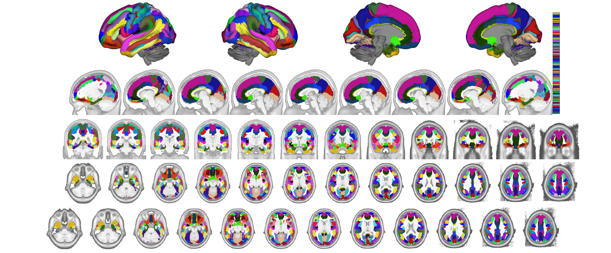
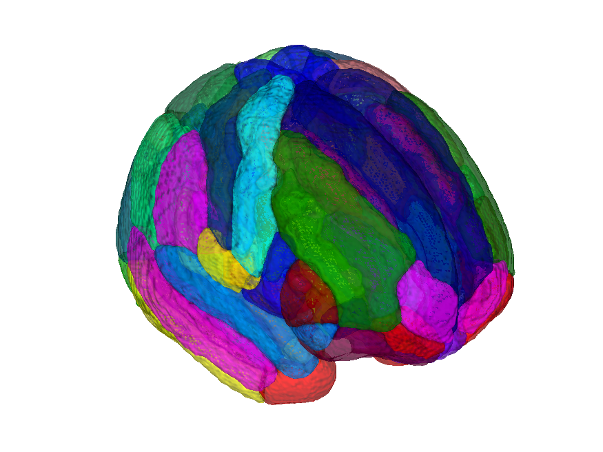

# Destrieux cortical gyral/sulcal atlas (Destrieux et al. 2010) — CANlab volumetric build

## Overview

The **Destrieux atlas** is a medium-grained anatomical labelling of
cortical gyri and sulci, with gyri and sulci separated on the basis of
sulcal curvature. It is the standard FreeSurfer "a2009s" cortical
parcellation. This folder distributes a **volumetric projection**
built by CANlab via **registration fusion** using the same three studies
(SpaceTop N=88, PainGen N=241, BMRK5 N=88) as the volumetric Glasser
and Desikan-Killiany builds. Interregional boundaries (not only
cortical folding) are individualised. Two MNI builds are distributed:

- `destrieux_fmriprep20_atlas_object.mat` — MNI152NLin2009cAsym
- `destrieux_fsl6_atlas_object.mat` — MNI152NLin6Asym

> See [`README.md`](./README.md) for source notes and
> [`METHODS.md`](./METHODS.md) for the registration-fusion methodology.
> Build helpers live in [`src/`](./src) and the constructor is
> [`create_destrieux_atlas.m`](./create_destrieux_atlas.m).

## Primary reference

Destrieux, C., Fischl, B., Dale, A., & Halgren, E. (2010). *Automatic
parcellation of human cortical gyri and sulci using standard anatomical
nomenclature.* **NeuroImage, 53**(1), 1–15.
[doi:10.1016/j.neuroimage.2010.06.010](https://doi.org/10.1016/j.neuroimage.2010.06.010)

## Key images

| Axial+sagittal montage (fmriprep20) | 3-D isosurface (fmriprep20) |
| --- | --- |
|  |  |

The fmriprep20 (MNI152NLin2009cAsym) build. The FSL6
(MNI152NLin6Asym) build and template-named copies are also in
`png_images/`; produced by
[`visualize_contents.m`](./visualize_contents.m).

## How to load

Use the CANlab Core
[`load_atlas`](https://github.com/canlab/CanlabCore/blob/master/CanlabCore/Data_extraction/load_atlas.m)
keywords:

```matlab
atl = load_atlas('destrieux');             % default = fmriprep20
atl = load_atlas('destrieux_fmriprep20');  % MNI152NLin2009cAsym
atl = load_atlas('destrieux_fsl6');        % MNI152NLin6Asym
```

Or load the `.mat` or NIfTI directly:

```matlab
S = load('destrieux_fmriprep20_atlas_object.mat');
atl = S.atlas_obj;

obj = fmri_data('destrieux_MNI152NLin2009cAsym.nii.gz');
```

## File inventory

| File | Type | What it is |
| --- | --- | --- |
| `destrieux_fmriprep20_atlas_object.mat` | MAT (`atlas`) | Destrieux atlas in MNI152NLin2009cAsym space. `load_atlas('destrieux_fmriprep20')`. |
| `destrieux_fsl6_atlas_object.mat` | MAT (`atlas`) | Destrieux atlas in MNI152NLin6Asym space. `load_atlas('destrieux_fsl6')`. |
| `destrieux_MNI152NLin2009cAsym.nii.gz` | NIfTI | Hard-parcellation NIfTI in fmriprep default space. |
| `destrieux_MNI152NLin6Asym.nii.gz` | NIfTI | Hard-parcellation NIfTI in FSL default space. |
| `destrieux_fmriprep20_atlas_regions.{img,hdr,mat}` | Analyze + MAT | Probabilistic region maps used to build the fmriprep20 atlas. |
| `destrieux_fsl6_atlas_regions.{img,hdr,mat}` | Analyze + MAT | Probabilistic region maps used to build the FSL6 atlas. |
| `destrieux_labels.csv` | CSV | Per-parcel label names. |
| `create_destrieux_atlas.m` | MATLAB | Constructor script that builds the `.mat` objects. |
| `src/` | dir | Registration-fusion helper scripts. |
| `png_images/` | dir | Pre-rendered montage + isosurface figures (regenerated by `visualize_contents.m`). |
| `README.md` | Markdown | Source/methods notes. **Authoritative reference.** |
| `METHODS.md` | Markdown | Registration-fusion methodology write-up. |
| `visualize_contents.m` | MATLAB | Regenerates `png_images/`. |

## Citations

- Destrieux C, Fischl B, Dale A, Halgren E (2010). Automatic
  parcellation of human cortical gyri and sulci using standard
  anatomical nomenclature. *NeuroImage* 53:1–15.
  [doi:10.1016/j.neuroimage.2010.06.010](https://doi.org/10.1016/j.neuroimage.2010.06.010)
- Wu J, Ngo GH, Greve D, et al. (2018). Accurate nonlinear mapping
  between MNI volumetric and FreeSurfer surface coordinate systems.
  *Hum Brain Mapp* 39:3793–3808.
  [doi:10.1002/hbm.24213](https://doi.org/10.1002/hbm.24213)
- Fischl B (2012). FreeSurfer. *NeuroImage* 62:774–781.
  [doi:10.1016/j.neuroimage.2012.01.021](https://doi.org/10.1016/j.neuroimage.2012.01.021)
