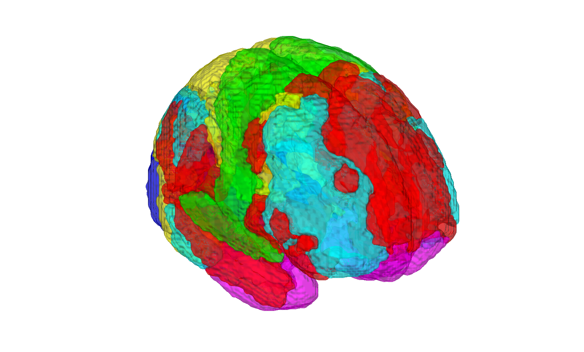

# Buckner 7-network resting-state parcellation (Buckner et al. 2011)

## Overview

The **Buckner 7-network parcellation** is a resting-state functional
connectivity atlas of the **cerebellum** (and originally cerebral
cortex) into seven canonical networks (visual, somatomotor, dorsal
attention, ventral attention, limbic, fronto-parietal control, and
default), derived from N=1000 resting-state fMRI subjects and projected
into MNI152 space. It is the cerebellar companion to the Yeo et al.
(2011) cortical 7/17-network parcellations and the Choi/Buckner (2012)
striatal parcellation.

This folder distributes a single CANlab `atlas` object that wraps the
seven networks for use with CanlabCore. Cortical Yeo network maps live
in a sibling folder ([`2011_Yeo_17networks/`](../2011_Yeo_17networks))
and Schaefer/Yeo cortical parcellations live in
[`2018_Schaefer_Yeo_multires_cortical_parcellation/`](../2018_Schaefer_Yeo_multires_cortical_parcellation).

## Primary reference

Buckner, R. L., Krienen, F. M., Castellanos, A., Diaz, J. C., & Yeo,
B. T. T. (2011). *The organization of the human cerebellum estimated
by intrinsic functional connectivity.* **Journal of Neurophysiology,
106**(5), 2322–2345.
[doi:10.1152/jn.00339.2011](https://doi.org/10.1152/jn.00339.2011)

Companion cortical parcellation: Yeo BT, Krienen FM, Sepulcre J, et al.
(2011) *J. Neurophysiol.* 106:1125–1165.
[doi:10.1152/jn.00338.2011](https://doi.org/10.1152/jn.00338.2011)

## Key images

| Axial+sagittal montage | 3-D isosurface |
| --- | --- |
|  |  |

The seven Buckner resting-state cortical networks. Produced by
[`visualize_contents.m`](./visualize_contents.m). The bundled
`buckner_networks_graphics.pptx` contains author-curated reference
figures of the seven networks.

## How to load

Use the CANlab Core
[`load_atlas`](https://github.com/canlab/CanlabCore/blob/master/CanlabCore/Data_extraction/load_atlas.m)
keyword:

```matlab
atl = load_atlas('buckner');   % buckner_networks_atlas_object.mat
```

Or load the `.mat` directly:

```matlab
S = load('buckner_networks_atlas_object.mat');
atl = S.atlas_obj;
```

## File inventory

| File | Type | What it is |
| --- | --- | --- |
| `buckner_networks_atlas_object.mat` | MAT (`atlas`) | 7-network parcellation as a CANlab `atlas` object. `load_atlas('buckner')`. |
| `buckner_networks_graphics.pptx` | PowerPoint | Author-curated network reference figures. |
| `visualize_contents.m` | MATLAB | Generates `png_images/` (montage + isosurface). |

## Citations

- Buckner RL, Krienen FM, Castellanos A, Diaz JC, Yeo BT (2011). The
  organization of the human cerebellum estimated by intrinsic
  functional connectivity. *J Neurophysiol* 106:2322–2345.
  [doi:10.1152/jn.00339.2011](https://doi.org/10.1152/jn.00339.2011)
- Yeo BT, Krienen FM, Sepulcre J, et al. (2011). The organization of
  the human cerebral cortex estimated by intrinsic functional
  connectivity. *J Neurophysiol* 106:1125–1165.
  [doi:10.1152/jn.00338.2011](https://doi.org/10.1152/jn.00338.2011)
- Choi EY, Yeo BT, Buckner RL (2012). The organization of the human
  striatum estimated by intrinsic functional connectivity.
  *J Neurophysiol* 108:2242–2263.
  [doi:10.1152/jn.00270.2012](https://doi.org/10.1152/jn.00270.2012)
