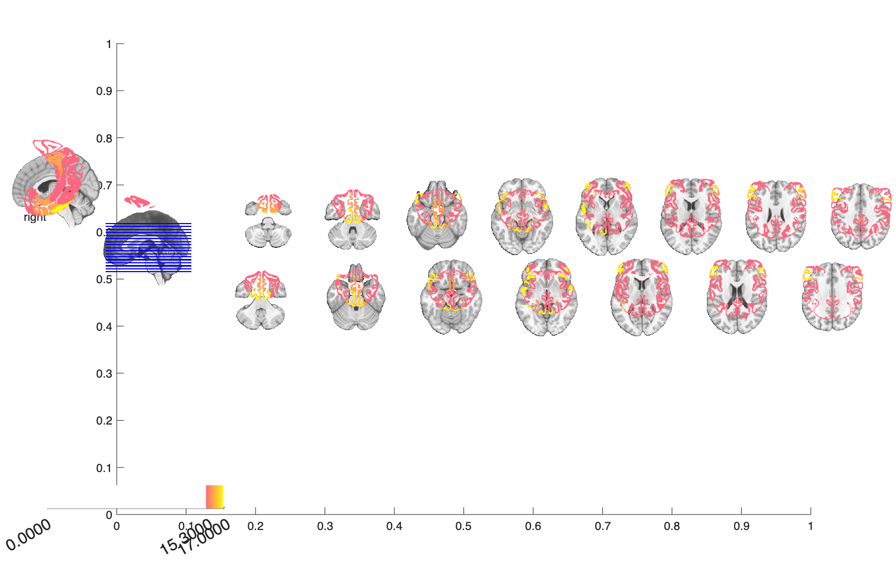
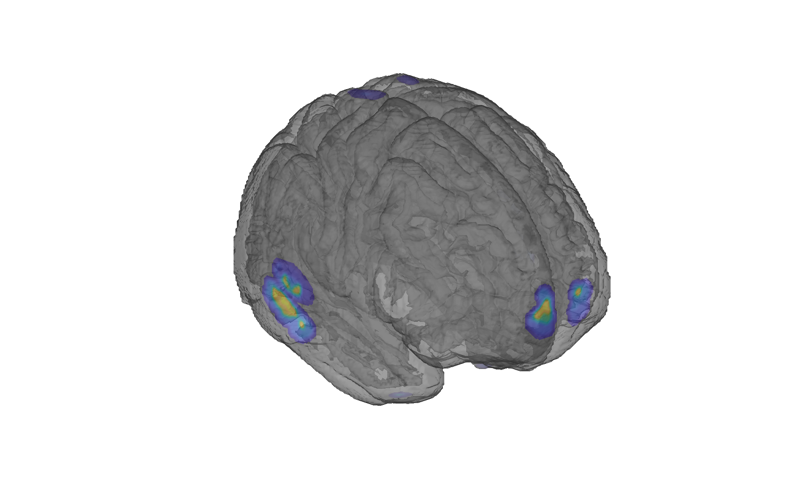

# Yeo 17-network cortical parcellation (Yeo et al. 2011)

## Overview

The **Yeo 7/17-network cortical parcellation** is a resting-state
functional connectivity atlas of the cerebral cortex derived from
**N=1000 resting-state fMRI subjects** registered with surface-based
alignment. A clustering approach identified seven (and a finer 17)
canonical networks of functionally coupled regions across the cortex.
This folder contains the **17-network volumetric projection** in
MNI152 (FreeSurfer-conformed) space.

> See [`Yeo_JNeurophysiol11_MNI152_README`](./Yeo_JNeurophysiol11_MNI152_README)
> for the authoritative file-by-file write-up and original recommended
> visualisation commands (FreeView / FSLView).

The companion Buckner cerebellar 7-network atlas lives in
[`2011_Buckner_7networks/`](../2011_Buckner_7networks). A more recent,
multi-resolution surface parcellation that uses Yeo's 17 networks as
a community ID is provided by Schaefer/Yeo 2018 (see
[`2018_Schaefer_Yeo_multires_cortical_parcellation/`](../2018_Schaefer_Yeo_multires_cortical_parcellation)).

## Primary reference

Yeo, B. T. T., Krienen, F. M., Sepulcre, J., Sabuncu, M. R., Lashkari,
D., Hollinshead, M., Roffman, J. L., et al. (2011). *The organization
of the human cerebral cortex estimated by intrinsic functional
connectivity.* **Journal of Neurophysiology, 106**(3), 1125–1165.
[doi:10.1152/jn.00338.2011](https://doi.org/10.1152/jn.00338.2011)

## Key images

| Axial+sagittal montage | 3-D isosurface |
| --- | --- |
|  |  |

The 17-network cortical parcellation (hard-labelled integer volume).
Produced by [`visualize_contents.m`](./visualize_contents.m) via
`canlab_render_patterns`.

## How to load

The 17-network parcellation distributed in this folder is the original
1 mm FreeSurfer-conformed volume. To load it as a CANlab
[`fmri_data`](https://github.com/canlab/CanlabCore) object:

```matlab
obj = fmri_data('Yeo2011_17Networks_MNI152_FreeSurferConformed1mm.nii.gz');
```

Note: `load_atlas('yeo17networks')` returns the **Schaefer/Yeo 2018**
cortical atlas object (with 17 networks as community IDs) and **not**
this Yeo-2011 volume. For a true Yeo-2011 17-network `atlas` object,
use the Schaefer/Yeo folder.

## File inventory

| File | Type | What it is |
| --- | --- | --- |
| `Yeo2011_17Networks_MNI152_FreeSurferConformed1mm.nii.gz` | NIfTI | 17 cortical networks projected to MNI152 (FreeSurfer-conformed 1 mm). |
| `Yeo2011_7Networks_ColorLUT.txt` | text | FreeSurfer color LUT for the 7-network parcellation. |
| `Yeo_JNeurophysiol11_MNI152_README` | text | **Authoritative reference.** Original Yeo 2011 README; file descriptions, color tables, citations, example usage. |
| `visualize_contents.m` | MATLAB | Writes `png_images/`. |

## Citations

- Yeo BT, Krienen FM, Sepulcre J, et al. (2011). The organization of
  the human cerebral cortex estimated by intrinsic functional
  connectivity. *J Neurophysiol* 106:1125–1165.
  [doi:10.1152/jn.00338.2011](https://doi.org/10.1152/jn.00338.2011)
- Buckner RL, Krienen FM, Castellanos A, et al. (2011). The
  organization of the human cerebellum estimated by intrinsic
  functional connectivity. *J Neurophysiol* 106:2322–2345.
  [doi:10.1152/jn.00339.2011](https://doi.org/10.1152/jn.00339.2011)
- Schaefer A, Kong R, Gordon EM, et al. (2018). Local-global
  parcellation of the human cerebral cortex from intrinsic functional
  connectivity MRI. *Cereb Cortex* 28:3095–3114.
  [doi:10.1093/cercor/bhx179](https://doi.org/10.1093/cercor/bhx179)
