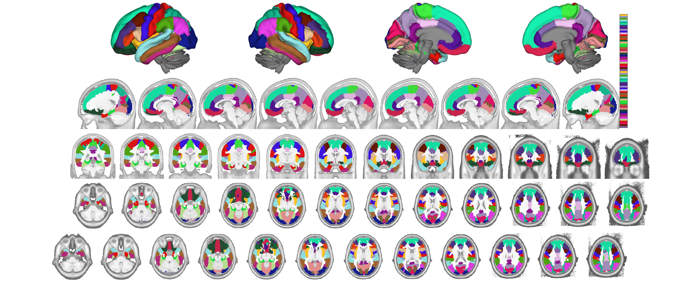
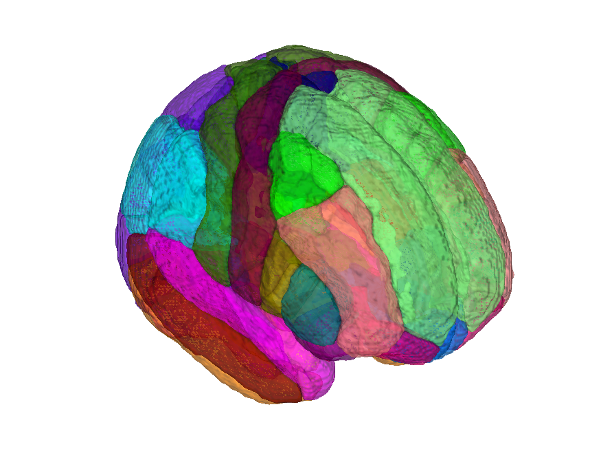

# Desikan-Killiany-Tourville (DKT) cortical atlas (Klein & Tourville 2012) — CANlab volumetric build

## Overview

The **Desikan-Killiany-Tourville (DKT)** atlas is Klein and Tourville's
update to the Desikan-Killiany (DK) cortical parcellation, with
relabelled and consolidated gyral boundaries that follow stricter
anatomical rules (yielding **31 labels per hemisphere**). It is the
default FreeSurfer "aparc.DKTatlas" parcellation and is provided by
Mindboggle-101.

This folder distributes a **volumetric projection** built by CANlab
via **registration fusion** using the same three studies (SpaceTop
N=88, PainGen N=241, BMRK5 N=88) as the volumetric Glasser,
Desikan-Killiany, and Destrieux builds. Interregional boundaries are
individualised. Two MNI builds are distributed:

- `dkt_fmriprep20_atlas_object.mat` — MNI152NLin2009cAsym
- `dkt_fsl6_atlas_object.mat` — MNI152NLin6Asym

Build helpers live in [`src/`](./src) and the constructor is
[`create_dkt_atlas.m`](./create_dkt_atlas.m). See the sibling
[`2006_desikan_killiany/`](../2006_desikan_killiany) folder for the
original DK parcellation and its `METHODS.md` for the
registration-fusion approach.

## Primary reference

Klein, A., & Tourville, J. (2012). *101 labeled brain images and a
consistent human cortical labeling protocol.* **Frontiers in
Neuroscience, 6**, 171.
[doi:10.3389/fnins.2012.00171](https://doi.org/10.3389/fnins.2012.00171)

## Key images

| Axial+sagittal montage (fmriprep20) | 3-D isosurface (fmriprep20) |
| --- | --- |
|  |  |

The fmriprep20 (MNI152NLin2009cAsym) build. The FSL6
(MNI152NLin6Asym) build and template-named copies are also in
`png_images/`; produced by
[`visualize_contents.m`](./visualize_contents.m).

## How to load

Use the CANlab Core
[`load_atlas`](https://github.com/canlab/CanlabCore/blob/master/CanlabCore/Data_extraction/load_atlas.m)
keywords:

```matlab
atl = load_atlas('dkt');             % default = fmriprep20
atl = load_atlas('dkt_fmriprep20');  % MNI152NLin2009cAsym
atl = load_atlas('dkt_fsl6');        % MNI152NLin6Asym
```

Or load the `.mat` directly:

```matlab
S = load('dkt_fmriprep20_atlas_object.mat');
atl = S.atlas_obj;
```

## File inventory

| File | Type | What it is |
| --- | --- | --- |
| `dkt_fmriprep20_atlas_object.mat` | MAT (`atlas`) | DKT atlas in MNI152NLin2009cAsym space. `load_atlas('dkt_fmriprep20')`. |
| `dkt_fsl6_atlas_object.mat` | MAT (`atlas`) | DKT atlas in MNI152NLin6Asym space. `load_atlas('dkt_fsl6')`. |
| `dkt_fmriprep20_atlas_regions.{img,hdr,mat}` | Analyze + MAT | Probabilistic region maps used to build the fmriprep20 atlas. |
| `dkt_fsl6_atlas_regions.{img,hdr,mat}` | Analyze + MAT | Probabilistic region maps used to build the FSL6 atlas. |
| `create_dkt_atlas.m` | MATLAB | Constructor script that builds the `.mat` objects. |
| `src/` | dir | Registration-fusion helper scripts. |
| `png_images/` | dir | Pre-rendered montage + isosurface figures (regenerated by `visualize_contents.m`). |
| `visualize_contents.m` | MATLAB | Regenerates `png_images/`. |

## Citations

- Klein A, Tourville J (2012). 101 labeled brain images and a
  consistent human cortical labeling protocol. *Front Neurosci* 6:171.
  [doi:10.3389/fnins.2012.00171](https://doi.org/10.3389/fnins.2012.00171)
- Desikan RS, Ségonne F, Fischl B, et al. (2006). An automated labeling
  system for subdividing the human cerebral cortex on MRI scans into
  gyral based regions of interest. *NeuroImage* 31:968–980.
  [doi:10.1016/j.neuroimage.2006.01.021](https://doi.org/10.1016/j.neuroimage.2006.01.021)
- Wu J, Ngo GH, Greve D, et al. (2018). Accurate nonlinear mapping
  between MNI volumetric and FreeSurfer surface coordinate systems.
  *Hum Brain Mapp* 39:3793–3808.
  [doi:10.1002/hbm.24213](https://doi.org/10.1002/hbm.24213)
