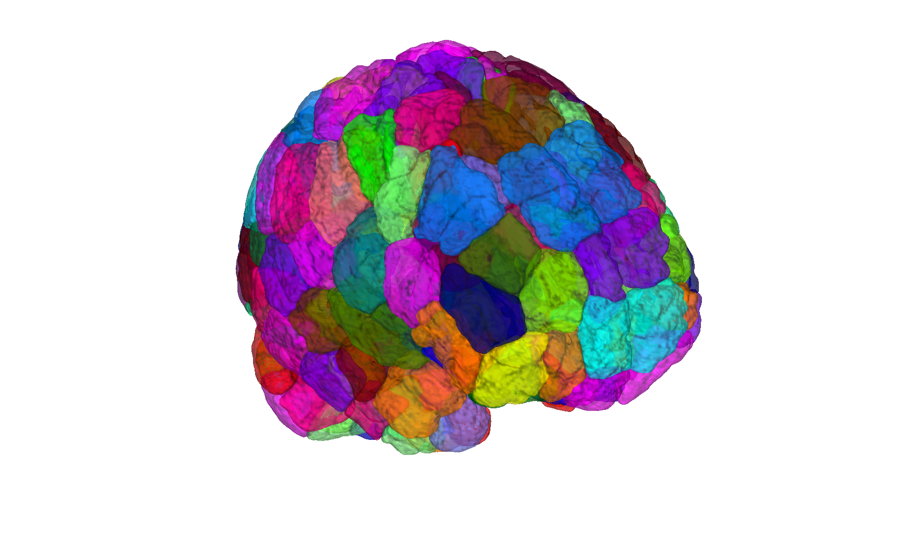

# Shen 268-node whole-brain functional parcellation (Shen et al. 2013)

## Overview

The **Shen 268-node parcellation** is a whole-brain (cortex +
subcortex + cerebellum) **functional parcellation** derived from
resting-state fMRI by a group-wise spectral clustering approach. It is
widely used as a node definition for connectome-style analyses and is
the default parcellation in NITRC's BioImage Suite distribution.

The original parcellation was generated in **MNI Colin27v1998 space**.
This folder also ships **resampled copies** in two more standard MNI
templates (CANlab build by Bogdan Petre, 10/2023, using ANTs
MultiLabel interpolation with sigma=0.5):

- `Shen_MNI152NLin2009cAsym_atlas_object.mat` — fmriprep default space
- `Shen_MNI152NLin6Asym_atlas_object.mat` — FSL default space
- `Shen_atlas_object.mat` — original Colin27v1998 space

> See [`README.md`](./README.md) for source notes and the rationale
> behind the multi-template resampling.

## Primary reference

Shen, X., Tokoglu, F., Papademetris, X., & Constable, R. T. (2013).
*Groupwise whole-brain parcellation from resting-state fMRI data for
network node identification.* **NeuroImage, 82**, 403–415.
[doi:10.1016/j.neuroimage.2013.05.081](https://doi.org/10.1016/j.neuroimage.2013.05.081)

## Key images

| Axial+sagittal montage (fmriprep) | 3-D isosurface (fmriprep) |
| --- | --- |
|  |  |

The MNI152NLin2009cAsym (fmriprep) build. The FSL6 (MNI152NLin6Asym)
and Colin27v1998 builds are also in `png_images/`; produced by
[`visualize_contents.m`](./visualize_contents.m).

## How to load

Use the CANlab Core
[`load_atlas`](https://github.com/canlab/CanlabCore/blob/master/CanlabCore/Data_extraction/load_atlas.m)
keywords:

```matlab
atl = load_atlas('shen_fmriprep20');  % MNI152NLin2009cAsym (recommended)
atl = load_atlas('shen_fsl6');        % MNI152NLin6Asym
atl = load_atlas('shen');             % Colin27v1998 (original; deprecated default)
```

Or load the `.mat` directly:

```matlab
S = load('Shen_MNI152NLin2009cAsym_atlas_object.mat');
atl = S.atlas_obj;
```

Or read the raw NIfTI:

```matlab
obj = fmri_data('shen_1mm_268_parcellation_MNI152NLin2009cAsym.nii.gz');
```

## File inventory

| File | Type | What it is |
| --- | --- | --- |
| `Shen_atlas_object.mat` | MAT (`atlas`) | Original Colin27v1998 build. `load_atlas('shen')`. |
| `Shen_MNI152NLin2009cAsym_atlas_object.mat` | MAT (`atlas`) | Resampled to fmriprep default. `load_atlas('shen_fmriprep20')`. |
| `Shen_MNI152NLin6Asym_atlas_object.mat` | MAT (`atlas`) | Resampled to FSL default. `load_atlas('shen_fsl6')`. |
| `Shen_atlas_regions.mat`, `Shen_MNI152NLin2009cAsym_atlas_regions.mat`, `Shen_MNI152NLin6Asym_atlas_regions.mat` | MAT (`region`) | Per-region `region` objects for each template. |
| `shen_1mm_268_parcellation.nii.gz` | NIfTI | Original 1 mm parcellation (Colin27v1998). |
| `shen_1mm_268_parcellation_MNI152NLin2009cAsym.nii.gz` | NIfTI | 1 mm parcellation in fmriprep default space. |
| `shen_1mm_268_parcellation_MNI152NLin6Asym.nii.gz` | NIfTI | 1 mm parcellation in FSL default space. |
| `shen_2mm_268_parcellation.nii.gz` | NIfTI | 2 mm parcellation (Colin27v1998). |
| `shen_1mm_268_regions.mat` | MAT | Region-list `.mat` used in legacy builds. |
| `shen_268_parcellation_networklabels.csv` | CSV | Mapping from parcel index to canonical network (Yeo-style). |
| `Shen_create_atlas_object.m`, `Shen_MNI152NLin2009cAsym_create_atlas_object.m`, `Shen_MNI152NLin6Asym_create_atlas_object.m` | MATLAB | Constructor scripts (per template). |
| `png_images/` | dir | Pre-rendered montage + isosurface figures (regenerated by `visualize_contents.m`). |
| `README.md` | Markdown | Source/space notes (**authoritative reference**). |
| `visualize_contents.m` | MATLAB | Regenerates `png_images/`. |

## Citations

- Shen X, Tokoglu F, Papademetris X, Constable RT (2013). Groupwise
  whole-brain parcellation from resting-state fMRI data for network
  node identification. *NeuroImage* 82:403–415.
  [doi:10.1016/j.neuroimage.2013.05.081](https://doi.org/10.1016/j.neuroimage.2013.05.081)
- Finn ES, Shen X, Scheinost D, Rosenberg MD, Huang J, Chun MM,
  Papademetris X, Constable RT (2015). Functional connectome
  fingerprinting: identifying individuals using patterns of brain
  connectivity. *Nat Neurosci* 18:1664–1671.
  [doi:10.1038/nn.4135](https://doi.org/10.1038/nn.4135)
