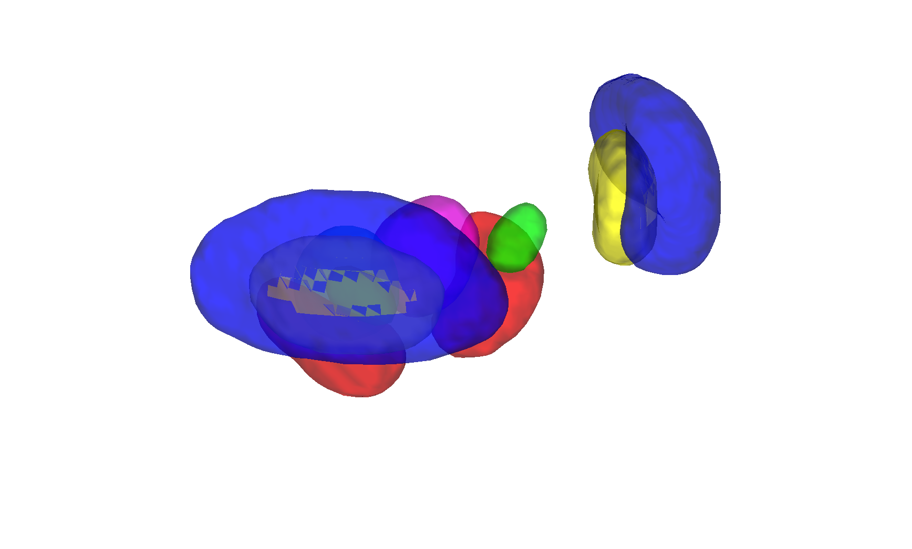

# Keuken 7T subcortical atlas (Keuken et al. 2014)

## Overview

The **Keuken 7T subcortical atlas** is a high-resolution probabilistic
atlas of basal-ganglia / midbrain nuclei derived from **7 Tesla
quantitative susceptibility and T2\*** imaging in young adults. It
provides expert manual delineations of structures that are hard to see
on conventional 1.5T/3T MRI — notably the **subthalamic nucleus (STN),
substantia nigra (SN), red nucleus (RN), and internal/external globus
pallidus (GPi/GPe)** — in MNI152 space.

The CANlab build wraps Keuken's `Nonlinear_combined_masks_threshold033`
volume as a single `atlas` object (probability threshold 0.33). See
the included paper [`Keuken2014Neuroimage.pdf`](./Keuken2014Neuroimage.pdf)
for the methods.

## Primary reference

Keuken, M. C., Bazin, P.-L., Crown, L., Hootsmans, J., Laufer, A.,
Müller-Axt, C., Sier, R., et al. (2014). *Quantifying inter-individual
anatomical variability in the subcortex using 7T structural MRI.*
**NeuroImage, 94**, 40–46.
[doi:10.1016/j.neuroimage.2014.03.032](https://doi.org/10.1016/j.neuroimage.2014.03.032)

Local PDF: [`Keuken2014Neuroimage.pdf`](./Keuken2014Neuroimage.pdf).

## Key images

| Axial+sagittal montage | 3-D isosurface |
| --- | --- |
|  |  |

The 7T probabilistic subcortical atlas. Produced by
[`visualize_contents.m`](./visualize_contents.m).

## How to load

Use the CANlab Core
[`load_atlas`](https://github.com/canlab/CanlabCore/blob/master/CanlabCore/Data_extraction/load_atlas.m)
keyword:

```matlab
atl = load_atlas('keuken');   % Keuken_7T_atlas_object.mat
```

Or load the `.mat` directly:

```matlab
S = load('Keuken_7T_atlas_object.mat');
atl = S.atlas_obj;
```

Or read the raw NIfTI:

```matlab
obj = fmri_data('Nonlinear_combined_masks_threshold033.nii.gz');
```

## File inventory

| File | Type | What it is |
| --- | --- | --- |
| `Keuken_7T_atlas_object.mat` | MAT (`atlas`) | CANlab atlas object. `load_atlas('keuken')`. |
| `Keuken_7T_atlas_regions.mat` | MAT (`region`) | Per-region `region` array. |
| `Keuken_create_atlas_object.m` | MATLAB | Constructor script that builds the `.mat`. |
| `Nonlinear_combined_masks_threshold033.nii.gz` | NIfTI | Hard-parcellation NIfTI thresholded at probability 0.33. |
| `Keuken2014Neuroimage.pdf` | PDF | Primary reference (NeuroImage 2014). |
| `visualize_contents.m` | MATLAB | Writes `png_images/`. |

## Citations

- Keuken MC, Bazin P-L, Crown L, et al. (2014). Quantifying
  inter-individual anatomical variability in the subcortex using 7T
  structural MRI. *NeuroImage* 94:40–46.
  [doi:10.1016/j.neuroimage.2014.03.032](https://doi.org/10.1016/j.neuroimage.2014.03.032)
- Forstmann BU, Keuken MC, Schafer A, Bazin P-L, Alkemade A,
  Turner R (2014). Multi-modal ultra-high resolution structural 7-Tesla
  MRI data repository. *Sci Data* 1:140048.
  [doi:10.1038/sdata.2014.48](https://doi.org/10.1038/sdata.2014.48)
