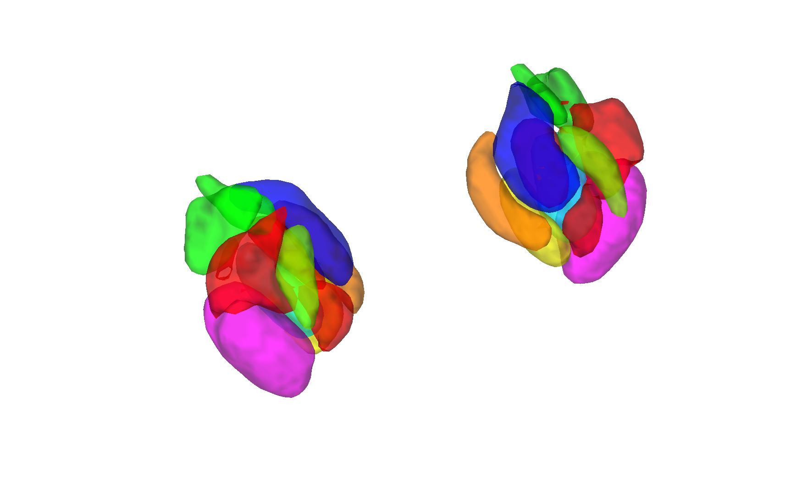

# CIT168 amygdala atlas v1.0.3 (Tyszka & Pauli 2016)

## Overview

The **CIT168 amygdala atlas v1.0.3** is a probabilistic in-vivo
parcellation of the **human amygdala** into nine bilateral nuclei /
nuclear groups, built from high-resolution 1 mm T1 and T2 scans of
the **168 young adult Caltech / HCP participants** that define the
CIT168 template. Per-nucleus probability maps are provided in the
CIT168 template space and projected into the two standard MNI
templates (CANlab build).

> See [`README.pdf`](./README.pdf) for the authoritative author
> documentation, [`LICENSE.txt`](./LICENSE.txt), and
> [`VERSION.txt`](./VERSION.txt). Build scripts are
> [`CIT168_MNI152NLin2009cAsym_create_atlas_object.m`](./CIT168_MNI152NLin2009cAsym_create_atlas_object.m)
> and
> [`CIT168_MNI152NLin6Asym_create_atlas_object.m`](./CIT168_MNI152NLin6Asym_create_atlas_object.m).

This atlas is the **amygdala companion** to the CIT168 reinforcement-
learning subcortical atlas (see
[`2018_CIT168_Reinf_Learn_v1.1.0/`](../2018_CIT168_Reinf_Learn_v1.1.0)).

## Primary reference

Tyszka, J. M., & Pauli, W. M. (2016). *In vivo delineation of
subdivisions of the human amygdaloid complex in a high-resolution
group template.* **Human Brain Mapping, 37**(11), 3979–3998.
[doi:10.1002/hbm.23289](https://doi.org/10.1002/hbm.23289)

## Key images

| Axial+sagittal montage (fmriprep) | 3-D isosurface (fmriprep) |
| --- | --- |
|  |  |

The MNI152NLin2009cAsym (fmriprep) build of the CIT168 probabilistic
amygdala atlas. The MNI152NLin6Asym (FSL6) build and the
author-named `CIT168_MNI152NLin6Asym_amygdala_v1.0.3_*` copies are
also in `png_images/`; produced by
[`visualize_contents.m`](./visualize_contents.m).

## How to load

Use the CANlab Core
[`load_atlas`](https://github.com/canlab/CanlabCore/blob/master/CanlabCore/Data_extraction/load_atlas.m)
keywords:

```matlab
atl = load_atlas('cit168_amygdala');             % default = fmriprep20
atl = load_atlas('cit168_amygdala_fmriprep20');  % MNI152NLin2009cAsym
atl = load_atlas('cit168_amygdala_fsl6');        % MNI152NLin6Asym
```

Or load the `.mat` directly:

```matlab
S = load('CIT168_MNI152NLin2009cAsym_amygdala_v1.0.3_atlas_object.mat');
atl = S.atlas_obj;
```

## File inventory

| File | Type | What it is |
| --- | --- | --- |
| `CIT168_MNI152NLin2009cAsym_amygdala_v1.0.3_atlas_object.mat` | MAT (`atlas`) | Amygdala atlas in MNI152NLin2009cAsym space. `load_atlas('cit168_amygdala_fmriprep20')`. |
| `CIT168_MNI152NLin6Asym_amygdala_v1.0.3_atlas_object.mat` | MAT (`atlas`) | Amygdala atlas in MNI152NLin6Asym space. `load_atlas('cit168_amygdala_fsl6')`. |
| `CIT168_MNI152NLin2009cAsym_amygdala_v1.0.3_atlas_regions.mat` | MAT (`region`) | Per-region `region` array (fmriprep). |
| `CIT168_MNI152NLin6Asym_amygdala_v1.0.3_atlas_regions.mat` | MAT (`region`) | Per-region `region` array (FSL). |
| `CIT168_MNI152NLin2009cAsym_create_atlas_object.m` | MATLAB | Constructor for fmriprep20 build. |
| `CIT168_MNI152NLin6Asym_create_atlas_object.m` | MATLAB | Constructor for FSL6 build. |
| `CIT168toMNI152_1mm/` | dir | Author-supplied template files and probability maps. |
| `CIFTI/` | dir | CIFTI label files. |
| `png_images/` | dir | Pre-rendered montage + isosurface figures (regenerated by `visualize_contents.m`). |
| `README.pdf` | PDF | **Authoritative reference** (author documentation). |
| `LICENSE.txt` | text | Atlas license. |
| `VERSION.txt` | text | Atlas version metadata. |
| `visualize_contents.m` | MATLAB | Regenerates `png_images/`. |

## Citations

- Tyszka JM, Pauli WM (2016). In vivo delineation of subdivisions of
  the human amygdaloid complex in a high-resolution group template.
  *Hum Brain Mapp* 37:3979–3998.
  [doi:10.1002/hbm.23289](https://doi.org/10.1002/hbm.23289)
- Pauli WM, Nili AN, Tyszka JM (2018). A high-resolution probabilistic
  in vivo atlas of human subcortical brain nuclei. *Sci Data* 5:180063.
  [doi:10.1038/sdata.2018.63](https://doi.org/10.1038/sdata.2018.63)
