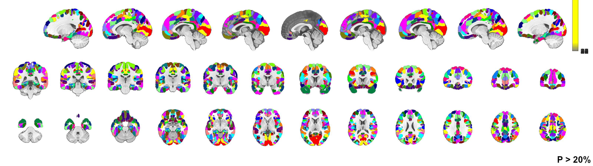
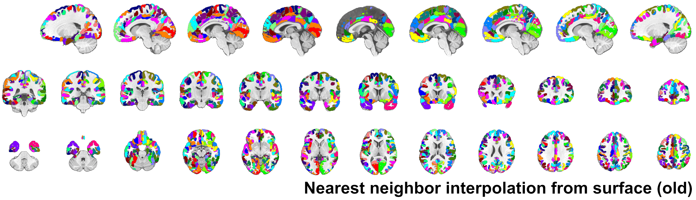
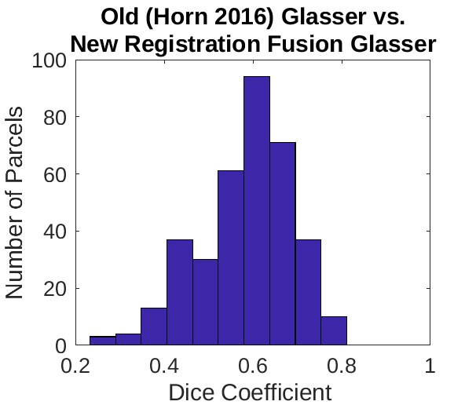
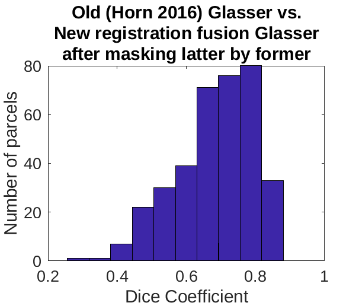
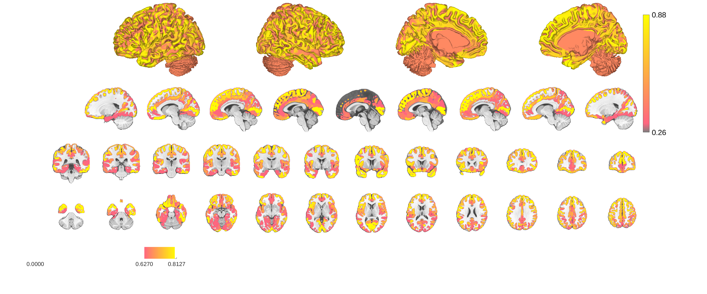
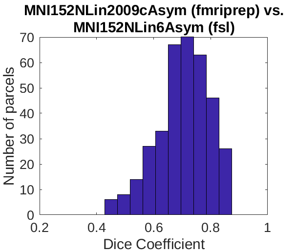
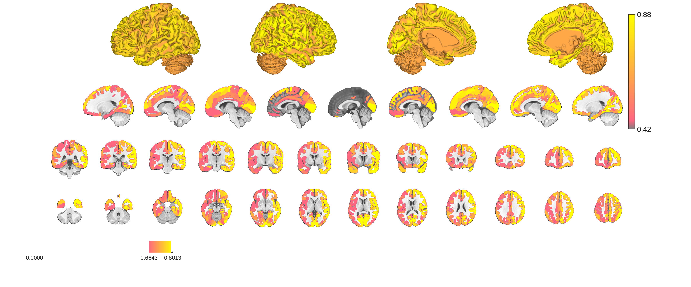
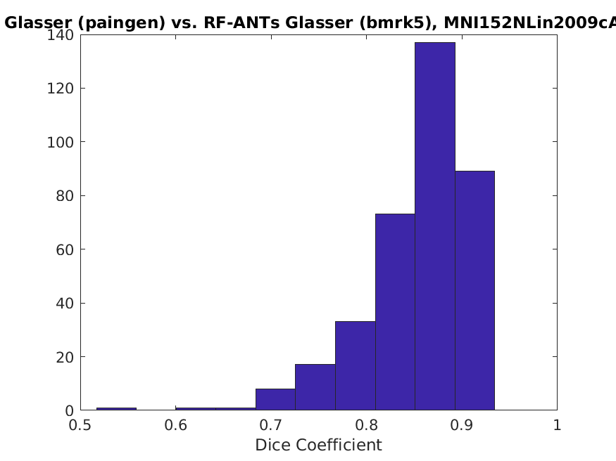

## Overview

This is the HCP multimodal parcellation v. 1 published by Glasser, Coalson, Robinson, Hacker, et al. 2016 Nature,
projected into volumetric space using registration fusion, which Thomas Yeo's group has shown to be the best
approach (Wu et al 2018 HBM).

Two versions are available, MNI152NLin2009cAsym space (fmriprep 20.2.3 default) and MNI152NLin6Asym space (fsl 5/6
default).

## Usage (important)

Invoke the following to load this atlas.

load_atlas('glasser_fmriprep20')
load_atlas('glasser_fsl6')

DO NOT USE load_atlas('glasser') or load_atlas('cortex') intending to access the best version of this atlas. 
These are legacy aliases that load the old glasser projection. See section below on comparisons with this 
version for improvements now available.

## Probabilities

The atlas is probablistic. The original atlas is defined on a surface, but this surface is folded in different 
ways for different people. Misalignment of gyri and sucli results in parcels projecting into different locations
for different people. The probabilities indicate the likelihood an individual's parcel will project to the 
designated location.

Probabilities were computed first based on alignments in each of two studies (BMRK5, PainGen) separately and
then averaged. Different studies have different acquisition parameters, which can result in systematic
differences in resulting alignments. Averaging over more studies would be better. In the interest of facilitating
futher updates to this dataset these two studies have had their subject specific MNI space projections uploaded
to figshare. If you want to recompute the probability maps/parcel boundaries you can follow the approach in
the src subfolder here for a new study and combine it with these maps for a cumulative improvement. Maps are here:

https://doi.org/10.6084/m9.figshare.24431146

Note, even in surface space not all subjects have perfect correspondence of region boundaries. There are two 
missing pieces needed to correctly identify subject level surface boundaries.
* Functional alignment (e.g. MSMAll, like in Glasser et al. 2016)
* Areal feature based identification 
Glasser et al. developed pattern classifiers to identify subject specific boundaries, in addition to performing
multimodal functional alignment. One or both of these methods would be needed to identify subject specific
parcel boundaries and then project those into volumetric space using registration fusion. This would be something
like (1) run fmriprep, (2) do functional surface alignment (3) run areal classifier to identify subject specific
boundaries (4) back project subject specific boundaries through (a) subject specific functional alignments, 
(b) surface to native T1 volume transformations and finally (c) native volume to standard template volume 
transformations.

A subject specific parcel projection approach would take into account variability in surface space parcel 
boundaries. We do not do that here. In that sense these probabilities indicate something very technical, not 
something biologically meaningful. They tell us how likely a signal from a voxel is to be circumscribed by a 
particular label in the group parcellation if projected to surface space through a subject specific transformation, 
but even so that label may still not correspond to the designated area for any particular subject. 
That identity is not determined by the group template these probabilities inform, but rather by subject specific 
myelin and resting state network features.

The purpose of these probability maps is to adjudicate between competing atlases when making composites or to
provide an objective basis for boundary delineation, not for direct physiological inference.

To my knowledge Glasser et al. have not published their subject specific region classifiers (as of 10/24/23), 
but I think subject specific parcellations may be avialable from the HCP dataset, and might provide an avenue 
towards an improved version of this atlas. Coalsen et al. 2018 PNAS achieve precise this kind of surface
to volume mapping that takes variability of the subject specific surface parcellations into account and compares
it to a projection that doesn't. They do not share their templates, but their paper may provide some guidance 
on whether or not it's worthwhile to pursue such an improvement on this atlas here.

## Methods

Mappings were created using "registration fusion". Projections from native space to fsaverage spherical surfaces
were computed for each of many subjects. Transformations from native space to different MNI space templates
were also computed. By enchaining the inverse transform to surface space with the forward transform to mni
space we can get a fsaverage surface to MNI space projection for each subject. The Glasser surface parcellation
was transformed with this enchained set of transforms for each of 241 unrelated participants in paingen and 89
participants from BMRK5. All transformations were computed by running fmriprep 20.2.3 with recon-all enabled
on these participants, so this probablistic atlas is ideally calibrated for use with fmriprep aligned volumes.
Resulting parcellations were uploaded to figshare

https://doi.org/10.6084/m9.figshare.24431146

and averaged first within study and then the study specific probability maps were averaged with one another.
This might be improved by taking a precision weighted average, but both studies are fairly large, and dice
coefficients of mean parcellations between the two studies are fairly close to 1, so it's likely unnecessary.

Notably, the original Glasser MMP atlas is in an HCP specific surface space called fs_LR. We had only computed
transformations from native to fsaverage space though, not fs_LR space. Therefore rather than resampling atlas
labels from the original Glasser MMP atlas, we resampled them from a fs_LR to fsaverage transformed atlas. The
transformation was obtained from HCP here,

https://github.com/Washington-University/HCPpipelines/tree/master/global/templates/standard_mesh_atlases

Specifically the fs_L/fs_L-to-fs_LR_fsaverage.L_LR.spherical_std.164k_fs_L.surf.gii and 
fs_R/fs_R-to-fs_LR_fsaverage.R_LR.spherical_std.164k_fs_R.surf.gii were used.

It's not clear to me if fsaverage and fs_LR differ in any way besides vertex locations (fs_LR is symmetric by
design, while fsaverage is not), but it seems like an improved atlas could be obtained by using native space
to fs_LR *sphere.reg transformation files, and this may be warranted if this atlas is updated.

Implementation details are available in the src subfolder, which contains examples of scripts that were used
and a short methods write up.

## Comparison to "old" Glasser

Prior to Oct 2023 there was already a Glasser atlas in this repo. It's now housed in the "old" subfolder of this directory
and is still (as of Oct 2023) returned by load_atlas('glasser'). The source scripts for this atlas accompany it in the
"old" folder. It appears that the strategy for voxel label assignment was simply identifying the nearest neighbor voxel
of a particular surface coordinate. This does not take into account differences in radii between different volumetric and
surface templates. For instance, MNI152NLin2009cAsym and MNI152NLin6Asym (fmriprep's default and FSL's "standard" template)
do not have the same radius. Likewise, the freesurfer template used to determine the cortical surface is not the same
as either of these. This risks introducing radial biases into the alignments. Additionally, the volumetric template used
by the "old" parcellation appears to be the symmetric MNI152NLin2009c template, which is not in widespread use as a spatial
normalization template. Instead most of us are using asymmetric templates of one variety or another. The assignment of 
labels was performed using a gray matter segmentation from this template, but these gray matter contours don't correspond
to the contours of our templates. This approach is highly suspect.

Thankfully, visual inspection of the resulting parcellation shows that it's surprisingly similar to the more accurate
parcellation now available through registration fusion. Lucky, because we've published several papers based on this old
parcellation. Clearly though there's room for improvement. Boundaries are constrained to the template's sulci and gyri,
but individual subjects do not get their gyri and sulci aligned to this template that accurately. Some might see this
level of precision as an advantage, but any degree of 'precision' is an illusion. Look at the cerebellum and you'll see
the atlas bleeding over into the superior aspects of it, despite being a cortical surface atlas. It's not a matter of
precision, it's a matter of an imprecise fit to a mean template. What we offer here instead is the mean of many precise 
fits to individual templates, which is clearly better in this regard. While different individuals may have different
ventral visual cortical foldings, none of them have have visual cortex in the cerebellum. Finally, the old atlas is
necessarily non-probablistic, which limits its versatility. Note that in the figure below underlay is 
MNI152NLin2009cAsym, which is nearly indistiguishable from MNI152NLin2009aAsym, the asymmetric version of the 
template the old glasser parcellation was projected to. The fmriprep20 registration fusion image it cycles with is 
thresholded at 20% probability, which is a default threshold used throughout much of this repo.

Old glasser parcellation vs. new parcellation thresholded at probability >= 20%. Underlay is the fmriprep standard
space, MNI152NLin2009cAsym, which matches the target space of the new parcellation and is theoretically close to
the target space of the old space, to whatever extent one might claim the old parcellation had a target space at all.

Quantitative comparisons between the old and new parcellations are much more damning. Dice coefficients, which
measure the degree of overlap (1 = 100% overlap, 0 = no overlap), indicate dramatic differences between the two 
templates

Part of the problem is the difference in relative size of the parcells in the new vs. old atlas. We can remove
this from the equation though by masking the new atlas by the old one and recomputing the dice coefficient. This
improves the alignment slightly, but there are still many regions that show poor overlap (Dice coefficient < 0.5).

The distribution of dice coefficients is organized in a seemingly systematic way across the cortex.

We can look at the relative agreement between MNI152NLin2009cAsym and MNi152NLin6Asym templates for a reference
point. What we see is no terrible dice coefficients (all > 0.5).  

There's a surprisingly lateralization bias to this
with left lateralized regions showing worse dice coefficients (~0.1 worse) than right side regions.
There seems to be a greater degree of lateralization of the MNI152NLin2009cAsym template than the	MNI152NLin6Asym	 
template. Notably, MNI does not	distributed an asymmetric template, and	it seems that the Asym version is an FSL
specific thing.	It's not clear what they did to	generate it, but the absence of	an asymmetric template from the
template's original authors suggests that perhaps FSL used some	kind of	imperfect post-hoc manipulation	to introduce
asymmetry. This is apparently upon visual inspection if you cycle between the two templates in	fsleyes	or 
connectome workbench. There's more shift in gyri on the	left side than the right side as you cycle (not	shown). 
Regardless of the cause, this recommends using the atlas projection that matches your reference space to avoid
misattribution of labels.

Alternatively we can look at the difference between studies, since we have two studies here. These show the
greatest agreement, with practically all dice coefficients greater than 0.7

Dice coefficients in the range of 0.8 are what the original authors who came up with registration fusion (wu et al 2018)
found when comparing their best methods with a gold standard comparator. This demonstrates that the alignments we have
here are not too biased towards one study or another, although improvement by including additional studies is both
possible and encouraged, hence why I've shared the subject specific parcellations on figshare. You can inspect these
directly if you want more insight into what's going on here.

## References

If using this parcellation please cite the original paper and the registration fusion papers accordingly.

Original parcellation paper:
Glasser, Matthew F., Timothy S. Coalson, Emma C. Robinson, Carl D. Hacker, John Harwell, Essa Yacoub, Kamil Ugurbil, et al. 2016. A Multi-Modal Parcellation of Human Cerebral Cortex. Nature 536 (7615): 171?78.

Registration Fusion Paper:
Wu J, Ngo GH, Greve D, Li J, He T, Fischl B, Eickhoff SB, Yeo T. Accurate nonlinear mapping between MNI volumetric and FreeSurfer surface coordinate systems. 2018. Human Brain Mapping 39(9) 3793-3808. DOI: 10.1002/hbm.24213

Comparison of surface and volumetric atlases
Coalson T, Van Essen D, Glasser MF. The impact of traditional neuroimaging methods on the spatial localization of cortical areas.  2018. PNAS 115(27)

##
Bogdan Petre
10/24/2023
