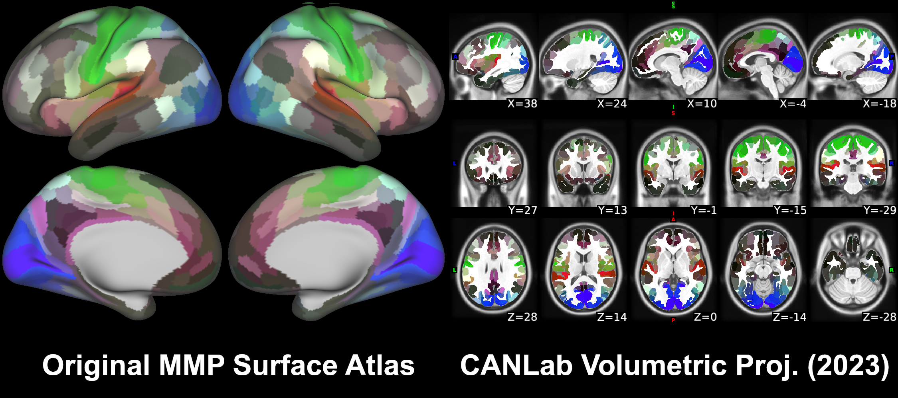
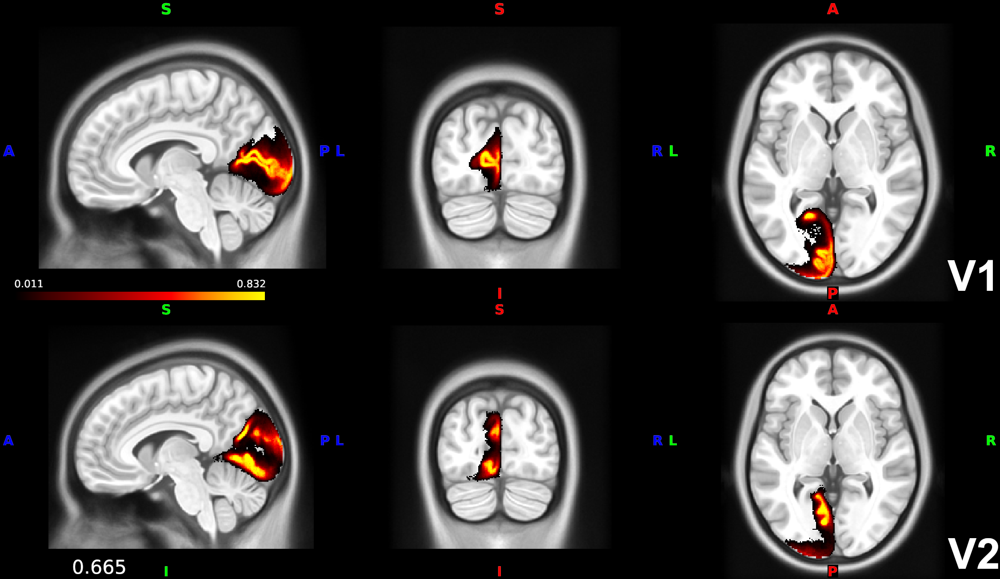

# Glasser HCP MMP1 cortical parcellation (Glasser et al. 2016) — CANlab volumetric build

## Overview

The **HCP Multi-Modal Parcellation (HCP-MMP1)** of human cerebral cortex
into **360 areas** (180 per hemisphere) by Glasser et al. 2016 *Nature*.
The parcellation is originally surface-based; this folder distributes a
**volumetric projection** built by the CANlab using
**registration-fusion** (Wu et al. 2018 HBM), in two MNI templates:

- `glasser_MNI152NLin2009cAsym_atlas_object.mat` — fmriprep 20.2.3 default space
- `glasser_MNI152NLin6Asym_atlas_object.mat` — FSL 5/6 default space

The atlas is **probabilistic**: each voxel carries the probability that
the parcel assigned to it would actually project there in an arbitrary
individual aligned to the same template. Probabilities are averaged
across three independent CANlab studies (BMRK5, PainGen, SpaceTop) and
can be thresholded using the atlas object's `threshold()` method.

> See [`README.md`](./README.md) for the authoritative methods write-up
> (including probability calculation, comparison with the legacy
> "old Glasser" projection, dice-coefficient diagnostics, and
> recommendations for use). [`METHODS.md`](./METHODS.md) is the short
> methods summary; full implementation scripts are in `src/`.

**Primary references.**

- Glasser, M. F., Coalson, T. S., Robinson, E. C., Hacker, C. D.,
  Harwell, J., Yacoub, E., Ugurbil, K., et al. (2016). *A multi-modal
  parcellation of human cerebral cortex.* **Nature, 536**(7615), 171–178.
  [doi:10.1038/nature18933](https://doi.org/10.1038/nature18933)
- Wu, J., Ngo, G. H., Greve, D., Li, J., He, T., Fischl, B.,
  Eickhoff, S. B., & Yeo, B. T. T. (2018). *Accurate nonlinear mapping
  between MNI volumetric and FreeSurfer surface coordinate systems.*
  **Human Brain Mapping, 39**(9), 3793–3808.
  [doi:10.1002/hbm.24213](https://doi.org/10.1002/hbm.24213)

The original Glasser paper is paywalled; the local PDF is not yet
checked in. See the DOI link above.

## Key images

Author-curated build-quality figures from [`images/`](./images) and
[`diagnostics/`](./diagnostics) (see the local [`README.md`](./README.md)
for the full set with full caption text):



*Side-by-side comparison of the legacy and registration-fusion builds
of the volumetric Glasser parcellation.*



*Probability maps for V1 and V2 illustrate the per-voxel uncertainty
in the new probabilistic build.*

[`visualize_contents.m`](./visualize_contents.m) additionally writes
montage + isosurface PNGs into `png_images/` for both the
MNI152NLin2009cAsym and MNI152NLin6Asym builds.

## How to load

Use the CANlab Core
[`load_atlas`](https://github.com/canlab/CanlabCore/blob/master/CanlabCore/Data_extraction/load_atlas.m)
keywords:

```matlab
atl = load_atlas('glasser_fmriprep20');   % MNI152NLin2009cAsym (fmriprep default)
atl = load_atlas('glasser_fsl6');         % MNI152NLin6Asym    (FSL standard)
```

**Do not** use `load_atlas('glasser')` or `load_atlas('cortex')` —
these are legacy aliases that return the older, less accurate
`old/Glasser2016HCP_atlas_object.mat`. See the comparison section of
the [`README.md`](./README.md) for why the new build is preferred.

Threshold by probability:

```matlab
atl_50 = threshold(atl, 0.5);   % retain voxels where probability >= 0.5
```

Or load the surface labels directly:

```matlab
gii_L = gifti(which('Glasser_2016.32k.L.label.gii'));
gii_R = gifti(which('Glasser_2016.32k.R.label.gii'));
```

## Construction script

The complete build is reproducible from
[`create_glasser_atlas.m`](./create_glasser_atlas.m), with helper
materials in [`src/`](./src). Per-subject parcellations used for the
probability averaging are archived on figshare:
[doi:10.6084/m9.figshare.24431146](https://doi.org/10.6084/m9.figshare.24431146).

## File inventory

| File | Type | What it is |
| --- | --- | --- |
| `glasser_MNI152NLin2009cAsym_atlas_object.mat` | MAT (`atlas`) | **Probabilistic atlas in fmriprep default space.** `load_atlas('glasser_fmriprep20')`. |
| `glasser_MNI152NLin6Asym_atlas_object.mat` | MAT (`atlas`) | **Probabilistic atlas in FSL default space.** `load_atlas('glasser_fsl6')`. |
| `Glasser_2016.32k.L.label.gii` / `…R.label.gii` | GIfTI | 32k cortical surface labels per hemisphere (fs_LR). |
| `lh.HCP-MMP1.annot` / `rh.HCP-MMP1.annot` | FreeSurfer annot | HCP-MMP1 label file for each hemisphere on fsaverage. |
| `lctx_labels.txt` / `rctx_labels.txt` | text | Per-parcel name lists for L/R hemispheres. |
| `create_glasser_atlas.m` | MATLAB | Constructor script that builds the `.mat` objects. |
| `src/` | dir | Implementation details and helper scripts. |
| `images/` | dir | Curated comparison figures (old vs new, probability examples). |
| `diagnostics/` | dir | Dice-coefficient diagnostics and GIFs from the methods write-up. |
| `old/` | dir | Legacy ("old") Glasser projection — kept for back-compat with `load_atlas('glasser')`. |
| `README.md` | Markdown | Detailed methods + diagnostics write-up. **Authoritative reference.** |
| `METHODS.md` | Markdown | Short methods summary. |
| `visualize_contents.m` | MATLAB | Regenerates `png_images/`. |

## Citations

- Glasser MF, Coalson TS, Robinson EC, et al. (2016). A multi-modal
  parcellation of human cerebral cortex. *Nature* 536:171–178.
  [doi:10.1038/nature18933](https://doi.org/10.1038/nature18933)
- Wu J, Ngo GH, Greve D, Li J, He T, Fischl B, Eickhoff SB, Yeo TT (2018).
  Accurate nonlinear mapping between MNI volumetric and FreeSurfer
  surface coordinate systems. *Hum Brain Mapp* 39:3793–3808.
  [doi:10.1002/hbm.24213](https://doi.org/10.1002/hbm.24213)
- Coalson TS, Van Essen DC, Glasser MF (2018). The impact of traditional
  neuroimaging methods on the spatial localization of cortical areas.
  *PNAS* 115:E6356–E6365.
  [doi:10.1073/pnas.1801582115](https://doi.org/10.1073/pnas.1801582115)
