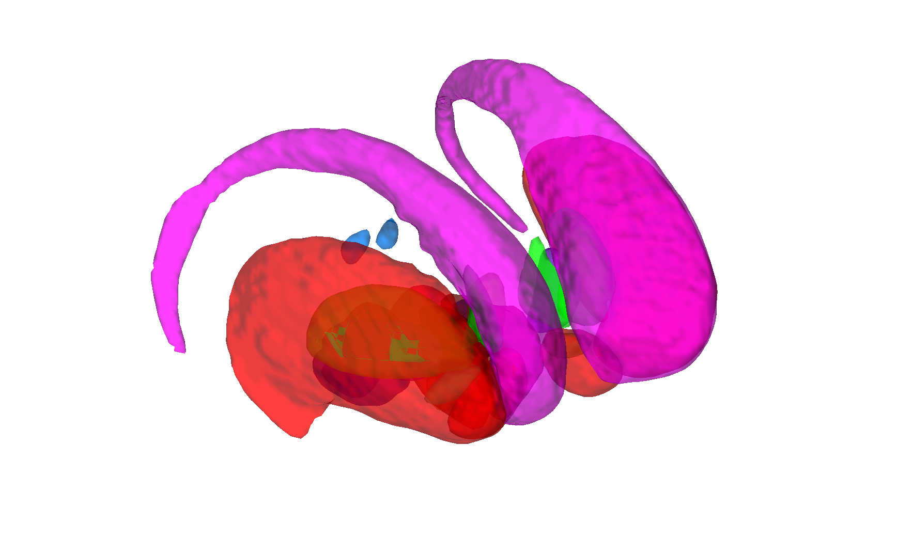

# CIT168 reinforcement-learning subcortical atlas v1.0.0 (Pauli, Nili & Tyszka 2018)

## Overview

The **CIT168 reinforcement-learning subcortical atlas** is a
high-resolution **probabilistic** parcellation of subcortical nuclei
relevant to reinforcement learning and reward — striatum (Pu, Ca,
NAC), pallidum (GPe, GPi), substantia nigra (SNc, SNr), VTA, PBP,
ventral pallidum, hypothalamus (HN, HTH), mammillary nucleus, red
nucleus, subthalamic nucleus, and extended amygdala. Labels were
manually drawn by three independent observers on the high-resolution
CIT168 T1/T2 template (700 µm) and combined into probability maps.

This folder contains **v1.0.0**, the original release in the native
CIT168 / MNI152NLin2009cAsym 1 mm space. The newer
[v1.1.0](../2018_CIT168_Reinf_Learn_v1.1.0) is recommended for new
work and ships in both MNI152NLin2009cAsym and MNI152NLin6Asym.

> See [`README.pdf`](./README.pdf) for the authoritative author
> documentation. The two primary publications are bundled as
> [`Pauli_2018_Atlas_Scientific_Data.pdf`](./Pauli_2018_Atlas_Scientific_Data.pdf)
> and
> [`Pauli_2017_bioarxiv_subcortical_atlas.pdf`](./Pauli_2017_bioarxiv_subcortical_atlas.pdf).
> Inter/intra-observer agreement metrics are in
> [`inter_observer_metrics.csv`](./inter_observer_metrics.csv) and
> [`intra_observer_metrics.csv`](./intra_observer_metrics.csv), and a
> per-observer report lives in [`Report/`](./Report).

## Primary reference

Pauli, W. M., Nili, A. N., & Tyszka, J. M. (2018). *A high-resolution
probabilistic in vivo atlas of human subcortical brain nuclei.*
**Scientific Data, 5**, 180063.
[doi:10.1038/sdata.2018.63](https://doi.org/10.1038/sdata.2018.63)

## Key images

| Axial+sagittal montage | 3-D isosurface |
| --- | --- |
|  |  |

The v1.0.0 reinforcement-learning subcortical atlas. Produced by
[`visualize_contents.m`](./visualize_contents.m). For new work,
prefer the v1.1.0 sibling folder.

## How to load

Use the CANlab Core
[`load_atlas`](https://github.com/canlab/CanlabCore/blob/master/CanlabCore/Data_extraction/load_atlas.m)
keywords:

```matlab
atl = load_atlas('subcortical_rl');  % CIT168 v1.0.0 (deprecated; prefer v1.1.0)
atl = load_atlas('cit168');          % same alias
```

`load_atlas` warns that v1.0.0 is deprecated; for new work use
`load_atlas('cit168_fmriprep20')` or `load_atlas('cit168_fsl6')` from
the sibling [`2018_CIT168_Reinf_Learn_v1.1.0/`](../2018_CIT168_Reinf_Learn_v1.1.0)
folder.

Or load the `.mat` directly:

```matlab
S = load('CIT168_MNI_subcortical_atlas_object.mat');
atl = S.atlas_obj;
```

## File inventory

| File | Type | What it is |
| --- | --- | --- |
| `CIT168_MNI_subcortical_atlas_object.mat` | MAT (`atlas`) | CANlab atlas object (v1.0.0). `load_atlas('cit168')`. |
| `CIT168_MNI_subcortical_atlas_regions.{img,hdr,mat}` | Analyze + MAT | Region-by-region probability maps + `region` array. |
| `CIT168_create_atlas_object.m` | MATLAB | Current constructor script. |
| `CIT168_create_atlas_object_old.m` | MATLAB | Legacy constructor. |
| `CIT168_labels_and_web_link.rtf` | RTF | Label name reference + atlas web link. |
| `labels.txt` | text | Plain-text per-index label list (16 nuclei). |
| `prob_atlas.nii.gz` | NIfTI | 4-D probability stack across all nuclei. |
| `prob_atlas_bilateral.nii.gz` | NIfTI | 4-D bilateral probability stack. |
| `CIT168_T1w_700um.nii.gz`, `CIT168_T1w_head_700um.nii.gz` | NIfTI | Source 700 µm T1 templates (brain / head). |
| `CIT168_T2w_700um.nii.gz`, `CIT168_T2w_head_700um.nii.gz` | NIfTI | Source 700 µm T2 templates (brain / head). |
| `obs-0{0,1,2}_label_{mean,var}.nii.gz` | NIfTI | Per-observer label mean/variance volumes (inter-rater material). |
| `inter_observer_metrics.csv`, `intra_observer_metrics.csv` | CSV | Inter/intra-rater Dice/agreement metrics. |
| `MNI152_2009c_nonlin_asym_1mm/` | dir | MNI152NLin2009cAsym 1 mm copies. |
| `Report/` | dir | Per-observer reliability reports. |
| `README.pdf` | PDF | **Authoritative author documentation.** |
| `Pauli_2018_Atlas_Scientific_Data.pdf`, `Pauli_2017_bioarxiv_subcortical_atlas.pdf` | PDF | Primary references. |
| `visualize_contents.m` | MATLAB | Writes `png_images/`. |

## Citations

- Pauli WM, Nili AN, Tyszka JM (2018). A high-resolution probabilistic
  in vivo atlas of human subcortical brain nuclei. *Sci Data* 5:180063.
  [doi:10.1038/sdata.2018.63](https://doi.org/10.1038/sdata.2018.63)
- Tyszka JM, Pauli WM (2016). In vivo delineation of subdivisions of
  the human amygdaloid complex in a high-resolution group template.
  *Hum Brain Mapp* 37:3979–3998.
  [doi:10.1002/hbm.23289](https://doi.org/10.1002/hbm.23289)
- Pauli WM, O'Reilly RC, Yarkoni T, Wager TD (2016). Regional
  specialization within the human striatum for diverse psychological
  functions. *PNAS* 113:1907–1912.
  [doi:10.1073/pnas.1507610113](https://doi.org/10.1073/pnas.1507610113)
