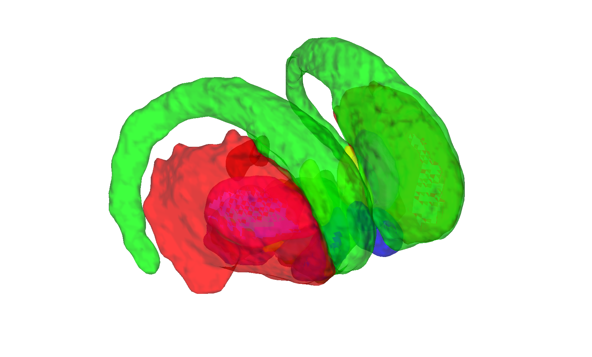

# CIT168 reinforcement-learning subcortical atlas v1.1.0 (Pauli, Nili & Tyszka 2018)

## Overview

The **CIT168 reinforcement-learning subcortical atlas v1.1.0** is the
current release of Pauli, Nili & Tyszka's high-resolution probabilistic
parcellation of subcortical nuclei relevant to reinforcement learning
and reward (striatum, pallidum, SN, VTA, PBP, ventral pallidum,
hypothalamus, mammillary, red nucleus, STN, extended amygdala). It is
the **recommended version** for new work; v1.0.0 is kept for back
compatibility in [`../2018_CIT168_Reinf_Learn_v1.0.0/`](../2018_CIT168_Reinf_Learn_v1.0.0).

The atlas is generated in the native CIT168 template space. This
folder packages the author-supplied projections into the two standard
MNI templates as CANlab `atlas` objects:

- `MNI152-Nonlin-Asym-2009c/CIT168_MNI152NLin2009cAsym_subcortical_v1.1.0_atlas_object.mat` — fmriprep default space
- `MNI152-FSL/CIT168_MNI152NLin6Asym_subcortical_v1.1.0_atlas_object.mat` — FSL default space

> Author source notes: see
> [`CIT168_Reinf_Learn_v1.1.0/README.md`](./CIT168_Reinf_Learn_v1.1.0/README.md)
> (source: [https://osf.io/jkzwp/](https://osf.io/jkzwp/)).
> Labels list: [`CIT168_Reinf_Learn_v1.1.0/labels.txt`](./CIT168_Reinf_Learn_v1.1.0/labels.txt).

## Primary reference

Pauli, W. M., Nili, A. N., & Tyszka, J. M. (2018). *A high-resolution
probabilistic in vivo atlas of human subcortical brain nuclei.*
**Scientific Data, 5**, 180063.
[doi:10.1038/sdata.2018.63](https://doi.org/10.1038/sdata.2018.63)

## Key images

| Axial+sagittal montage (fmriprep) | 3-D isosurface (fmriprep) |
| --- | --- |
|  |  |

The MNI152NLin2009cAsym (fmriprep) build of v1.1.0. The
MNI152NLin6Asym (FSL6) build is also in `png_images/`; produced by
[`visualize_contents.m`](./visualize_contents.m). Author-supplied
per-template PNGs additionally live in
`CIT168_Reinf_Learn_v1.1.0/MNI152-FSL/png_images/` and
`CIT168_Reinf_Learn_v1.1.0/MNI152-Nonlin-Asym-2009c/png_images/`.

## How to load

Use the CANlab Core
[`load_atlas`](https://github.com/canlab/CanlabCore/blob/master/CanlabCore/Data_extraction/load_atlas.m)
keywords:

```matlab
atl = load_atlas('cit168_fmriprep20');  % MNI152NLin2009cAsym (recommended)
atl = load_atlas('cit168_fsl6');        % MNI152NLin6Asym
```

Or load a `.mat` directly:

```matlab
S = load('CIT168_MNI152NLin2009cAsym_subcortical_v1.1.0_atlas_object.mat');
atl = S.atlas_obj;
```

## File inventory

| File | Type | What it is |
| --- | --- | --- |
| `CIT168_MNI152NLin2009cAsym_create_atlas_object.m` | MATLAB | Constructor for the fmriprep20 build. |
| `CIT168_MNI152NLin6Asym_create_atlas_object.m` | MATLAB | Constructor for the FSL6 build. |
| `CIT168_Reinf_Learn_v1.1.0/CIT168_MNI152NLin2009cAsym_subcortical_v1.1.0_atlas_object.mat` | MAT (`atlas`) | Atlas object in fmriprep default space. `load_atlas('cit168_fmriprep20')`. |
| `CIT168_Reinf_Learn_v1.1.0/CIT168_MNI152NLin6Asym_subcortical_v1.1.0_atlas_object.mat` | MAT (`atlas`) | Atlas object in FSL default space. `load_atlas('cit168_fsl6')`. |
| `CIT168_Reinf_Learn_v1.1.0/MNI152-Nonlin-Asym-2009c/CIT168toMNI152-2009c_prob.nii.gz` | NIfTI | 4-D probability stack (fmriprep space). |
| `CIT168_Reinf_Learn_v1.1.0/MNI152-FSL/CIT168toMNI152-FSL_prob.nii.gz` | NIfTI | 4-D probability stack (FSL space). |
| `CIT168_Reinf_Learn_v1.1.0/CIFTI/` | dir | CIFTI label files. |
| `CIT168_Reinf_Learn_v1.1.0/labels.txt` | text | Per-index label list (16 nuclei). |
| `CIT168_Reinf_Learn_v1.1.0/README.md` | Markdown | **Authoritative source notes** (OSF origin). |
| `CIT168_Reinf_Learn_v1.1.0/MNI152-*/png_images/` | dir | Author-supplied template-specific PNGs. |
| `visualize_contents.m` | MATLAB | Writes `png_images/`. |

## Citations

- Pauli WM, Nili AN, Tyszka JM (2018). A high-resolution probabilistic
  in vivo atlas of human subcortical brain nuclei. *Sci Data* 5:180063.
  [doi:10.1038/sdata.2018.63](https://doi.org/10.1038/sdata.2018.63)
- Tyszka JM, Pauli WM (2016). In vivo delineation of subdivisions of
  the human amygdaloid complex in a high-resolution group template.
  *Hum Brain Mapp* 37:3979–3998.
  [doi:10.1002/hbm.23289](https://doi.org/10.1002/hbm.23289)
- Pauli WM, O'Reilly RC, Yarkoni T, Wager TD (2016). Regional
  specialization within the human striatum for diverse psychological
  functions. *PNAS* 113:1907–1912.
  [doi:10.1073/pnas.1507610113](https://doi.org/10.1073/pnas.1507610113)
