## Overview

This is a probablistic atlas meant to correspond to freesurfer's thalamic 
subnuclear parcellations, a joint histologic and in vivo parcellation of the
thalamus into 23 unique regions per hemisphere. It is less granular than 
Morel, but has an open usage license, is probablistic and is likely to be 
more accurately segmented.

The probablistic labels are not directly derived from the original Iglesias 
et al. (2018) Neuroimage parcellation that is used internally by freesurfer.
Those probablistic labels aren't readily available. They're stored in an
esoteric format interally by freesurfer, and based on personal correspondence 
with Iglesias there is no readily available nifti version of the 
probablistic labels available for distribution. There is a version available
that's packaged with LeadDBS, but the relationship between this version and
the original probablistic labels isn't clear. Instead, what I (BP) have done
is to fit the freesurfer segmentation to 278 HCP participants and use those
subject specific labels to determine probablistic labels for the population.

It's fairly easy to run these segmentations on new data though and it seems to
produce good segmentations if you have DWI and T1 data and use the joint T1/DTI
segmentation algorithm (Tregidgo et al. [2023] Neuroimage; 
https://freesurfer.net/fswiki/ThalamicNucleiDTI), so if you need subject 
specific segmentations you may be better off just performing that segmentation 
yourself. But for labeling group analysis results or for situations where you
can't perform this segmentation, these labels may still be helpful. Note that 
the segmentations are not performed that well without DWI data. The 
corticothalamic tract has poor contrast in T1 data, and even T2w structural 
scans don't seem to be good enough. DWI data is needed if you want an automated
segmentation of your own that doesn't require much supervision.

## Methods

Atlas labels were generated by running freesurfer's Thalamic segmentation on
T1 and DWI data from 278 unrelated HCP participants. DWI data was analyzed
using fsl 6.0.4's dtifit. Individual segmentations in HCP's acpc_dc 
pseudo-native space (rigid body transformed to align acpc axes, distortion 
corrected and cropped) were transformed to MNI152NLin6Asym space using HCPs 
precomputed warp fields. The subcortically weighted transformation from 
Neuroimaging_Pattern_Masks/templates/transforms were then used to project group
probablistic labels from MNI152NLin6Asym space to MNI152NLin2009cAsym space. 

Note that no other spatial transformations were applied to the data except for 
a subject specific projection from HCP's acpc_dc space to standard space using
HCPs precomputed warp matrices (a single interpolation step). For instance
DWI data was already in alignment with T1w data in the HCP acpc_dc space, so
even though the Freesurfer docs recommend aligning the T1w data to the DWI data
we did not need to perform this step, and it seemed safer to use HCPs minimally
preprocessed data as our starting point rather than going back to raw data, 
attempting to perform all their esoteric preprocessing steps and then 
performing the segmentation in the native DWI space.

Labels were grouped at successive levels of granularity. labels 1 is the 
maximal level provided by the histological segmentations that determine the
priors freesurfer used. Labels 2 is a slight adjustment to group subdivisions 
of nuclei (e.g. lateral/median, parvocellular, magnocellular), etc. Labels 3 
is based on the manual segmentation of Tregidgo (2023) Neuoimage, which 
represents nuclei that can be distinguished based on MR contrast alone (in
T1, T2 or FA data) and was used as the gold standard comparator for evaluating
the histological segmentations during development of the freesurfer algorithm.
labels 4 is the subdivision from iglesias 2018 Table 2.

## Comparison with Morel

The morel atlas is the most detailed histological atlas available in MNI space.
Its major limitation is that it is based on 6 participants (or maybe 3 and
mirror imaged, unclear), is not probablistic, and lacks an open license. The 
Iglesias atlas is based on 12 participants (or maybe 6 and mirror imaged) 
augmented by 55 in vivo scans that are used to calibrate probabilistic maps. 
In our case these are further mediated by projection to 278 individual's 
segmentations. That said, the number of thalamic regions that Iglesias et al 
(2018) Neuroimage could distinguish are fewer than those of the Morel atlas. 
The following equivalence mapping may be helpful for comparing and contrasting 
the resultant parcellations from each.

Morel -> Iglesias:  
AD AM, AV -> AV  
Hb -> Missing  
LGNmc, LGNpc -> LGN  
LP (more lateral) -> LP (more medial)  
Li, SG -> L-SG  
MDmc -> MDm (renamed to MDmc)  
MDpc -> MDl (renamed to MDpc)  
PuI + Po -> PuI  
PuM -> PuMm PuMl  
RN -> Missing  
STh -> Missing  
VLpd, VLpv, VM -> VLp  
VPLa, VPLp, VPI, VPM -> VPL  
mtt -> Missing (this is a white matter tract though, not a nucleus)  

A direct comparison of regions, grouped by the above equivalence relationships
reveals rough colocalization of ROIs across this HCP278 atlas and Morel's,
but also substantial differences in many cases, particularly in the case of 
subdivisions of the pulvinar, the location of the lateral posterior nucleus, 
and the extent of the central lateral nucleus.

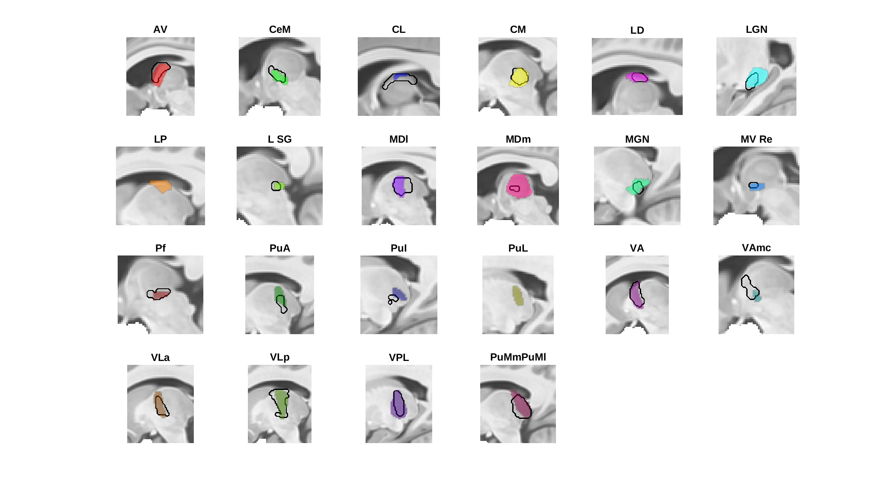
Left Thalamus (sagittal)

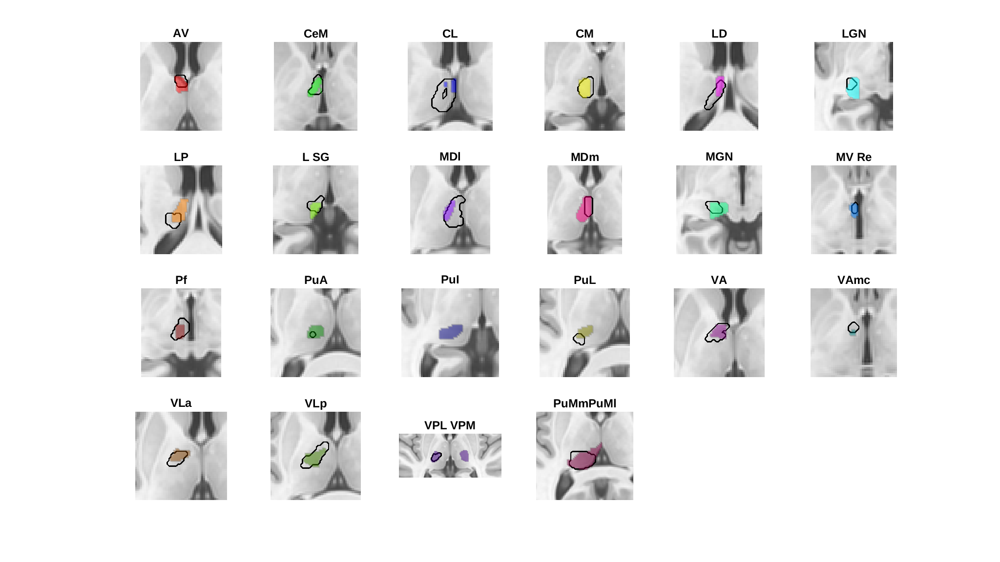
Left Thalamus (coronal)

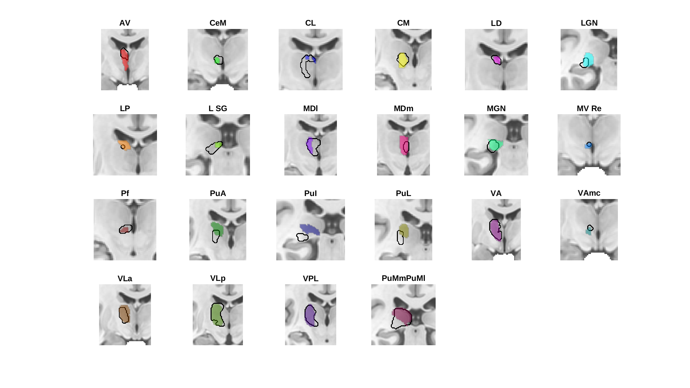
Left Thalamus (axial)

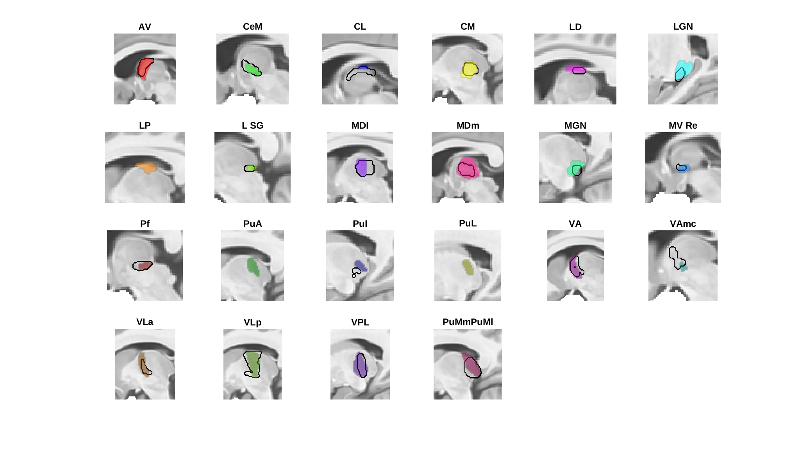
Right Thalamus (sagittal)

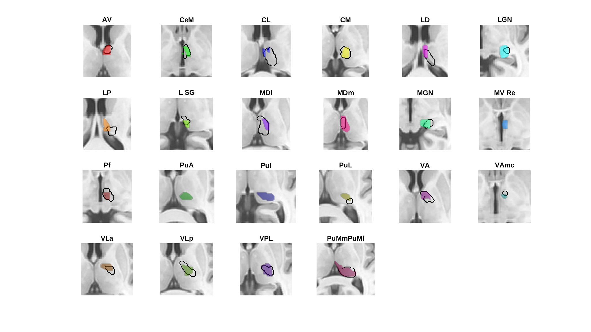
Right Thalamus (coronal)

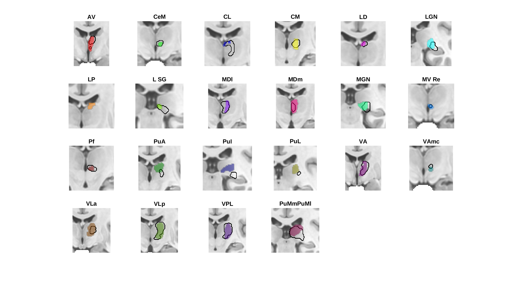
Right Thalamus (axial)

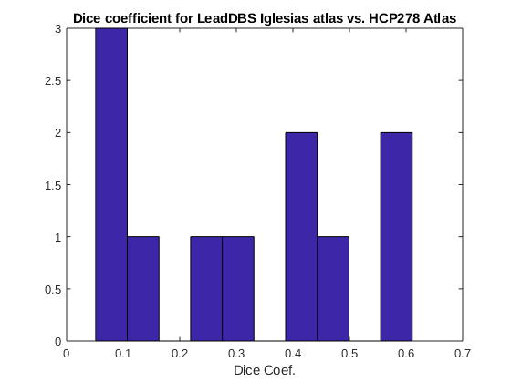

## Comparison with LeadsDBS version

JE Iglesias 'hacked together' a set of probability maps for use in LeadsDBS. I 
(BP) downloaded the software and obtained the probability maps for comparison 
with what I generated from HCP. LeadsDBS atlas is in MNI152NLin2009bAsym space,
which is sufficiently similar to MNI152NLin2009cAsym that I did not realign
any of the data and just compare leads parcels with the HCP278 parcels.

Judging by dice coefficients of thresholded (p>0.2) and binarized parcel masks
and correlations of parcel probability maps, the two segmentations are only
approximately similar. Visual inspection paints a much more generous
picture though. Because I used the DTI informed posteriors I don't have the
exact same set of parcels, but 23 of the parcels are in common, so in the figures
below we consider these. The HCP278 parcellation seems sufficiently similar to
confirm that there were no serious methadological errors in the HCP278 
parcellation approach, and unlike the LeadsDBS data, the methods used to generate
the data are transparent, so for my part (BP) I'm satisfied with the result.

Legend:  
Black outlines - LeadsDBS (p > 0.2)  
Colored Blobs - HCP278 parcellation (p > 0.2)  

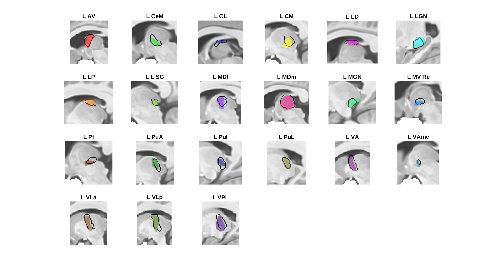
Left Thalamus (sagittal)

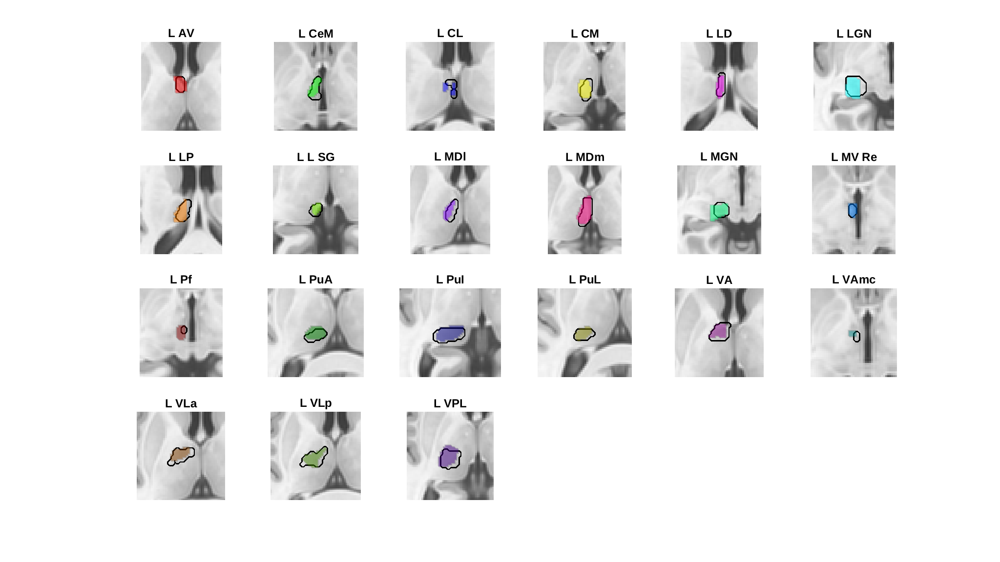
Left Thalamus (coronal)

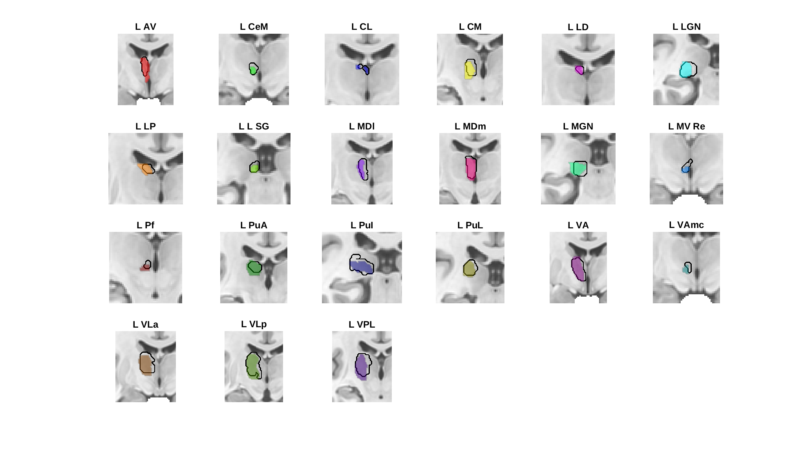
Left Thalamus (axial)

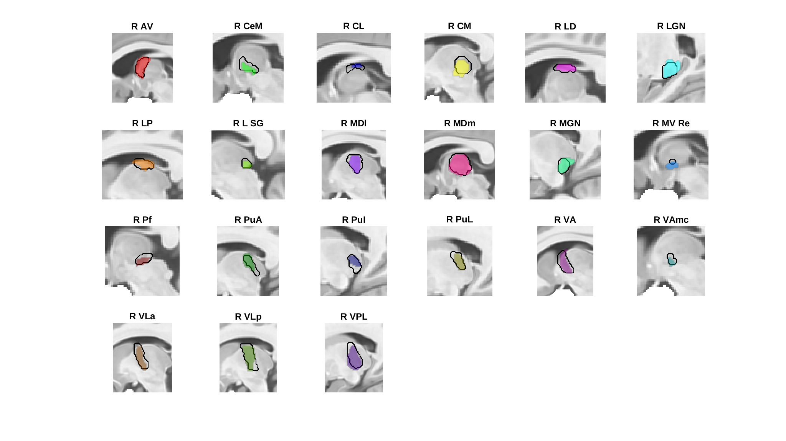
Right Thalamus (sagittal)

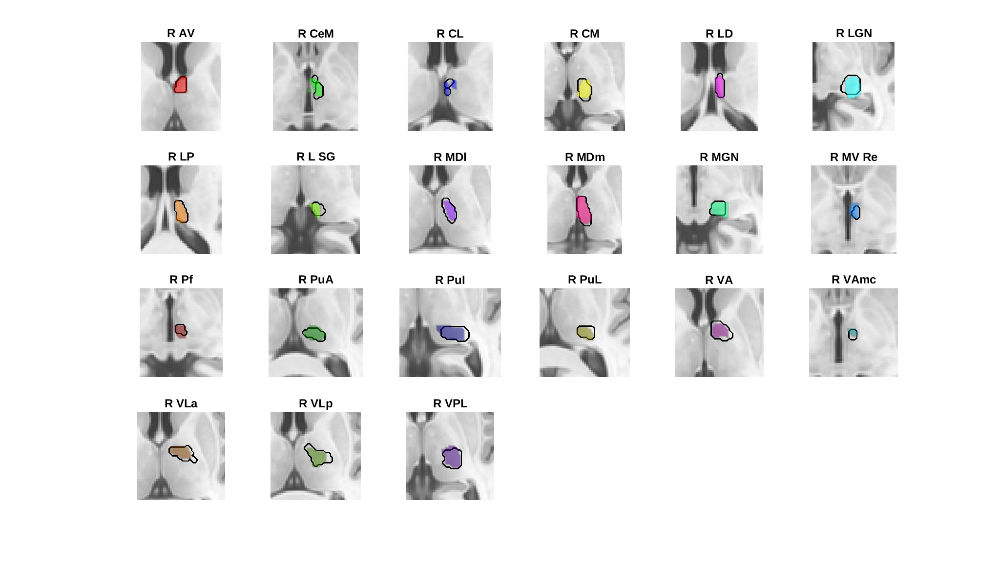
Right Thalamus (coronal)

Right Thalamus (axial)

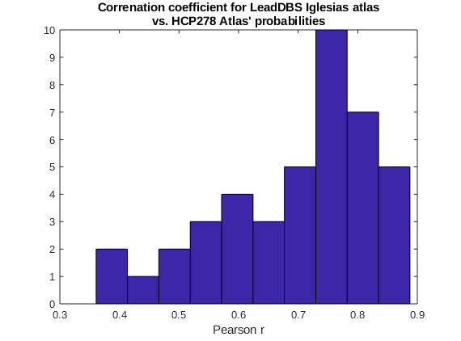

## References

* Iglesias JE, Insausti R, Lerma-Usabiaga G, Bocchetta M, Van Leemput K, Greve DN, van der Kouwe A, Fischl B, Caballero-Gaudes C, Paz-Alonso PM. (2018). A probablistic atlas of the human thalamuc nuclei combining ex vivo MRI and histology. Neuroimage, 314-326, 183.
* Tregidgo HFJ, Soskic S, Althonayan J, Maffei C, Van Leemput K, Golland P, Insausti R, Lerma-Usabiaga G, Caballero-Gaudes C, Paz-Alonso PM, Yendiki A, Alexander DC, Bocchetta M, Rohrer JD, Iglesias JE. (2023). Accurate Bayesian segmentation of thalamic nuclei using diffusion MRI and an improved histological atlas. Neuroimage,  274, 120129.
