## Overview

This is a probablistic atlas meant to correspond to freesurfer's thalamic 
subnuclear parcellations, a joint histologic and in vivo parcellation of the
thalamus into 23 unique regions per hemisphere. It is less granular than 
Morel, but has an open usage license, is probablistic and is likely to be 
more accurately segmented. That notwithstanding, the biological accuracy of 
the labeling hasn't been sufficiently validated in my opinion (nor has any 
other MNI space thalamic atlas), so treat it primarily as an ontology rather 
than something with any kind of granular biological validity.

The probablistic labels are derived from labels produced by application of an
automated bayesian segmentation algorithm to 618 participants from 3 studies.
The most recent versions of the algorithm is robust when given DWI and T1 
data, so if individual parcellations are needed you can obtain them easily.
[Further instructions](https://www.notion.so/Thalamic-Subnuclear-Segmentation-Freesurfer-Iglesias-d44e92d56f124108a2f54018adba42fa?pvs=4) 
are available on the lab Notion page. Personally, I (BP) don't think it's going
to make much of a difference unless you have very high quality T1 images to
work with though, and for most uses this group mean atlas is likely to do just
as well.

## Methods

The probablistic labels are not directly derived from the original Iglesias
et al. (2018) Neuroimage parcellation that is used internally by freesurfer.
Those probablistic labels aren't readily available. They're stored in an
esoteric format interally by freesurfer, and based on personal correspondence
with Iglesias there is no readily available nifti version of the
probablistic labels available for distribution. There is a version available
that's packaged with LeadDBS, but the relationship between this version and
the original probablistic labels isn't clear. Instead, what I (BP) have done
is to fit the freesurfer segmentation to 278 HCP participants, 76 spacetop
participants and 264 paingen participants and use those subject specific labels
to determine probablistic labels for the population.

Atlas labels were generated by running freesurfer's Thalamic segmentation on
T1 and DWI data from 278 unrelated HCP participants, 76 spacetop participants 
(all spacetop participants are unrelated) and 264 unrelated paingen participants. 
DWI data was analyzed using fsl 6.0.4's dtifit. 

Individual segmentations in HCP's acpc_dc pseudo-native space (rigid body transformed 
to align acpc axes, distortion corrected and cropped) were transformed to 
MNI152NLin6Asym space using HCPs precomputed warp fields. QSIPrep was also run and 
rigid body transformations from HCP's ACPC space to QSIPreps ACPC space was computed 
using T1 images in each and ANTs. Other QSIPrep outputs were not used. Transformations 
to MNI152NLin2009cAsym was obtained by concatenating this transform with QSIPreps 
transformation to MNI152NLin2009cAsym. 

For spacetop and paingen all data were run through QSIPrep (v0.16.1) and FMRIPrep 
(v20.2.3) with surface reconstruction. Alignments between QSIPrep's ACPC space and 
FMRIPrep/Freesurfer space were obtained using ANTs and rigid body alignment of T1 
images from QSIPrep and FMRIPrep. Segmentations were performed using Freesurfer 7.4.1's 
mri_segment_thalamic_nuclei_dti_cnn with the v1.1 model patch. Segmentation was 
performed in FMRIPrep's native space and vector images from dtifit were transformed 
using FSL's vecreg. All other transformations were applied using ANTs. Spline 
interpolation was used for upsampling DTI models to T1 native spaces. Spatial 
transformations to MNI152NLin6Asym and MNI152NLin2009cAsym templates were estimated
by fMRIPrep (ANTs) and applied to obtained labels using NearestNeighbor 
interpolation.

Note that for HCP data no other spatial transformations were applied to the data 
except for a subject specific projection from HCP's acpc_dc space to standard space 
using HCPs precomputed warp matrices (a single interpolation step). For instance
DWI data was already in alignment with T1w data in the HCP acpc_dc space, so
even though the Freesurfer docs recommend aligning the T1w data to the DWI data
we did not need to perform this step, and it seemed safer to use HCPs minimally
preprocessed data as our starting point rather than going back to raw data, 
attempting to perform all their esoteric preprocessing steps and then performing the 
segmentation in the native DWI space.

Meanwhile for PainGen and Spacetop data we did could have performed segmentation
in the DWI space, but performed it in FMRIPrep's space arbitrarily since we had
both template transforms available there while we only had transformations to
MNI152NLin2009cAsym from QSIPrep.

## Veracity of the atlas

TL;DR: You should treat this primarily as an ontology as opposed to biologically
accurate labeling. Treat the subnuclear boundaries with a certain degree of 
skepticism and try to validate any neurobiological claims you main pertaining
to this localization by appeal to additional criteria. Despite the large sample
used here, the atlas boundaries are likely to be primarily driven by the source
histlogical sections and contrast images used during the original atlas 
construction by Iglesias et al. (2018) (the priors) rather than by our data. If
neurobiological claims are necessary, try to restrict yourself to the labels_3
level of granularity where at least the parcel boundaries can be corroborated
by features visible in group mean contrast maps.

How well calibrated should you take the atlas probabilities to be? How much
confidence should you have in the parcel boundaries here? The use of a large
training sample (N=618) and multiple studies (3x) should give you a high
degree of confidence in both of these factors, but only if the individualized
parcellations are accurate to begin with. They could all just be slight updates to
the model priors, or they could contribute substantial new information and produce
highly accurate individualized segmetations. So which is it?

Although visual inspection of individuals' parcellations confirms that the thalamic 
boundaries are all sensible I don't have a good enough eye for intrathalamic nuclear 
boundaries to determine whether or not they're correctly or simply arbitrarily placed 
by the algorithm on a per-subject basis. Even the proverbial "expert anatomist" would 
struggle because the contrast images available aren't quite good enough to discern 
many of the anatomical boundaries, hence the use of histology derived Bayesian priors 
in the segmentation model. The original methods paper also did not rigorously test 
the veracity of individualized parcel boundaries. They merely showed that a multivariate
region based volumetric pattern produced better descrimination of alzheimers patients
from controls than thalamic volume alone, which isn't a particularly convincing
argument for the posterior boundary accuracy. It's likely any multivariate measure 
would have done better than a univariate measure at discriminating alzheimers from
controls.

We can evaluate functional homogeneity across participants as a potential measure
of boundary quality. Individual parcels are not fully aligned between participants 
by standard spatial normalization techniques, hence the probabilities associated
with the parcel labels in this atlas (if alignment were perfect all probabilities for
all labels would be 1). Signals obtained from individualized parcellations should 
therefore be more homogeneous across participants than signals obtained from the 
group parcels. We therefore take task evoked responses from SpaceTop (Pain, Vicarious 
and Cognitive) and estimate the mean parcel task evoked response for each in each 
thalamic region in each of the 76 particpants segmented using both individual parcellations 
and a group parcellation. We then evaluate the effect of parcellation type and the
interaction between task x parcellation type for each region. We would expect to see 
larger regional effects with the individualized parcellation due 
to constructive amplification while we expect lower regional effects in the group 
parcellation due to destructive interference of signals from heterogenous sources 
("blurring"). We also expect task differences between regions to be greater in the 
individualized parcellation (significant interactions) for the same reason.

First level GLM contrasts were estimated using task evoked responses taken
with respect to baseline, controling for 24 motion parameters and CSF, and using a 
canonical HRF for convolution. Data was unsmoothed. Of the 76 participants with individual 
parcellations, 73 of them had task contrasts available (the other three were presumably 
missing BOLD data, I ran all that I could).

A mixed effects model was fit to predict mean regional BOLD at the "second level" for each 
parcel using either an individualized parcellation or a group parcellation. Subjects were 
treated as random effectively turning this into a within subjects repeated measures 
analysis, although this isn't clearly illustrated in the figures below, so take note now.
Task contrasts were coded pain = [1/2, -1/3] vic = [-1/2, -1/3], cog = [0, 2/3] which 
yeilded two planned contrasts: pain_v_vic and pain_vic_v_cog. A parcellation variable was 
also coded as [1/2, -1/2] for the individual vs. group parcellation (resp). In Wilkinson 
notation the model took the form,

BOLD ~ parcellation + pain_v_vic + pain_vic_v_cog + parcellation:pain_v_vic + parcellation:pain_vic_v_cog

For clarity of results, the model was modified by removing the intercept (mean region
BOLD) and introducing a unit region variable, which results in model output that lists
the region name instead of "(intercept)", but is otherwise identical so long as a
"region_var_name:" term is prefixed to each of the above variables. This doesn't really
matter here, but if you look at the [published html](html/subnuclear_parcellation_test_2.html) 
it's important to note.

Models were fit separately for each region using restricted expectation maximum 
likelihood (ReML) and full covariance estimation. Satterthwaites correction was used to 
estimate degrees of freedom, and in most cases yeilded n-1 degrees of freedom, but due 
to some regions missing in some individual parcellations the df are also somewhat variable.
This is precisely what we would expect for a repeated measures analysis.

Contrasts were estimated using a canonical GLM model of task evoked responses taken
with respect to baseline. Of the 76 participants with individual parcellations,
73 of them had task contrasts available (the other three were presumably missing
BOLD data, I ran all that I could).

The results are very mixed. With 46 regions our Holm-Sidak corrected p-value 
theshold is p < 0.0011 for alpha=0.05.

Regions with lower evoked response across tasks using individualized parcellations (unexpected):
- central_medial_(left) 
- centromedian_(left) 
- Mediodorsal_medial_magnocellular-like_(left) 
- medial_geniculate_(left) 
- parafascicular_(left) 
- centromedian_(right) 
- medial_geniculate_(right) 

Regions	with lower pain vs. vic task contrast using individualized parcellation:
- ventral_posterolateral_and_ventral_posteromedial_(left) 
- ventral_anterior_(right) 

Regions	with lower mean(pain & vic) vs.	cog task contrast using	individualized parcellation:
- limitans (suprageniculate) (left) 
- medial geniculate (right)  

Region with greater evoked response across tasks using individualized parcellation (expected):
- ventral_lateral_anterior_(left) 
- ventral_lateral_posterior_(left) 
- Pulvinar_medial_(medial_subdivision)_(left) 
- Pulvinar_medial_(lateral_subdivision)_(left) 
- Pulvinar_inferior_(right) 
- Pulvinar_lateral_(right) 
- ventral_lateral_anterior_(right) 
- ventral_lateral_posterior_(right) 
- Pulvinar_medial_(lateral_subdivision)_(right)

Regions with greater mean(pain & vic) vs. cog task contrast using individualized parcellation:
- ventral posterolateral & ventral posteromedial (left) 
- mediodorsal (median partition, magnocellular-like) (right) 
- ventral lateral, anterior (right)  

I'm not entirely sure what to make of this. It seems sensible, particularly since the greatest
effects are the decreased contrast in the medial geniculate nucleus, where we should have
no signal for these tasks, but the differences are extremely small. Here are some figures
showing the largest three effect sizes I see.

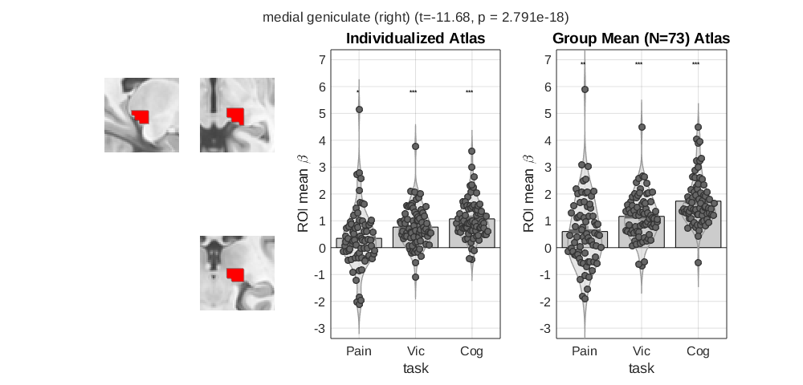
Average contrast across tasks is reduced in medial geniculate nucleus by using individualized parcellations.

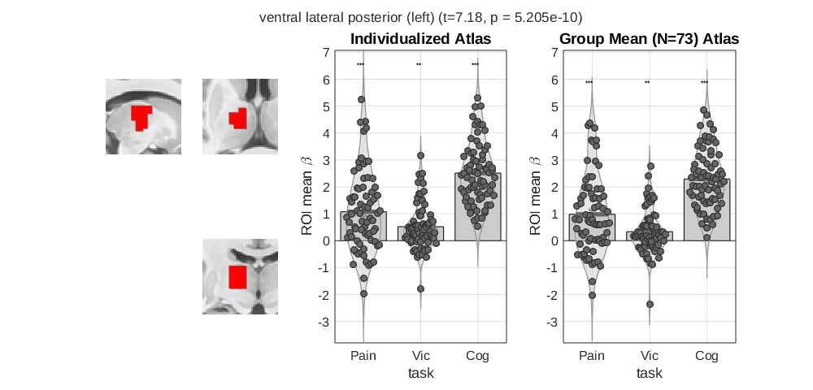
Average contrast in ventral lateral posterior (VLp) thalamus is increased by using individualized parcellations.

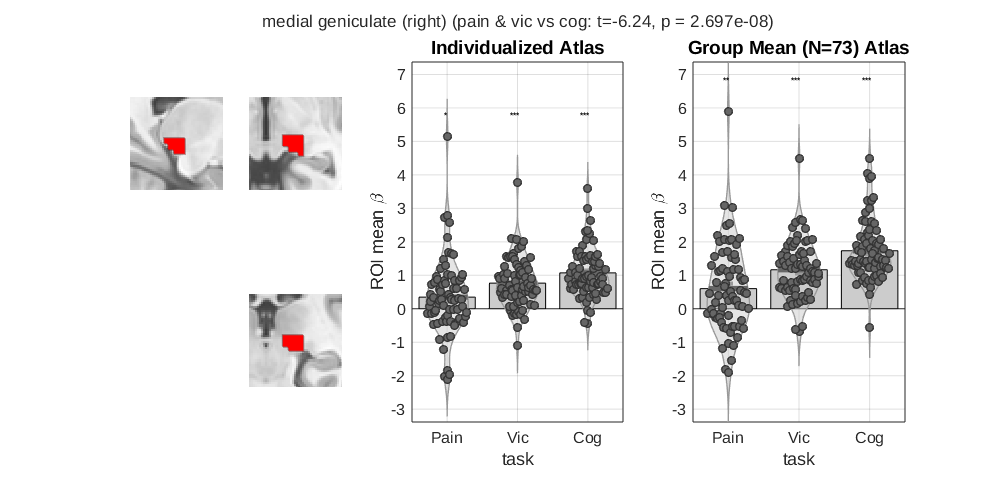
The difference between cog and the other two tasks is reduced in the medial geniculate nucleus by using individualized parcellations. 

I also tried testing a multivariate version of this by comparing the individualized regions to the
group regions' means for performance in 10-fold cross validated prediction of task. I
got indistinguishable loss (~0.15 +/- 0.01 depending on kfold slicing, chance 
= 0.667) in both cases.

It's possible this would matter more in large datasets, or that the difference would be greater 
with better quality data, where the posterior parcel labels can be driven more by the data
than the priors than they are here, I don't know. Bottom line, don't get hung up on the parcel
boundaries or probabilities in this atlas. Just use them instrumentally, e.g. for a principled
ontology or erosion/dilation of regions, or coarsely, e.g. for delineation of boundaries 
between the thalamus and surrounding white matter tracks, or perhaps large subdivisions like
those of the coarser labels (stored in the labels_3 property). The latter you can easily 
verify for yourself since they line up nicely with structures visible in the MNI152NLin2009cAsym
tempalate (below).

## Labels

Labels were grouped at successive levels of granularity. 
* labels 1: maximal level provided by the histological segmentations that determine the
priors freesurfer used. 
* labels 2: a slight adjustment to group subdivisions 
of nuclei (e.g. lateral/median, parvocellular, magnocellular), etc. 
* labels 3: based on the manual segmentation of Tregidgo (2023) Neuoimage, which 
represents nuclei that can be distinguished based on MR contrast alone (in
T1, T2 or FA data) and was used as the gold standard comparator for evaluating
the histological segmentations during development of the freesurfer algorithm.
* labels 4: the subdivision from iglesias 2018 Table 2.

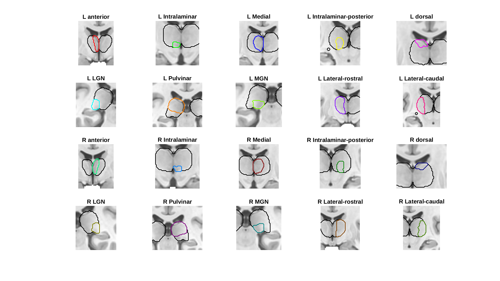
Note how with the labels_3 parcellation you can see structures circumstribed by atlas
boundaires in the MNI152NLin2009cAsym atlas (it's most obvious if you compare with the 
contralateral thalamus, e.g. anterior, medial and MGN nuclei). These plots were produced 
by the following command if you want to inspect these further,

atlas_obj.downsample_parcellation('labels_3').threshold(0.2).montage('regioncenters','outline',[0,0,0],'coronal')

## Comparison with Morel

The morel atlas is the most detailed histological atlas available in MNI space.
Its major limitation is that it is based on 6 participants (or maybe 3 and
mirror imaged, unclear), is not probablistic, and lacks an open license. The 
Iglesias atlas is based on 12 participants (or maybe 6 and mirror imaged) 
augmented by 55 in vivo scans that are used to calibrate probabilistic maps. 
In our case these are further mediated by projection to 278 individual's 
segmentations. That said, the number of thalamic regions that Iglesias et al 
(2018) Neuroimage could distinguish are fewer than those of the Morel atlas. 
The following equivalence mapping may be helpful for comparing and contrasting 
the resultant parcellations from each.

Morel -> Iglesias:  
AD AM, AV -> AV  
Hb -> Missing  
LGNmc, LGNpc -> LGN  
LP (more lateral) -> LP (more medial)  
Li, SG -> L-SG  
MDmc -> MDm  
MDpc -> MDl  
PuI + Po -> PuI  
PuM -> PuMm PuMl  
RN -> Missing  
STh -> Missing  
VLpd, VLpv, VM -> VLp  
VPLa, VPLp, VPI, VPM -> VPL  
mtt -> Missing (this is a white matter tract though, not a nucleus)  

A direct comparison of regions, grouped by the above equivalence relationships
reveals rough colocalization of ROIs across this atlas and Morel's,
but also substantial differences in many cases, particularly in the case of 
subdivisions of the pulvinar, the location of the lateral posterior nucleus, 
and the extent of the central lateral nucleus.

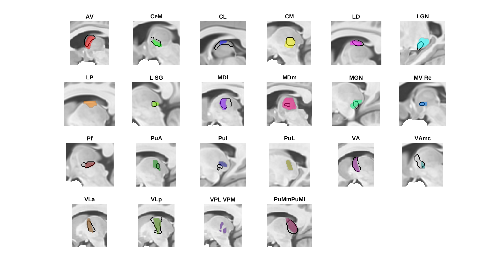
Left Thalamus (sagittal)

Left Thalamus (coronal)

Left Thalamus (axial)

Right Thalamus (sagittal)

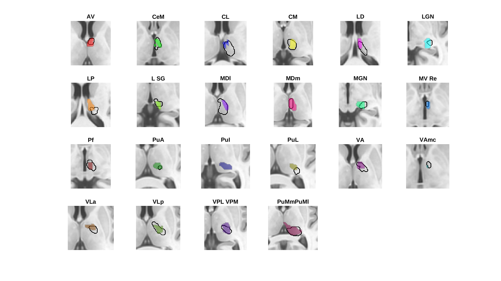
Right Thalamus (coronal)

Right Thalamus (axial)

## Comparison with LeadsDBS version

JE Iglesias made a first pass effort to assemble a set of probability maps for 
use in LeadsDBS. I (BP)  downloaded the software and obtained the probability maps 
for comparison with what I generated from HCP. LeadsDBS atlas is in 
MNI152NLin2009bAsym space, which is sufficiently similar to MNI152NLin2009cAsym 
that I did not realign any of the data and just compare leads parcels with the 
parcels in my version.

Judging by dice coefficients of thresholded (p>0.2) and binarized parcel masks
and correlations of parcel probability maps, the two segmentations are only
approximately similar. Visual inspection paints a much more generous
picture though. Because I used the DTI informed posteriors I don't have the
exact same set of parcels, but 23 of the parcels are in common, so in the figures
below we consider these. The present parcellation seems sufficiently similar to
confirm that there were no serious methadological errors in the current 
parcellation approach, and unlike the LeadsDBS data, the methods used to generate
the data are transparent, so for my part (BP) I'm satisfied with the result.

Legend:  
Black outlines - LeadsDBS (p > 0.2)  
Colored Blobs - The current parcellation (p > 0.2)  

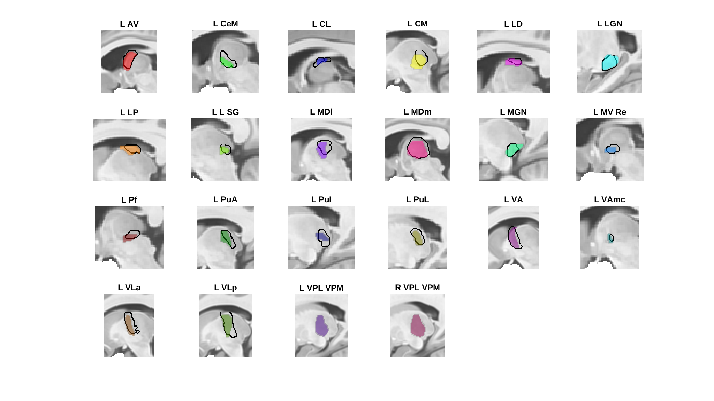
Left Thalamus (sagittal)

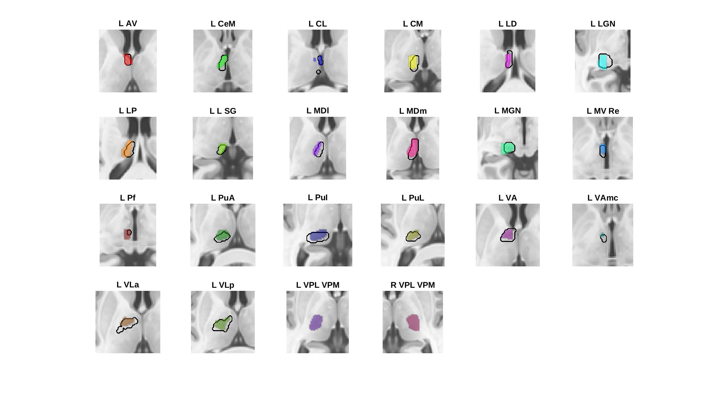
Left Thalamus (coronal)

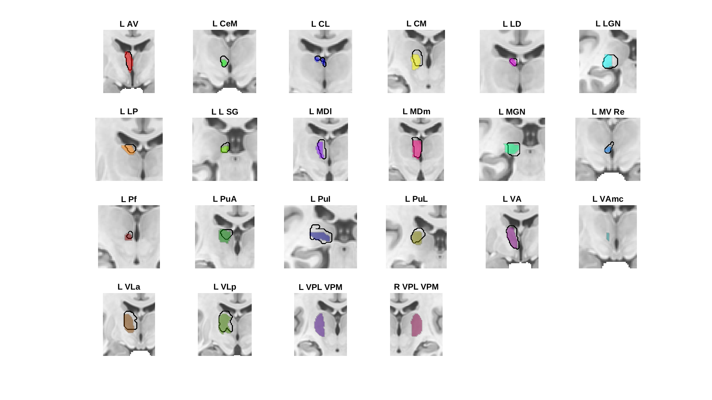
Left Thalamus (axial)

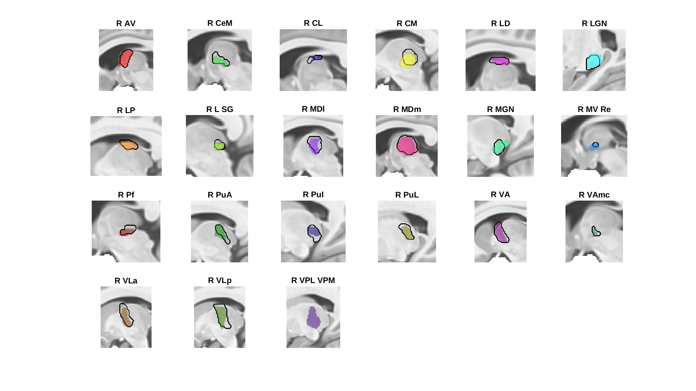
Right Thalamus (sagittal)

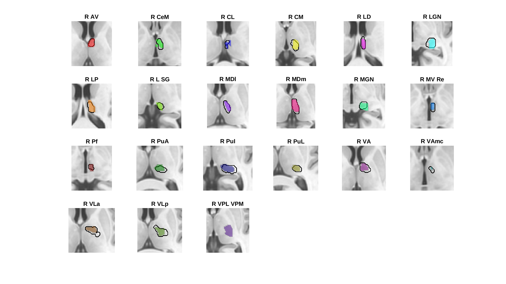
Right Thalamus (coronal)

Right Thalamus (axial)

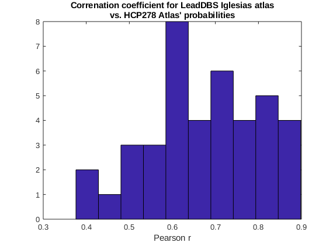

## References

* Iglesias JE, Insausti R, Lerma-Usabiaga G, Bocchetta M, Van Leemput K, Greve DN, van der Kouwe A, Fischl B, Caballero-Gaudes C, Paz-Alonso PM. (2018). A probablistic atlas of the human thalamuc nuclei combining ex vivo MRI and histology. Neuroimage, 314-326, 183.
* Tregidgo HFJ, Soskic S, Althonayan J, Maffei C, Van Leemput K, Golland P, Insausti R, Lerma-Usabiaga G, Caballero-Gaudes C, Paz-Alonso PM, Yendiki A, Alexander DC, Bocchetta M, Rohrer JD, Iglesias JE. (2023). Accurate Bayesian segmentation of thalamic nuclei using diffusion MRI and an improved histological atlas. Neuroimage,  274, 120129.
