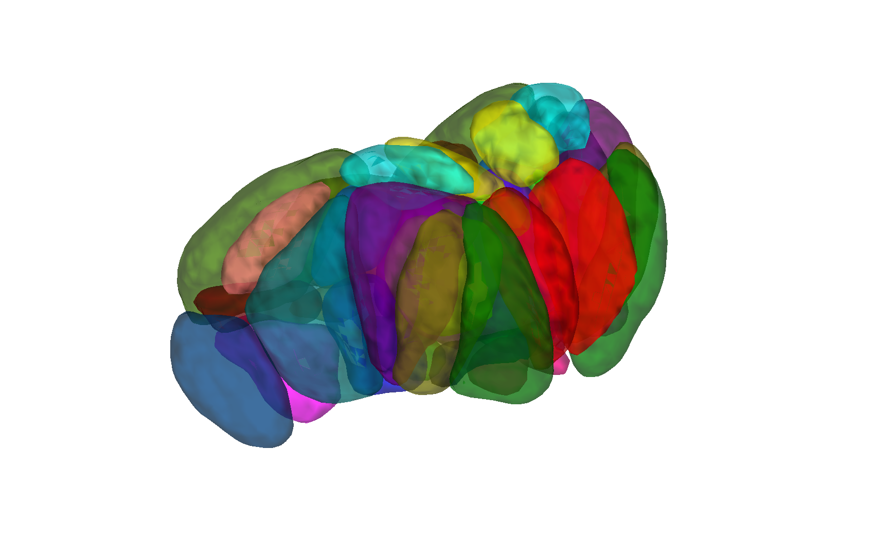

# Iglesias thalamic nuclei reconstruction (Iglesias et al. 2018)

## Overview

A **probabilistic MNI-space atlas** of thalamic nuclei matching
**FreeSurfer's** joint histologic + in-vivo Bayesian thalamic
segmentation (Iglesias et al. 2018), reconstructed by CANlab. The
parcellation labels **~23 nuclei per hemisphere**. Probabilistic
labels are not directly distributed by FreeSurfer; this build fits
FreeSurfer's segmentation pipeline to **278 HCP + 76 SpaceTop + 264
PainGen** participants (N=618) and averages the per-subject
parcellations to obtain population probability maps. Less granular
than Morel but with an open license and (in BP's assessment) more
accurate segmentations.

> See [`README.md`](./README.md) for the authoritative methods
> write-up, veracity assessment, and validation comparisons with
> LeadDBS / Morel. Validation scripts are
> [`compare_with_leadDBS_version.m`](./compare_with_leadDBS_version.m)
> and [`compare_with_morel.m`](./compare_with_morel.m).
> Per-template constructors are
> [`iglesias_MNI152NLin2009cAsym_create_atlas.m`](./iglesias_MNI152NLin2009cAsym_create_atlas.m)
> and
> [`iglesias_MNI152NLin6Asym_create_atlas.m`](./iglesias_MNI152NLin6Asym_create_atlas.m).
> Rendered diagnostic HTML lives in [`html/`](./html); build helpers
> in [`src/`](./src).

The companion **Iglesias hypothalamus atlas** lives in
[`../2020_iglesias_hypothalamus/`](../2020_iglesias_hypothalamus).

## Primary reference

Iglesias, J. E., Insausti, R., Lerma-Usabiaga, G., Bocchetta, M.,
Van Leemput, K., Greve, D. N., van der Kouwe, A., et al. (2018). *A
probabilistic atlas of the human thalamic nuclei combining ex vivo
MRI and histology.* **NeuroImage, 183**, 314–326.
[doi:10.1016/j.neuroimage.2018.08.012](https://doi.org/10.1016/j.neuroimage.2018.08.012)

## Key images

| Axial+sagittal montage (fmriprep) | 3-D isosurface (fmriprep) |
| --- | --- |
|  |  |

The MNI152NLin2009cAsym (fmriprep) build of the Iglesias thalamic
nuclei reconstruction. The MNI152NLin6Asym (FSL6) build and the
detailed HCP278/ST76/PG264 multi-nucleus parcellation are also in
`png_images/`; produced by [`visualize_contents.m`](./visualize_contents.m).

## How to load

Use the CANlab Core
[`load_atlas`](https://github.com/canlab/CanlabCore/blob/master/CanlabCore/Data_extraction/load_atlas.m)
keywords:

```matlab
atl = load_atlas('iglesias_thal');             % default = fmriprep20
atl = load_atlas('iglesias_thal_fmriprep20');  % MNI152NLin2009cAsym
atl = load_atlas('iglesias_thal_fsl6');        % MNI152NLin6Asym
```

Or load the `.mat` directly:

```matlab
S = load('iglesias_HCP278_ST76_PG264_MNI152NLin2009cAsym_atlas_object.mat');
atl = S.atlas_obj;
```

## File inventory

| File | Type | What it is |
| --- | --- | --- |
| `iglesias_HCP278_ST76_PG264_MNI152NLin2009cAsym_atlas_object.mat` | MAT (`atlas`) | Thalamic atlas in fmriprep default space. `load_atlas('iglesias_thal_fmriprep20')`. |
| `iglesias_HCP278_ST76_PG264_MNI152NLin6Asym_atlas_object.mat` | MAT (`atlas`) | Thalamic atlas in FSL default space. `load_atlas('iglesias_thal_fsl6')`. |
| `iglesias_HCP278_ST76_PG264_MNI152NLin2009cAsym_atlas_regions.{img,hdr,mat}` | Analyze + MAT | Per-region probability maps (fmriprep). |
| `iglesias_HCP278_ST76_PG264_MNI152NLin6Asym_atlas_regions.{img,hdr,mat}` | Analyze + MAT | Per-region probability maps (FSL). |
| `iglesias_MNI152NLin2009cAsym_create_atlas.m` | MATLAB | Constructor for fmriprep20 build. |
| `iglesias_MNI152NLin6Asym_create_atlas.m` | MATLAB | Constructor for FSL6 build. |
| `compare_with_leadDBS_version.m` | MATLAB | Validation vs. LeadDBS Iglesias copy. |
| `compare_with_morel.m` | MATLAB | Validation vs. Morel thalamic atlas. |
| `html/` | dir | Rendered diagnostic HTML reports. |
| `src/` | dir | Helper scripts for the FreeSurfer-fitting pipeline. |
| `png_images/` | dir | Pre-rendered montage + isosurface figures (regenerated by `visualize_contents.m`). |
| `README.md` | Markdown | **Authoritative methods + veracity assessment.** |
| `visualize_contents.m` | MATLAB | Regenerates `png_images/`. |

## Citations

- Iglesias JE, Insausti R, Lerma-Usabiaga G, et al. (2018). A
  probabilistic atlas of the human thalamic nuclei combining ex vivo
  MRI and histology. *NeuroImage* 183:314–326.
  [doi:10.1016/j.neuroimage.2018.08.012](https://doi.org/10.1016/j.neuroimage.2018.08.012)
- Tregidgo HFJ, Soskic S, Althonayan J, et al. (2023). Domain-agnostic
  segmentation of thalamic nuclei from joint structural and diffusion
  MRI. *Hum Brain Mapp* 44:1–17.
  [doi:10.1002/hbm.26474](https://doi.org/10.1002/hbm.26474)
- Krauth A, Blanc R, Poveda A, Jeanmonod D, Morel A, Székely G (2010).
  A mean three-dimensional atlas of the human thalamus. *NeuroImage*
  49:2053–2062.
  [doi:10.1016/j.neuroimage.2009.10.042](https://doi.org/10.1016/j.neuroimage.2009.10.042)
