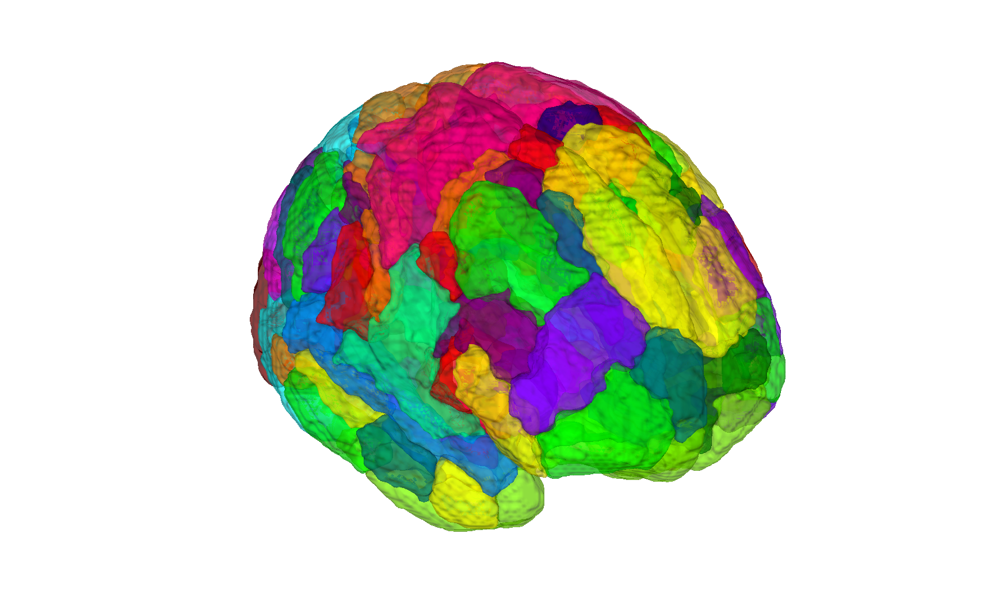

# Schaefer/Yeo multi-resolution cortical parcellation (Schaefer et al. 2018)

## Overview

The **Schaefer-Yeo cortical parcellation** is a multi-resolution
**local-global** parcellation of the cerebral cortex derived from
resting-state fMRI (N=1489) using a gradient-weighted Markov Random
Field. Parcels honour both local functional homogeneity and the
**Yeo 7/17-network** community structure. Resolutions are available
from 100 to 1000 parcels; this folder ships the **400-parcel,
17-network** variant in MNI152 space.

The CANlab build wraps the parcellation as two CANlab `atlas` objects:

- `Schaefer2018Cortex_atlas_object.mat` — default 400-parcel object
- `Schaefer2018Cortex_17networks_atlas_object.mat` — same parcels with
  the 17-network community ID embedded as the primary label

Constructors: [`Schaefer_create_atlas_object.m`](./Schaefer_create_atlas_object.m)
and [`schaefer_atlas_create_17_networks_LR.m`](./schaefer_atlas_create_17_networks_LR.m).

The Yeo network mapping per parcel is documented in
[`Yeo2011_17networks_N1000.split_components.glossary.csv`](./Yeo2011_17networks_N1000.split_components.glossary.csv).
Yeo surface reference images are in
[`yeo17networks_surface_images/`](./yeo17networks_surface_images).

## Primary reference

Schaefer, A., Kong, R., Gordon, E. M., Laumann, T. O., Zuo, X.-N.,
Holmes, A. J., Eickhoff, S. B., & Yeo, B. T. T. (2018).
*Local-global parcellation of the human cerebral cortex from
intrinsic functional connectivity MRI.* **Cerebral Cortex, 28**(9),
3095–3114.
[doi:10.1093/cercor/bhx179](https://doi.org/10.1093/cercor/bhx179)

## Key images

| Schaefer 400 parcels (montage) | Yeo 17 networks (montage) |
| --- | --- |
|  |  |
|  |  |

The 400-parcel cortical solution and the 17-network community
labelling. Produced by [`visualize_contents.m`](./visualize_contents.m).
Author-supplied per-network surface PNGs additionally live in
[`yeo17networks_surface_images/`](./yeo17networks_surface_images).

## How to load

Use the CANlab Core
[`load_atlas`](https://github.com/canlab/CanlabCore/blob/master/CanlabCore/Data_extraction/load_atlas.m)
keyword:

```matlab
atl = load_atlas('yeo17networks');  % Schaefer2018Cortex_17networks_atlas_object.mat
```

Or load the `.mat` directly:

```matlab
S = load('Schaefer2018Cortex_atlas_object.mat');                % 400 parcels
atl = S.atlas_obj;

S = load('Schaefer2018Cortex_17networks_atlas_object.mat');     % 17 networks
atl = S.atlas_obj;
```

Or read the raw NIfTI:

```matlab
obj = fmri_data('Schaefer2018_400Parcels_17Networks_order_FSLMNI152_2mm.nii.gz');
```

## File inventory

| File | Type | What it is |
| --- | --- | --- |
| `Schaefer2018Cortex_atlas_object.mat` | MAT (`atlas`) | 400-parcel CANlab atlas object. |
| `Schaefer2018Cortex_atlas_regions.mat` | MAT (`region`) | Per-region `region` array (400 parcels). |
| `Schaefer2018Cortex_17networks_atlas_object.mat` | MAT (`atlas`) | Same parcels relabeled with 17-network community IDs. `load_atlas('yeo17networks')`. |
| `Schaefer2018Cortex_17networks_atlas_regions.mat` | MAT (`region`) | 17-network `region` array. |
| `Schaefer2018_400Parcels_17Networks_order_FSLMNI152_2mm.nii.gz` | NIfTI | Original 400-parcel hard-parcellation NIfTI (FSL MNI152 2 mm). |
| `Schaefer2018_400Parcels_17Networks_order.txt` | text | Per-parcel index → label/colour table. |
| `Schaefer_create_atlas_object.m` | MATLAB | Constructor for the 400-parcel atlas. |
| `schaefer_atlas_create_17_networks_LR.m` | MATLAB | Constructor for the 17-network LR build. |
| `Yeo2011_17networks_N1000.split_components.glossary.csv` | CSV | Yeo network → community-name glossary. |
| `yeo17networks_surface_images/` | dir | Author-supplied per-network cortical-surface PNGs. |
| `visualize_contents.m` | MATLAB | Writes `png_images/`. |

## Citations

- Schaefer A, Kong R, Gordon EM, et al. (2018). Local-global
  parcellation of the human cerebral cortex from intrinsic functional
  connectivity MRI. *Cereb Cortex* 28:3095–3114.
  [doi:10.1093/cercor/bhx179](https://doi.org/10.1093/cercor/bhx179)
- Yeo BT, Krienen FM, Sepulcre J, et al. (2011). The organization of
  the human cerebral cortex estimated by intrinsic functional
  connectivity. *J Neurophysiol* 106:1125–1165.
  [doi:10.1152/jn.00338.2011](https://doi.org/10.1152/jn.00338.2011)
