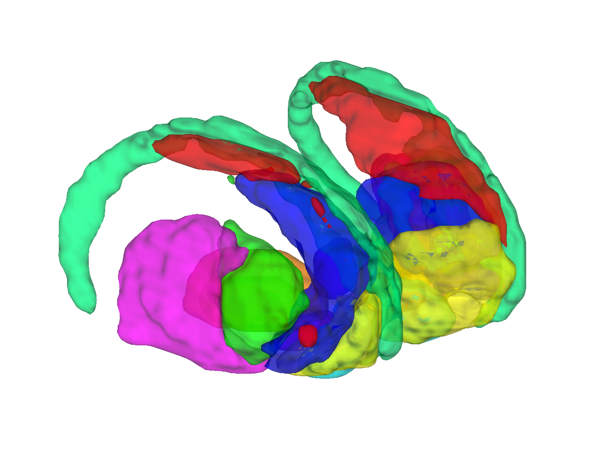
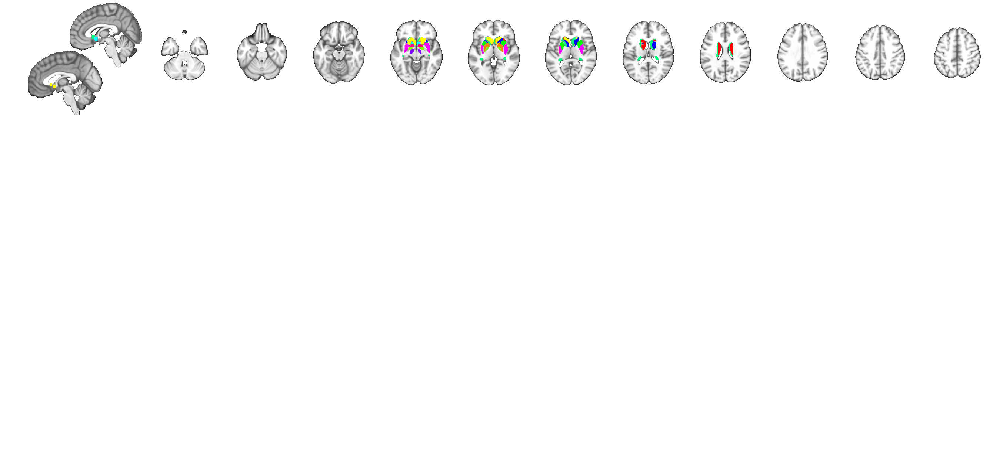

# CANlab 2018 combined whole-brain atlas (Wager lab)

## Overview

The **CANlab 2018 combined atlas** is the original Wager-lab
**whole-brain composite atlas**, stitched together from multiple
published, expert-validated parcellations:

- **Cortex** — Glasser HCP-MMP1 (Glasser et al. 2016) volumetric
  projection.
- **Striatum** — Pauli 2016 basal-ganglia parcels.
- **Thalamus** — Morel atlas (Krauth et al. 2010).
- **Basal ganglia / extended subcortex** — combined from CIT168 +
  ad-hoc CANlab labels.
- **Brainstem** — combined CANlab brainstem (PAG, RVM, NRM, NCS, LC,
  DR, MR, SN, VTA, etc.) sourced from multiple published atlases.
- **Cerebellum** — SUIT-style cerebellar lobules.

This atlas is the **predecessor** to the more recent CANlab 2023 and
2024 atlases (see `../2023_CANLab_atlas/` and
`../2024_CANLab_atlas/`) and is still used for back-compatibility.
The 1 mm `CANlab_combined_atlas_object_2018.mat` and the downsampled
2 mm `CANlab_combined_atlas_object_2018_2mm.mat` are the two main
entry points. The legacy `Thalamus_combined_atlas_object.mat`,
`Basal_ganglia_combined_atlas_object.mat`, and
`brainstem_combined_atlas_object.mat` are individual building blocks
that `load_atlas` exposes under their own keywords.

> Main constructor: [`script_2018_Wager_combined_atlas.m`](./script_2018_Wager_combined_atlas.m).
> Sub-atlas constructors:
> [`create_brainstem_atlas.m`](./create_brainstem_atlas.m),
> [`create_basal_ganglia_atlas.m`](./create_basal_ganglia_atlas.m),
> [`create_thalamus_atlas.m`](./create_thalamus_atlas.m).
> Relabeling helper:
> [`plugin_canlab_atlas_2018_relabel_larger_units.m`](./plugin_canlab_atlas_2018_relabel_larger_units.m).
> Author-curated PowerPoint of region subset graphics:
> `canlab_atlas_region_subset_graphics.pptx`.
> Older versions are archived in [`old/`](./old).

## Primary references

This is a derivative atlas; cite the source atlases (see Citations
below). For the combined CANlab build:

- Wager, T. D., and CANlab (2018). CANlab combined whole-brain atlas.
  In: *Neuroimaging Pattern Masks* repository,
  [`Atlases_and_parcellations/2018_Wager_combined_atlas`](./).

## Key images

Pre-rendered figures in [`png_images/`](./png_images):


*Axial+sagittal montage of the full combined atlas.*



*Isosurface of the Glasser HCP-MMP1 cortical component (as embedded in
the combined atlas).*



*Axial+sagittal montage of the Glasser HCP-MMP1 cortical component.*


*Isosurface of the Pauli 2016 basal-ganglia / striatum component.*


*Axial+sagittal montage of the Pauli 2016 striatum component.*


*Axial+sagittal montage of the combined CANlab brainstem sub-atlas.*

[`visualize_contents.m`](./visualize_contents.m) regenerates these
PNGs and adds isosurface views for the combined atlas and thalamus.

## How to load

Use the CANlab Core
[`load_atlas`](https://github.com/canlab/CanlabCore/blob/master/CanlabCore/Data_extraction/load_atlas.m)
keywords:

```matlab
atl = load_atlas('canlab2018');         % 1 mm combined atlas
atl = load_atlas('canlab2018_2mm');     % 2 mm combined atlas

% Component sub-atlases:
atl = load_atlas('thalamus');           % Morel-derived Thalamus_combined_atlas_object.mat
atl = load_atlas('striatum');           % Pauli 2016 striatum
atl = load_atlas('pauli_bg');           % same alias
% Basal ganglia / brainstem components are wrapped in canlab2018 itself.
```

Or load the `.mat` directly:

```matlab
S = load('CANlab_combined_atlas_object_2018.mat');
atl = S.atlas_obj;

obj = fmri_data('CANlab_2018_combined_atlas.nii.gz');   % hard-parcellation NIfTI
```

## File inventory

| File | Type | What it is |
| --- | --- | --- |
| `CANlab_combined_atlas_object_2018.mat` | MAT (`atlas`) | 1 mm combined atlas. `load_atlas('canlab2018')`. |
| `CANlab_combined_atlas_object_2018_2mm.mat` | MAT (`atlas`) | 2 mm combined atlas. `load_atlas('canlab2018_2mm')`. |
| `CANlab_2018_combined_atlas.nii.gz` | NIfTI | Hard-parcellation NIfTI (1 mm). |
| `CANlab_2018_combined_atlas_2mm.nii.gz` | NIfTI | Hard-parcellation NIfTI (2 mm). |
| `Thalamus_combined_atlas_object.mat` | MAT (`atlas`) | Morel-derived thalamus sub-atlas. `load_atlas('thalamus')`. |
| `Morel_Thalamus_main_body_region_and_atlas_obj.mat` | MAT | Morel thalamus main-body region/atlas object. |
| `Basal_ganglia_combined_atlas_object.mat` | MAT (`atlas`) | Combined basal-ganglia sub-atlas. |
| `brainstem_combined_atlas_object.mat` | MAT (`atlas`) | Combined CANlab brainstem sub-atlas. |
| `brainstem_combined_atlas_regions.mat` | MAT (`region`) | Brainstem `region` array. |
| `brainstem_combined_isosurface.png` | PNG | Standalone brainstem isosurface figure (top-level copy). |
| `script_2018_Wager_combined_atlas.m` | MATLAB | Main constructor script. |
| `create_brainstem_atlas.m` | MATLAB | Brainstem sub-atlas constructor. |
| `create_basal_ganglia_atlas.m` | MATLAB | Basal-ganglia sub-atlas constructor. |
| `create_thalamus_atlas.m`, `create_thalamus_atlas_old.m` | MATLAB | Thalamus sub-atlas constructors (current + legacy). |
| `plugin_canlab_atlas_2018_relabel_larger_units.m` | MATLAB | Helper that relabels small parcels into larger functional units. |
| `canlab_atlas_region_subset_graphics.pptx` | PowerPoint | Author-curated region-subset reference figures. |
| `old/` | dir | Archived earlier versions. |
| `png_images/` | dir | Pre-rendered montage + isosurface figures. |
| `visualize_contents.m` | MATLAB | Regenerates `png_images/`. |

## Citations

- Glasser MF, Coalson TS, Robinson EC, et al. (2016). A multi-modal
  parcellation of human cerebral cortex. *Nature* 536:171–178.
  [doi:10.1038/nature18933](https://doi.org/10.1038/nature18933)
- Pauli WM, O'Reilly RC, Yarkoni T, Wager TD (2016). Regional
  specialization within the human striatum for diverse psychological
  functions. *PNAS* 113:1907–1912.
  [doi:10.1073/pnas.1507610113](https://doi.org/10.1073/pnas.1507610113)
- Krauth A, Blanc R, Poveda A, Jeanmonod D, Morel A, Székely G (2010).
  A mean three-dimensional atlas of the human thalamus. *NeuroImage*
  49:2053–2062.
  [doi:10.1016/j.neuroimage.2009.10.042](https://doi.org/10.1016/j.neuroimage.2009.10.042)
- Pauli WM, Nili AN, Tyszka JM (2018). A high-resolution probabilistic
  in vivo atlas of human subcortical brain nuclei. *Sci Data* 5:180063.
  [doi:10.1038/sdata.2018.63](https://doi.org/10.1038/sdata.2018.63)
- Diedrichsen J, Balsters JH, Flavell J, Cussans E, Ramnani N (2009).
  A probabilistic MR atlas of the human cerebellum. *NeuroImage*
  46:39–46.
  [doi:10.1016/j.neuroimage.2009.01.045](https://doi.org/10.1016/j.neuroimage.2009.01.045)
