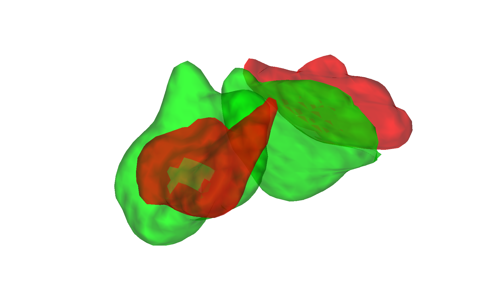

# Nucleus Accumbens core / shell DWI atlas (Cartmell et al. 2019)

## Overview

A probabilistic parcellation of the human **nucleus accumbens** into
**core** and **shell** subdivisions, derived from diffusion-weighted
imaging (DWI) tractography in healthy adults. Cartmell, Tian and
colleagues used connectivity to anterior cingulate / orbitofrontal
cortex (core-like) versus ventral pallidum / amygdala (shell-like) to
separate the two functional subterritories that conventional T1
contrast cannot reliably distinguish. This folder ships the CANlab
volumetric build in two MNI templates:

- `NAcCoreShell_MNI152NLin2009cAsym_atlas_object.mat` — fmriprep default space
- `NAcCoreShell_MNI152NLin6Asym_atlas_object.mat` — FSL default space

The atlas is probabilistic; thresholding is delegated to the user.

## Primary reference

- Cartmell, S. C. D., Tian, Q., Thio, B. J., Leuze, C., Ye, L.,
  Williams, N. R., Yang, G., Ben-Dor, G., Deisseroth, K., Grill, W. M.,
  McNab, J. A., & Halpern, C. H. (2019). *Multimodal characterization
  of the human nucleus accumbens.* **NeuroImage, 198**, 137–149.
  [doi:10.1016/j.neuroimage.2019.05.019](https://doi.org/10.1016/j.neuroimage.2019.05.019)

No local PDF is checked in. See the DOI link above.

## Key images

Pre-rendered montage + isosurface PNGs are in [`png_images/`](./png_images):


*Axial + sagittal montage of NAc core / shell parcels in fmriprep
default space.*



*3-D isosurface in FSL default space.*

[`visualize_contents.m`](./visualize_contents.m) regenerates both
montage and isosurface PNGs.

## How to load

Use the CANlab Core
[`load_atlas`](https://github.com/canlab/CanlabCore/blob/master/CanlabCore/Data_extraction/load_atlas.m)
keywords:

```matlab
atl = load_atlas('cartmell_nac');          % MNI152NLin2009cAsym (fmriprep)
atl = load_atlas('cartmell_nac_fsl6');     % MNI152NLin6Asym (FSL)
```

Direct load:

```matlab
S = load('NAcCoreShell_MNI152NLin2009cAsym_atlas_object.mat');
atl = S.atlas_obj;   % or whichever variable name is in the .mat
```

## File inventory

| File | Type | What it is |
| --- | --- | --- |
| `NAcCoreShell_MNI152NLin2009cAsym_atlas_object.mat` | MAT (`atlas`) | Probabilistic atlas in fmriprep default space. `load_atlas('cartmell_nac')`. |
| `NAcCoreShell_MNI152NLin6Asym_atlas_object.mat` | MAT (`atlas`) | Probabilistic atlas in FSL default space. `load_atlas('cartmell_nac_fsl6')`. |
| `NAcCoreShell_MNI152NLin2009cAsym_atlas_regions.{nii,mat}` | NIfTI / MAT | Per-region label volumes (fmriprep space). |
| `NAcCoreShell_MNI152NLin6Asym_atlas_regions.{nii,mat}` | NIfTI / MAT | Per-region label volumes (FSL space). |
| `NAcCoreShell_MNI152NLin20009cAsym_create_atlas_object.m` | MATLAB | Constructor script (fmriprep build). |
| `NAcCoreShell_MNI152NLin6Asym_create_atlas_object.m` | MATLAB | Constructor script (FSL build). |
| `src/` | dir | Source NIfTIs and helper scripts used to build the atlas. |
| `png_images/` | dir | Pre-rendered montage / isosurface PNGs. |
| `visualize_contents.m` | MATLAB | Re-renders `png_images/`. |

## Citations

- Cartmell SCD, Tian Q, Thio BJ, et al. (2019). Multimodal
  characterization of the human nucleus accumbens. *NeuroImage*
  198:137–149. [doi:10.1016/j.neuroimage.2019.05.019](https://doi.org/10.1016/j.neuroimage.2019.05.019)
- Tian Y, Margulies DS, Breakspear M, Zalesky A. (2020). Topographic
  organization of the human subcortex unveiled with functional
  connectivity gradients. *Nat Neurosci* 23:1421–1432.
  [doi:10.1038/s41593-020-00711-6](https://doi.org/10.1038/s41593-020-00711-6)
- Haber SN, Knutson B. (2010). The reward circuit: linking primate
  anatomy and human imaging. *Neuropsychopharmacology* 35:4–26.
  [doi:10.1038/npp.2009.129](https://doi.org/10.1038/npp.2009.129)
