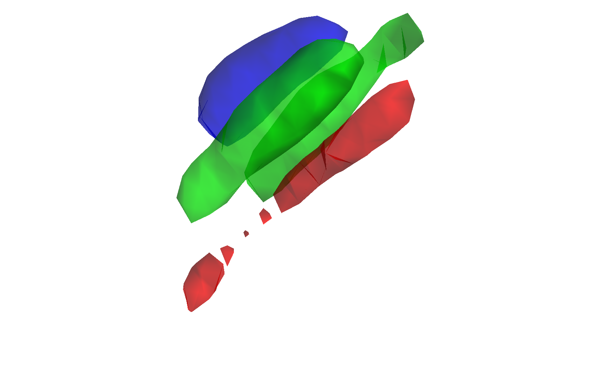

# Periaqueductal Gray (PAG) functional parcellation (Kragel et al. 2019)

## Overview

A functional parcellation of the human **periaqueductal gray (PAG)**
into columnar subregions (dorsomedial, dorsolateral, lateral,
ventrolateral) derived from 7T resting-state fMRI and validated against
task-evoked responses. Kragel and colleagues clustered PAG voxels by
connectivity profile to recover the classical columnar organisation
documented in animal anatomy. This folder ships the CANlab `atlas`
object built from those parcels:

- `Kragel2019PAG_atlas_object.mat` — main atlas object.
- `Kragel2019PAG_atlas_regions.mat` — region-level data.

This PAG parcellation is also embedded inside the CANlab2023 and
CANLab2024 combined atlases.

## Primary reference

- Kragel, P. A., Bianciardi, M., Hartley, L., Matthewson, G., Choi, J.-K.,
  Quigley, K. S., Wald, L. L., Wager, T. D., Barrett, L. F., & Satpute,
  A. B. (2019). *Functional involvement of human periaqueductal gray
  and other midbrain nuclei in cognitive control.* **Journal of
  Neuroscience, 39**(31), 6180–6189.
  [doi:10.1523/JNEUROSCI.2043-18.2019](https://doi.org/10.1523/JNEUROSCI.2043-18.2019)

No local PDF is checked in. See the DOI link above.

## Key images

Pre-rendered figures in [`png_images/`](./png_images):


*Axial + sagittal montage of PAG columnar parcels.*



*3-D isosurface of PAG columnar parcels.*

[`visualize_contents.m`](./visualize_contents.m) regenerates both PNGs.

## How to load

Use the CANlab Core
[`load_atlas`](https://github.com/canlab/CanlabCore/blob/master/CanlabCore/Data_extraction/load_atlas.m)
keyword:

```matlab
atl = load_atlas('kragel2019pag');
```

Or load directly:

```matlab
S = load('Kragel2019PAG_atlas_object.mat');
atl = S.atlas_obj;
```

## File inventory

| File | Type | What it is |
| --- | --- | --- |
| `Kragel2019PAG_atlas_object.mat` | MAT (`atlas`) | PAG columnar parcellation atlas object. `load_atlas('kragel2019pag')`. |
| `Kragel2019PAG_atlas_regions.mat` | MAT (`region`) | Region-level data extracted from the atlas. |
| `Kragel_create_atlas_object.m` | MATLAB | Constructor script that builds the `.mat`. |
| `png_images/` | dir | Pre-rendered montage / isosurface PNGs. |
| `visualize_contents.m` | MATLAB | Re-renders `png_images/`. |

## Citations

- Kragel PA, Bianciardi M, Hartley L, et al. (2019). Functional
  involvement of human periaqueductal gray and other midbrain nuclei
  in cognitive control. *J Neurosci* 39:6180–6189.
  [doi:10.1523/JNEUROSCI.2043-18.2019](https://doi.org/10.1523/JNEUROSCI.2043-18.2019)
- Satpute AB, Wager TD, Cohen-Adad J, et al. (2013). Identification
  of discrete functional subregions of the human periaqueductal gray.
  *PNAS* 110:17101–17106.
  [doi:10.1073/pnas.1306095110](https://doi.org/10.1073/pnas.1306095110)
- Bandler R, Shipley MT. (1994). Columnar organization in the midbrain
  periaqueductal gray: modules for emotional expression?
  *Trends Neurosci* 17:379–389.
  [doi:10.1016/0166-2236(94)90047-7](https://doi.org/10.1016/0166-2236(94)90047-7)
