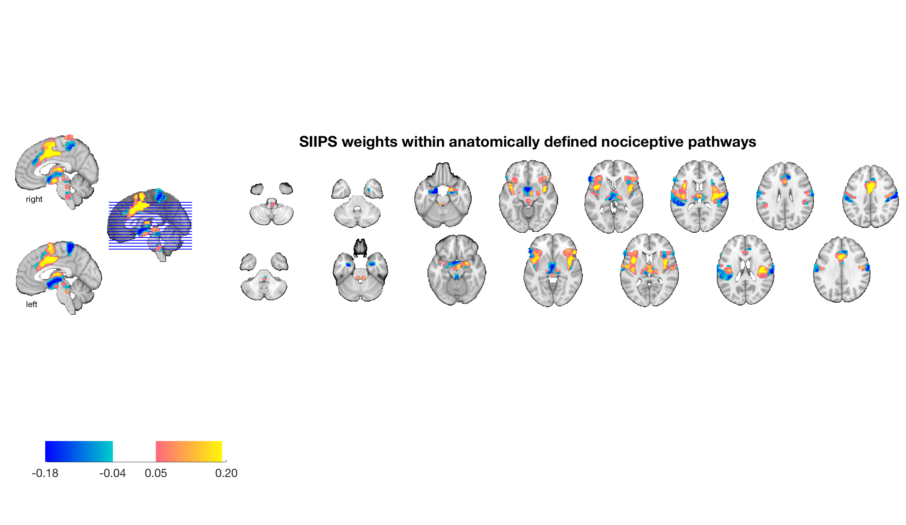
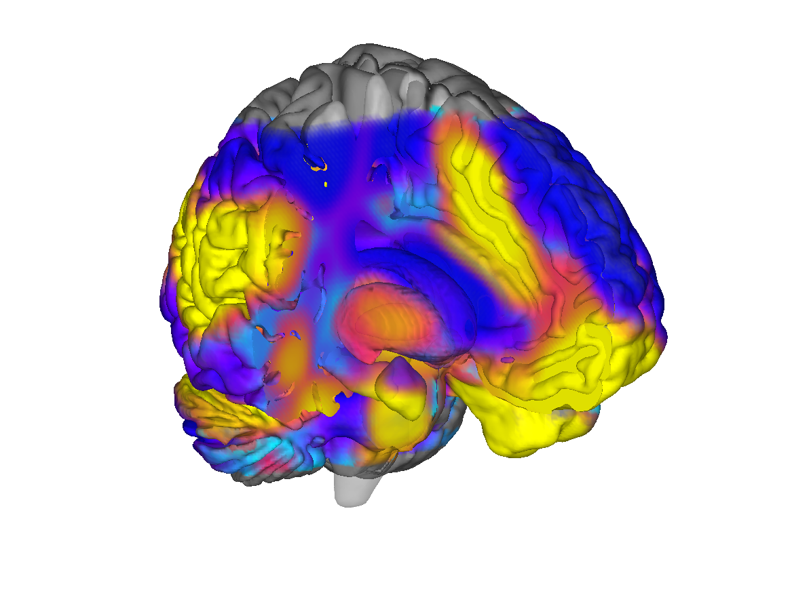

# Canonical pain pathways atlas (Wager lab; ca. 2019)

## Overview

A curated atlas of regions that participate in **canonical ascending /
descending pain pathways**, assembled by the Wager lab. Regions span
thalamic relays (VPL/VPM, MD), brainstem nuclei (PAG, parabrachial,
RVM), spinothalamic targets in S1/S2/posterior insula, mid-cingulate,
amygdala, hypothalamus and descending modulation nodes. Each region
ships with both an atlas label and a `region` object that carries
local SIIPS / cPDM patterns used in published applications (Wager
lab pain pipeline). A 2024 successor (`pain_pathways2024`) is
provided in [`2024_CANLab_atlas/`](../2024_CANLab_atlas).

This folder is the canonical home of the `painpathways` atlas.

## Primary reference

There is no single primary publication; the atlas is described in
the CANlab Brain Patterns documentation and used across the Wager
lab pain pipeline. Closely-related publications that motivate the
parcel selection:

- Wager TD, Atlas LY, Lindquist MA, Roy M, Woo C-W, Kross E. (2013).
  *An fMRI-based neurologic signature of physical pain.* **N Engl J Med
  368**:1388–1397.
  [doi:10.1056/NEJMoa1204471](https://doi.org/10.1056/NEJMoa1204471)
- Woo C-W, Schmidt L, Krishnan A, et al. (2017). *Quantifying cerebral
  contributions to pain beyond nociception.* **Nat Commun 8**:14211.
  [doi:10.1038/ncomms14211](https://doi.org/10.1038/ncomms14211)
- Geuter S, Reynolds Losin EA, Roy M, Atlas LY, Schmidt L, Krishnan A,
  Koban L, Wager TD, Lindquist MA. (2020). *Multiple brain networks
  mediating stimulus-pain relationships in humans.* **Cereb Cortex
  30**:4204–4219.
  [doi:10.1093/cercor/bhaa048](https://doi.org/10.1093/cercor/bhaa048)

See [`documents/`](./documents) for any locally-stored notes.

## Key images

Pre-rendered figures already in the folder:



*Pain-pathways regions overlaid with SIIPS1 weights.*



*Surface cutaway of PDM3 (Geuter et al. 2020 multivariate mediation
component) on the pain-pathways skeleton.*

Further surface / montage renderings are in
[`figures/painpathways_surface_renderings/`](./figures/painpathways_surface_renderings)
and [`figures/painpathways_montages/`](./figures/painpathways_montages).
[`visualize_contents.m`](./visualize_contents.m) refreshes these into
`png_images/`.

## How to load

Use the CANlab Core
[`load_atlas`](https://github.com/canlab/CanlabCore/blob/master/CanlabCore/Data_extraction/load_atlas.m)
keywords:

```matlab
atl       = load_atlas('painpathways');               % coarse pain pathways
atl_fine  = load_atlas('painpathways_finegrained');   % fine-grained variant
```

Direct loads:

```matlab
S = load('pain_pathways_atlas_obj.mat');                          % atlas + region objects
R = load('pain_pathways_region_obj_with_local_patterns.mat');     % region obj + local SIIPS/cPDM patterns
```

For the 2024 successor (CANLab2024-aligned), use
`load_atlas('painpathways2024')` (file lives in
[`2024_CANLab_atlas/`](../2024_CANLab_atlas)).

## File inventory

| File | Type | What it is |
| --- | --- | --- |
| `pain_pathways_atlas_obj.mat` | MAT (`atlas`) | Pain-pathways atlas object (coarse + fine variants). `load_atlas('painpathways')`. |
| `pain_pathways_region_obj_with_local_patterns.mat` | MAT (`region`) | Region object carrying local SIIPS / cPDM patterns per parcel. |
| `data/` | dir | Source NIfTIs / region data used to build the atlas. |
| `scripts/` | dir | Build scripts and analysis helpers. |
| `figures/` | dir | Cached surface renderings, montages, cPDM/SIIPS overlays. |
| `documents/` | dir | Notes / supplementary text. |
| `visualize_contents.m` | MATLAB | Regenerates `png_images/`. |

## Citations

- Wager TD, Atlas LY, Lindquist MA, Roy M, Woo C-W, Kross E. (2013).
  An fMRI-based neurologic signature of physical pain. *N Engl J Med*
  368:1388–1397. [doi:10.1056/NEJMoa1204471](https://doi.org/10.1056/NEJMoa1204471)
- Woo C-W, Schmidt L, Krishnan A, et al. (2017). Quantifying cerebral
  contributions to pain beyond nociception. *Nat Commun* 8:14211.
  [doi:10.1038/ncomms14211](https://doi.org/10.1038/ncomms14211)
- Geuter S, Reynolds Losin EA, Roy M, et al. (2020). Multiple brain
  networks mediating stimulus-pain relationships in humans.
  *Cereb Cortex* 30:4204–4219.
  [doi:10.1093/cercor/bhaa048](https://doi.org/10.1093/cercor/bhaa048)
