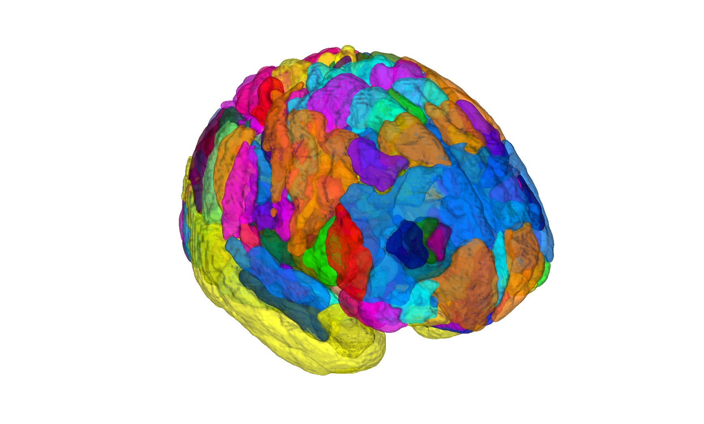

# Julich-Brain cytoarchitectonic atlas v3.0.3 (Amunts et al. 2020)

## Overview

The **Julich-Brain** is a probabilistic cytoarchitectonic atlas built
on histological observer-independent mapping in ten postmortem brains,
maintained by the Forschungszentrum Jülich. v3.0.3 covers **157 areas**
across cortex and selected subcortical structures (e.g., hippocampal
CA fields). This folder ships the CANlab volumetric build in two MNI
templates, plus surface labels on fsaverage and fsLR-32k.

- `julich_fmriprep20_atlas_object.mat` — fmriprep default space (MNI152NLin2009cAsym)
- `julich_fsl6_atlas_object.mat` — FSL standard space (MNI152NLin6Asym, mapped via Lead-DBS / Fonov ANTs transforms)
- `fsaverage_surface/` — fsaverage cortical labels
- `fslr_32k_surface/` — fsLR-32k cortical labels

> See [`README.md`](./README.md) for the authoritative methods
> write-up (provenance, GapMaps, registration to MNI152NLin6Asym),
> the data-descriptor PDF
> [`data-descriptor_9c56f019bbc8.pdf`](./data-descriptor_9c56f019bbc8.pdf),
> and the EBRAINS licence
> [`Licence-CC-BY-NC-SA.pdf`](./Licence-CC-BY-NC-SA.pdf).

Note: incomplete cortical areas are filled with "GapMaps" assigned a
synthetic probability of 0.2; treat them differently from real
parcels (see README).

## Primary reference

- Amunts, K., Mohlberg, H., Bludau, S., & Zilles, K. (2020).
  *Julich-Brain: a 3D probabilistic atlas of the human brain's
  cytoarchitecture.* **Science, 369**(6506), 988–992.
  [doi:10.1126/science.abb4588](https://doi.org/10.1126/science.abb4588)

Local data descriptor:
[`data-descriptor_9c56f019bbc8.pdf`](./data-descriptor_9c56f019bbc8.pdf).

## Key images

Pre-rendered figures in [`png_images/`](./png_images):


*Montage of Julich-Brain parcels in fmriprep default space.*



*3-D isosurface in FSL default space.*

[`visualize_contents.m`](./visualize_contents.m) regenerates both PNGs.

## How to load

Use the CANlab Core
[`load_atlas`](https://github.com/canlab/CanlabCore/blob/master/CanlabCore/Data_extraction/load_atlas.m)
keywords:

```matlab
atl = load_atlas('julich');           % MNI152NLin2009cAsym (fmriprep)
atl = load_atlas('julich_fsl6');      % MNI152NLin6Asym (FSL)
```

Direct loads:

```matlab
S   = load('julich_fmriprep20_atlas_object.mat');
atl = S.atlas_obj;
```

## File inventory

| File / Folder | Type | What it is |
| --- | --- | --- |
| `julich_fmriprep20_atlas_object.mat` | MAT (`atlas`) | Probabilistic atlas in fmriprep space. `load_atlas('julich')`. |
| `julich_fsl6_atlas_object.mat` | MAT (`atlas`) | Probabilistic atlas in FSL space. `load_atlas('julich_fsl6')`. |
| `julich_*_atlas_regions.{img,hdr,mat}` | Analyze / MAT | Per-region label volumes in each space. |
| `julich_fmriprep20_create_atlas_object.m` | MATLAB | Constructor script (fmriprep build). |
| `julich_fsl6_create_atlas_object.m` | MATLAB | Constructor script (FSL build). |
| `parseXML.m` | MATLAB | XML parser used by the constructors. |
| `warp_to_MNI152NLin6Asym.sh`, `warp_to_MNI152NLin6Asym0.sh` | shell | ANTs warp scripts used to project to FSL space. |
| `JulichBrainAtlas_3.0_157areas_terminology.json` | JSON | Authoritative parcel terminology / hierarchy. |
| `listOfPMapFiles.csv` | CSV | List of probabilistic NIfTIs distributed with the atlas. |
| `probabilistic_maps_pmaps_157areas/` | dir | Per-parcel 4-D probability maps. |
| `maximum_probability_maps_MPMs_157areas/` | dir | Winner-take-all MPM versions. |
| `fsaverage_surface/`, `fslr_32k_surface/` | dir | Cortical surface labels. |
| `data-descriptor_9c56f019bbc8.pdf` | PDF | EBRAINS data descriptor for v3.0.3. |
| `Licence-CC-BY-NC-SA.pdf` | PDF | Distribution licence (CC-BY-NC-SA). |
| `README.md` | Markdown | **Authoritative methods + provenance write-up.** |
| `png_images/` | dir | Pre-rendered montage / isosurface PNGs. |
| `visualize_contents.m` | MATLAB | Re-renders `png_images/`. |

## Citations

- Amunts K, Mohlberg H, Bludau S, Zilles K. (2020). Julich-Brain:
  a 3D probabilistic atlas of the human brain's cytoarchitecture.
  *Science* 369:988–992.
  [doi:10.1126/science.abb4588](https://doi.org/10.1126/science.abb4588)
- Amunts K, Zilles K. (2015). Architectonic mapping of the human
  brain beyond Brodmann. *Neuron* 88:1086–1107.
  [doi:10.1016/j.neuron.2015.12.001](https://doi.org/10.1016/j.neuron.2015.12.001)
- Eickhoff SB, Stephan KE, Mohlberg H, et al. (2005). A new SPM
  toolbox for combining probabilistic cytoarchitectonic maps and
  functional imaging data. *NeuroImage* 25:1325–1335.
  [doi:10.1016/j.neuroimage.2004.12.034](https://doi.org/10.1016/j.neuroimage.2004.12.034)
