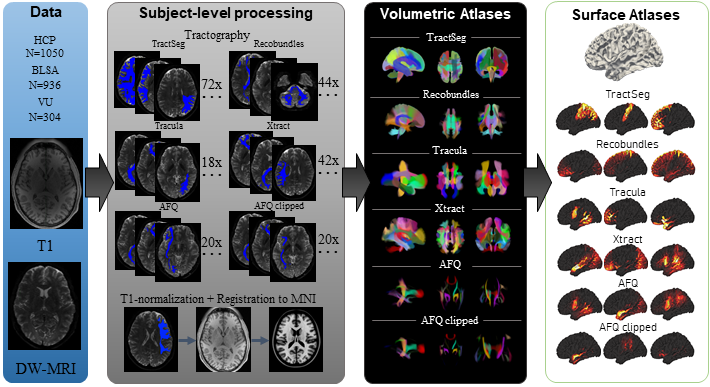

# Pandora white-matter bundle atlas (Hansen / Schilling et al. 2021)

## Overview

The **Pandora White-Matter Atlas** is a population-based collection
of probabilistic white-matter bundle atlases produced by six
state-of-the-art tractography pipelines (AFQ, AFQclipped, Recobundles,
TractSeg, Tracula, Xtract), applied to 2443 healthy adults from HCP,
the Baltimore Longitudinal Study of Aging, and a Vanderbilt cohort.
Each method contributes 216 white-matter fascicles distributed across
its 4-D NIfTI, with supplementary single-dataset versions.
Companion T1 templates are provided in [`T1/`](./T1) and a coarse
grey-matter parcellation in [`GMParc/`](./GMParc).

> See [`README.md`](./README.md) for the authoritative folder layout,
> licensing, and bundle list per method. This `contents_description.md`
> is a thin pointer; do not duplicate the README content.

## Primary reference

- Hansen, C. B., Yang, Q., Lyu, I., Rheault, F., Kerley, C., Chandio,
  B. Q., Fadnavis, S., Williams, O., Shafer, A. T., Resnick, S. M.,
  Zald, D. H., Cutting, L., Taylor, W. D., Boyd, B., Garyfallidis, E.,
  Anderson, A. W., Descoteaux, M., Landman, B. A., & Schilling, K. G.
  (2021). *Pandora: 4-D white matter bundle population-based atlases
  derived from diffusion MRI fiber tractography.*
  **Scientific Data, 8**(1), 159.
  [doi:10.1038/s41597-021-00913-y](https://doi.org/10.1038/s41597-021-00913-y)

bioRxiv preprint: <https://www.biorxiv.org/content/10.1101/2020.06.12.148999v1.full>.
No local PDF is checked in.

## Key images

Pipeline overview figure shipped with the atlas:



*Pandora bundle-atlas pipeline (figure copied from the MASILab Pandora
release).*

[`visualize_contents.m`](./visualize_contents.m) writes one montage +
isosurface per method to `png_images/`, treating each 4-D bundle
NIfTI as a continuous map (these are not labelled `atlas` objects).

## How to load

There is no `load_atlas` keyword for Pandora. Load any method's 4-D
bundle volume directly with `fmri_data`:

```matlab
afq      = fmri_data(fullfile('AFQ',        'AFQ.nii.gz'));
tractseg = fmri_data(fullfile('TractSeg',   'TractSeg.nii.gz'));
xtract   = fmri_data(fullfile('Xtract',     'Xtract.nii.gz'));
```

Each 4-D volume's `vol(:,:,:,k)` is the probabilistic occupancy of
bundle `k`; `<Method>_info.csv` in the same subfolder lists the
bundle names.

## File inventory

| Folder / File | Type | What it is |
| --- | --- | --- |
| `AFQ/`, `AFQclipped/`, `Recobundles/`, `TractSeg/`, `Tracula/`, `Xtract/` | dir | One subfolder per tractography pipeline, each with a 4-D bundle NIfTI, a `<Method>_info.csv` and a `supplementary/` per-dataset replica. |
| `GMParc/` | dir | Grey-matter parcellation used by the AFQ/Recobundles pipelines. |
| `T1/` | dir | Population-template T1s matched to the bundle atlases. |
| `figures/` | dir | Pipeline overview figure. |
| `README.md` | Markdown | **Authoritative atlas description and layout.** |
| `license.txt` | text | CC-BY 4.0 licence. |
| `visualize_contents.m` | MATLAB | Renders per-method montages / isosurfaces into `png_images/`. |

## Citations

- Hansen CB, Yang Q, Lyu I, et al. (2021). Pandora: 4-D white matter
  bundle population-based atlases derived from diffusion MRI fiber
  tractography. *Scientific Data* 8:159.
  [doi:10.1038/s41597-021-00913-y](https://doi.org/10.1038/s41597-021-00913-y)
- Yeatman JD, Dougherty RF, Myall NJ, Wandell BA, Feldman HM. (2012).
  Tract profiles of white matter properties: automating fiber-tract
  quantification. *PLoS ONE* 7:e49790.
  [doi:10.1371/journal.pone.0049790](https://doi.org/10.1371/journal.pone.0049790)
- Wasserthal J, Neher P, Maier-Hein KH. (2018). TractSeg —
  fast and accurate white matter tract segmentation.
  *NeuroImage* 183:239–253.
  [doi:10.1016/j.neuroimage.2018.07.070](https://doi.org/10.1016/j.neuroimage.2018.07.070)
