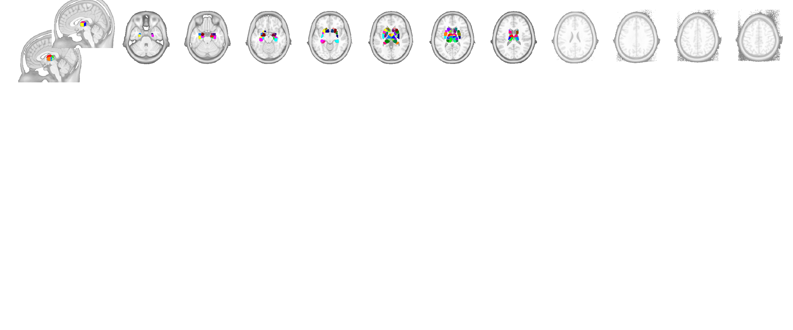
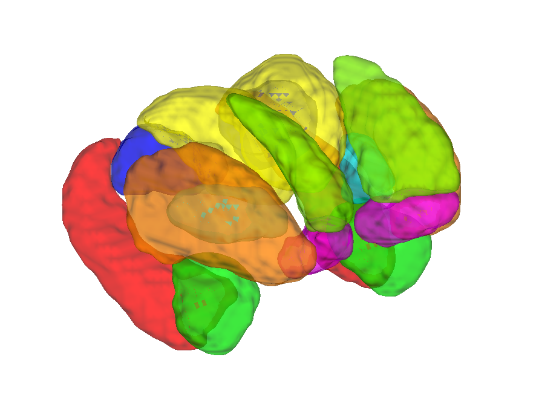

# Tian multi-scale subcortical atlas v1.1 (Tian et al. 2020)

## Overview

The **Tian Scale-4 (S4) subcortical parcellation** is a hierarchical
gradient-and-watershed partition of human subcortex derived from
resting-state functional connectivity in ~1000 HCP participants.
The atlas has four nested scales — S1 (16 parcels) through S4 (54
parcels) — that can be reduced on demand via `get_coarser_parcellation`.
This folder ships the CANlab probabilistic re-builds in two MNI
templates (built from individual-subject segmentations shared by
Ye Tian); the Tian S3/S4 parcellation is also embedded in CANlab2023
and CANlab2024.

- `tian_3t_fmriprep20_atlas_object.mat` — fmriprep default space
- `tian_3t_fsl6_atlas_object.mat` — FSL default space

> See [`README.md`](./README.md) for the authoritative methods
> write-up (probability construction, CIFTI prior, comparison with
> Pauli 2016) and
> [`Tian2020MSAProbmap.README`](./Tian2020MSAProbmap.README) for the
> upstream probmap-zip notes.

## Primary reference

- Tian, Y., Margulies, D. S., Breakspear, M., & Zalesky, A. (2020).
  *Topographic organization of the human subcortex unveiled with
  functional connectivity gradients.* **Nature Neuroscience, 23**(11),
  1421–1432.
  [doi:10.1038/s41593-020-00711-6](https://doi.org/10.1038/s41593-020-00711-6)

Upstream repo: <https://github.com/yetianmed/subcortex>. No local PDF
is checked in.

## Key images

Pre-rendered figures in [`png_images/`](./png_images) — one
montage + isosurface per Tian scale (S1–S4) in each MNI space:



*Axial + sagittal montage of the finest (S4, 54-parcel) Tian
subdivision in fmriprep default space.*



*3-D isosurface at the coarsest Tian scale (S1) in FSL default space.*

[`visualize_contents.m`](./visualize_contents.m) regenerates both
sets of PNGs.

## How to load

Use the CANlab Core
[`load_atlas`](https://github.com/canlab/CanlabCore/blob/master/CanlabCore/Data_extraction/load_atlas.m)
keywords:

```matlab
atl_fmriprep = load_atlas('tian_3t');         % fmriprep, S4 (default)
atl_fsl      = load_atlas('tian_3t_fsl6');    % FSL,      S4
% Reduce to a coarser scale on demand
atl_coarse   = atl_fmriprep.get_coarser_parcellation('labels_4');
```

Or load directly:

```matlab
S   = load('tian_3t_fmriprep20_atlas_object.mat');
atl = S.atlas_obj;
```

## File inventory

| File / Folder | Type | What it is |
| --- | --- | --- |
| `tian_3t_fmriprep20_atlas_object.mat` | MAT (`atlas`) | Probabilistic S4 atlas in fmriprep space (includes nested labels_2..4). `load_atlas('tian_3t')`. |
| `tian_3t_fsl6_atlas_object.mat` | MAT (`atlas`) | Probabilistic S4 atlas in FSL space. `load_atlas('tian_3t_fsl6')`. |
| `tian_3t_*_atlas_regions.{img,hdr,mat}` | Analyze / MAT | Per-region label volumes. |
| `Tian_3T_S4_MNI152NLin*_probability_maps.nii.gz` | NIfTI | 4-D probability maps used to build the atlas. |
| `Tian_3T_S4_MNI152NLin2009cAsym_create_atlas_object.m` | MATLAB | Constructor script (fmriprep build). |
| `Tian_3T_S4_MNI152NLin6Asym_create_atlas_object.m` | MATLAB | Constructor script (FSL build). |
| `Tian2020MSAProbmap.zip` | ZIP | Upstream multi-subject probmap archive. |
| `Tian2020MSAProbmap.README` | text | Distribution notes for the probmap zip. |
| `Group-Parcellation/` | dir | Original upstream group parcellations (older release). |
| `iid_parcellations/` | dir | Per-subject (i.i.d.) HCP parcellations used to estimate the probmap. |
| `old_atlas/` | dir | Earlier CANlab Tian build (kept for back-compat). |
| `license.txt` | text | Upstream licence. |
| `README.md` | Markdown | **Authoritative methods + atlas hierarchy notes.** |
| `png_images/` | dir | Pre-rendered montage / isosurface PNGs for S1–S4 in both spaces. |
| `visualize_contents.m` | MATLAB | Re-renders `png_images/`. |

## Citations

- Tian Y, Margulies DS, Breakspear M, Zalesky A. (2020). Topographic
  organization of the human subcortex unveiled with functional
  connectivity gradients. *Nat Neurosci* 23:1421–1432.
  [doi:10.1038/s41593-020-00711-6](https://doi.org/10.1038/s41593-020-00711-6)
- Haber SN, Knutson B. (2010). The reward circuit: linking primate
  anatomy and human imaging. *Neuropsychopharmacology* 35:4–26.
  [doi:10.1038/npp.2009.129](https://doi.org/10.1038/npp.2009.129)
- Watson DM, Andrews TJ. (2023). Connectopic mapping techniques do
  not reflect functional gradients in the brain. *NeuroImage* 277:120228.
  [doi:10.1016/j.neuroimage.2023.120228](https://doi.org/10.1016/j.neuroimage.2023.120228)
