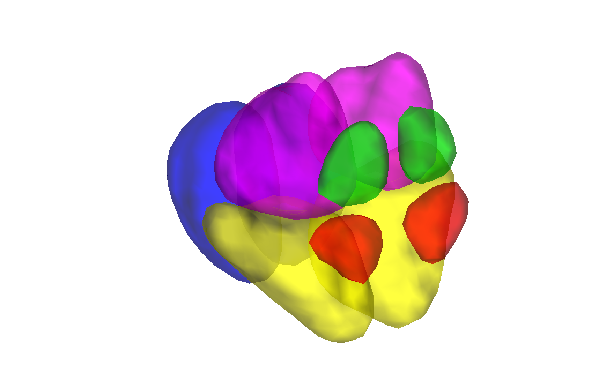

# Hypothalamus subunit segmentation (Iglesias / Billot 2020)

## Overview

A **hypothalamus subunit** segmentation derived from the
Billot/Iglesias/FreeSurfer hypothalamic deep-learning model
(Billot et al. 2020) and projected to MNI volumetric space at the
CANlab. The atlas subdivides the hypothalamus into anterior,
tuberal, posterior, and inferior subunits (5 per hemisphere),
yielding a probabilistic labelling that is more anatomically
faithful than the simple T1-derived bounding box used in older
canlab atlases. The hypothalamus parcellation that ships with
**CANLab2024** is sourced from this folder. Probabilistic per-voxel
maps were averaged across ~278 HCP subjects.

Two MNI builds are provided:

- `iglesias_hypothal_hcp278_MNI152NLin2009cAsym_atlas_object.mat` (fmriprep default)
- `iglesias_hypothal_hcp278_MNI152NLin6Asym_atlas_object.mat` (FSL default)

## Primary reference

- Billot, B., Bocchetta, M., Todd, E., Dalca, A. V., Rohrer, J. D.,
  & Iglesias, J. E. (2020). *Automated segmentation of the
  hypothalamus and associated subunits in brain MRI.* **NeuroImage,
  223**, 117287.
  [doi:10.1016/j.neuroimage.2020.117287](https://doi.org/10.1016/j.neuroimage.2020.117287)

No local PDF is checked in; see the DOI link above.

## Key images

Pre-rendered figures in [`png_images/`](./png_images):


*Axial + sagittal montage of hypothalamus subunits in fmriprep
default space.*



*3-D isosurface in FSL default space.*

[`visualize_contents.m`](./visualize_contents.m) regenerates both
sets of PNGs.

## How to load

Use the CANlab Core
[`load_atlas`](https://github.com/canlab/CanlabCore/blob/master/CanlabCore/Data_extraction/load_atlas.m)
keywords:

```matlab
atl = load_atlas('iglesias_hypothal');         % MNI152NLin2009cAsym (fmriprep)
atl = load_atlas('iglesias_hypothal_fsl6');    % MNI152NLin6Asym (FSL)
```

Direct loads:

```matlab
S   = load('iglesias_hypothal_hcp278_MNI152NLin2009cAsym_atlas_object.mat');
atl = S.atlas_obj;
% or the source segmentation NIfTI:
obj = fmri_data('hypothalamic_subunits_seg.v1.MNI152NLin6Asym.nii.gz');
```

## File inventory

| File | Type | What it is |
| --- | --- | --- |
| `iglesias_hypothal_hcp278_MNI152NLin2009cAsym_atlas_object.mat` | MAT (`atlas`) | Probabilistic atlas in fmriprep space. `load_atlas('iglesias_hypothal')`. |
| `iglesias_hypothal_hcp278_MNI152NLin6Asym_atlas_object.mat` | MAT (`atlas`) | Probabilistic atlas in FSL space. `load_atlas('iglesias_hypothal_fsl6')`. |
| `iglesias_hypothal_hcp278_MNI152NLin2009cAsym_probability_maps.nii.gz` | NIfTI | 4-D per-subunit probability map (fmriprep space). |
| `iglesias_hypothal_hcp278_MNI152NLin6Asym_probability_maps.nii.gz` | NIfTI | 4-D per-subunit probability map (FSL space). |
| `iglesias_hypothal_hcp278_MNI152NLin*_atlas_regions.{img,hdr,mat}` | Analyze / MAT | Per-region label volumes in both spaces. |
| `hypothalamic_subunits_seg.v1.MNI152NLin6Asym.nii.gz` | NIfTI | Source single-subject segmentation example. |
| `atlas_labels.csv` | CSV | Subunit label names and indices. |
| `iglesias_MNI152NLin2009cAsym_create_atlas.m` | MATLAB | Constructor script (fmriprep build). |
| `iglesias_MNI152NLin6Asym_create_atlas.m` | MATLAB | Constructor script (FSL build). |
| `png_images/` | dir | Pre-rendered montage / isosurface PNGs. |
| `visualize_contents.m` | MATLAB | Re-renders `png_images/`. |

## Citations

- Billot B, Bocchetta M, Todd E, Dalca AV, Rohrer JD, Iglesias JE.
  (2020). Automated segmentation of the hypothalamus and associated
  subunits in brain MRI. *NeuroImage* 223:117287.
  [doi:10.1016/j.neuroimage.2020.117287](https://doi.org/10.1016/j.neuroimage.2020.117287)
- Iglesias JE, Insausti R, Lerma-Usabiaga G, et al. (2018). A
  probabilistic atlas of the human thalamic nuclei combining ex vivo
  MRI and histology. *NeuroImage* 183:314–326.
  [doi:10.1016/j.neuroimage.2018.08.012](https://doi.org/10.1016/j.neuroimage.2018.08.012)
