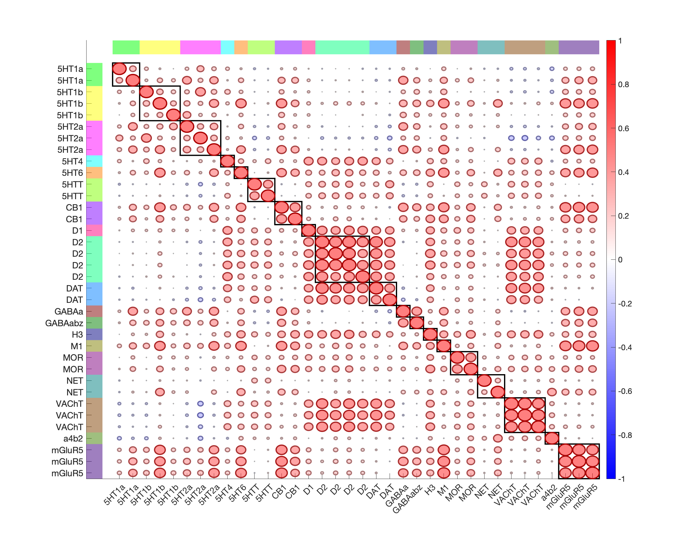
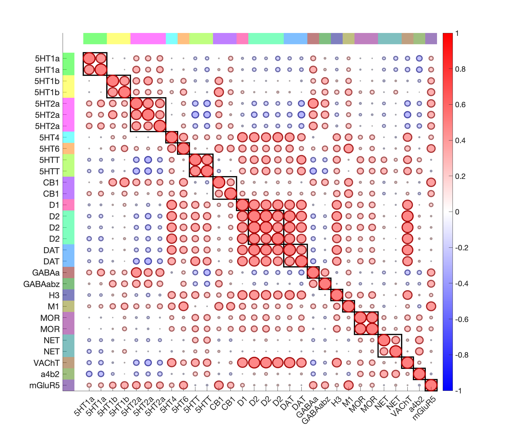

# Hansen PET tracer neurotransmitter maps (Hansen et al. 2022)

## Overview

A meta-analytic collection of **19 PET radioligand maps** for 9
neurotransmitter systems (serotonergic, dopaminergic, noradrenergic,
cholinergic, glutamatergic, GABAergic, opioid, histaminergic,
cannabinoid), aggregated from >1200 healthy adults across 36 PET
studies and registered to MNI space (Hansen et al. 2022,
*Nat Neurosci*). The CANlab redistribution packages all maps as
`fmri_data` objects, including a **z-scored / target-averaged**
version used by `load_image_set('hansen22')`.

These maps are continuous **patterns** rather than labelled parcels,
so we render them with `canlab_render_patterns` (not
`canlab_render_atlas`). They are widely used as covariates / spatial
predictors in CANlab analyses, e.g., to evaluate brainstem nuclei
in the Bianciardi atlas against serotonergic tracers (see
[`2023_Bianciardi_BrainstemNavigatorV0.9/README.md`](../2023_Bianciardi_BrainstemNavigatorV0.9/README.md)).

## Primary reference

- Hansen, J. Y., Shafiei, G., Markello, R. D., Smart, K., Cox, S. M. L.,
  Norgaard, M., Beliveau, V., Wu, Y., Gallezot, J.-D., Aumont, E.,
  Servaes, S., Scala, S. G., DuBois, J. M., Wainstein, G., Bezgin, G.,
  Funck, T., Schmitz, T. W., Spreng, R. N., Galovic, M., Koepp, M. J.,
  Duncan, J. S., Coles, J. P., Fryer, T. D., Aigbirhio, F. I.,
  McGinnity, C. J., Hammers, A., Soucy, J.-P., Baillet, S., Guimond, S.,
  Hietala, J., Bedard, M.-A., Leyton, M., Kobayashi, E., Rosa-Neto, P.,
  Ganz, M., Knudsen, G. M., Palomero-Gallagher, N., Shine, J. M.,
  Carson, R. E., Tuominen, L., Dagher, A., & Misic, B. (2022).
  *Mapping neurotransmitter systems to the structural and functional
  organization of the human neocortex.* **Nature Neuroscience, 25**(11),
  1569–1581.
  [doi:10.1038/s41593-022-01186-3](https://doi.org/10.1038/s41593-022-01186-3)

Local preprint:
[`hansen_receptors_preprint_updated.pdf`](./hansen_receptors_preprint_updated.pdf).

## Key images

Pre-rendered correlation summaries shipped with the folder:



*Spatial intercorrelations across the 19 individual PET tracer maps.*



*Combined (target-averaged) intercorrelation matrix used by
`load_image_set('hansen22')`.*

[`visualize_contents.m`](./visualize_contents.m) writes per-tracer
surface / montage / isosurface renderings into `png_images/`.

## How to load

Use the CANlab Core
[`load_image_set`](https://github.com/canlab/CanlabCore/blob/master/CanlabCore/Data_extraction/load_image_set.m)
keywords:

```matlab
[obj, target_names, image_names] = load_image_set('hansen22');
% Also accepts: 'pet', 'receptorbinding', 'pet_nr_map'
```

Direct loads (each `.mat` contains an `obj`/`obj_masked_zscored_averaged`
`fmri_data` object):

```matlab
S = load('Hansen_2022_PET_tracer_maps_masked_combined.mat');    % default used by load_image_set
obj = S.obj_masked_zscored_averaged;

S2 = load('Hansen_2022_PET_tracer_maps_Zscored_Averaged.mat');  % alternative z-scored set
```

## File inventory

| File | Type | What it is |
| --- | --- | --- |
| `Hansen_2022_PET_tracer_maps.mat` | MAT (`fmri_data`) | Raw per-tracer maps (19 images). |
| `Hansen_2022_PET_tracer_maps_masked.mat` | MAT (`fmri_data`) | Masked per-tracer maps. |
| `Hansen_2022_PET_tracer_maps_masked_combined.mat` | MAT (`fmri_data`) | Masked, z-scored, target-averaged set. **Used by `load_image_set('hansen22')`.** |
| `Hansen_2022_PET_tracer_maps_Zscored_Averaged.mat` | MAT (`fmri_data`) | Z-scored / averaged-per-target alternative. |
| `hansen_receptors_preprint_updated.pdf` | PDF | Updated preprint of the Hansen 2022 manuscript. |
| `canlab_prep_neuromaps_pet_images.mlx` | live MATLAB | Preprocessing pipeline that built the `.mat` files. |
| `canlab_explore_neuromaps_pet_images.mlx` | live MATLAB | Interactive exploration / cleanup. |
| `image_object_weighted_average.m` | MATLAB | Helper used during averaging. |
| `Table_S3_tor_working_to_match.xlsx` | Excel | Tracer / target metadata. |
| `Hansen PET maps intercorrelations*.{png,fig}` | image / fig | Cached correlation summaries. |
| `Hansen map cleanup.pptx` | PPTX | Working notes on cleanup. |
| `LICENSE.md` | text | Licence (re-distribution per upstream). |
| `visualize_contents.m` | MATLAB | Renders surface / montage / isosurface per tracer into `png_images/`. |

## Citations

- Hansen JY, Shafiei G, Markello RD, et al. (2022). Mapping
  neurotransmitter systems to the structural and functional
  organization of the human neocortex. *Nat Neurosci* 25:1569–1581.
  [doi:10.1038/s41593-022-01186-3](https://doi.org/10.1038/s41593-022-01186-3)
- Markello RD, Hansen JY, Liu Z-Q, et al. (2022). neuromaps:
  structural and functional interpretation of brain maps.
  *Nat Methods* 19:1472–1479.
  [doi:10.1038/s41592-022-01625-w](https://doi.org/10.1038/s41592-022-01625-w)
