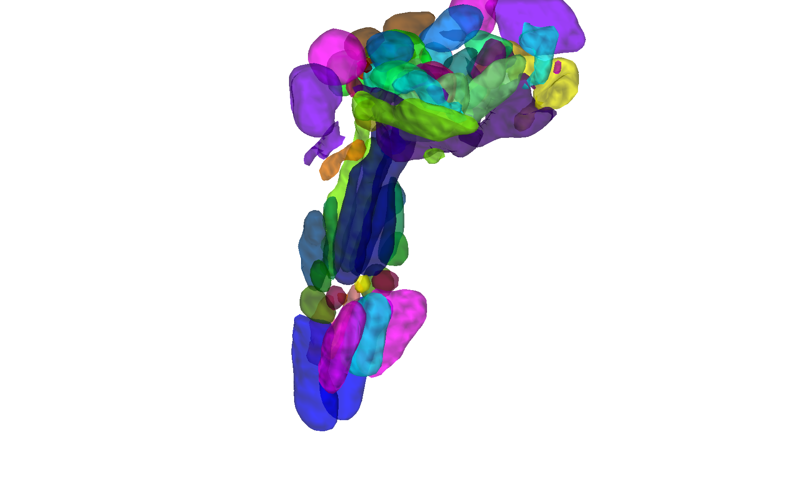

# Brainstem Navigator v0.9 (Bianciardi atlas)

## Overview

The **Brainstem Navigator** is an ongoing high-resolution probabilistic
atlas of brainstem nuclei (~ 200 nuclei across multiple
publications since 2015) built from 7T multimodal MRI (T1, T2,
diffusion FA). Small samples of participants are individually
segmented and aligned to FSL standard space, yielding probabilistic
maps. The atlas is provided in two parcellation granularities (fine
and coarse) and the CANlab redistribution includes 1 mm and 2 mm
volumetric builds in both fmriprep (MNI152NLin2009cAsym) and FSL
(MNI152NLin6Asym) reference spaces.

> See [`README.md`](./README.md) for the authoritative methods +
> evaluation write-up (raphe nuclei validation against Hansen PET
> tracers, comparison with CANlab 2018, etc.). Distribution license
> is restrictive — the atlas itself is **not redistributed** in this
> folder; instead, [`bianciardi_create_atlas_obj.m`](./bianciardi_create_atlas_obj.m)
> downloads and reformats the upstream ROIs at build time. The
> `.mat` files cached locally are the build products.

## Primary reference

- Bianciardi, M., Strong, C., Toschi, N., Edlow, B. L., Fischl, B.,
  Brown, E. N., Rosen, B. R., & Wald, L. L. (2015). *A probabilistic
  template of human mesopontine tegmental nuclei from in vivo 7T MRI.*
  **NeuroImage, 117**, 67–79.
  [doi:10.1016/j.neuroimage.2015.05.014](https://doi.org/10.1016/j.neuroimage.2015.05.014)

Multiple subsequent papers extend this atlas (Sclocco 2017,
Bianciardi 2016/2018, Singh 2019/2022). Local files include
[`Copyright.txt`](./Copyright.txt).

## Key images

Pre-rendered figures in [`png_images/`](./png_images):


*Axial + sagittal montage of brainstem nuclei (fmriprep default
space, 2mm build).*



*3-D isosurface of brainstem nuclei (FSL default space, 2mm build).*

[`visualize_contents.m`](./visualize_contents.m) regenerates the full
matrix of montage / isosurface PNGs across the four space-resolution
combinations.

## How to load

Use the CANlab Core
[`load_atlas`](https://github.com/canlab/CanlabCore/blob/master/CanlabCore/Data_extraction/load_atlas.m)
keywords:

```matlab
atl = load_atlas('bianciardi');             % fmriprep, 1mm
atl = load_atlas('bianciardi_2mm');         % fmriprep, 2mm
atl = load_atlas('bianciardi_fsl6');        % FSL,      1mm
atl = load_atlas('bianciardi_fsl6_2mm');    % FSL,      2mm
```

`load_atlas` will trigger
[`bianciardi_create_atlas_obj.m`](./bianciardi_create_atlas_obj.m)
to rebuild any missing `.mat` from the upstream sources.

## File inventory

| File / Folder | Type | What it is |
| --- | --- | --- |
| `bianciardi_MNI152NLin6Asym_2mm_atlas_object.mat` | MAT (`atlas`) | Locally-cached FSL 2mm build. `load_atlas('bianciardi_fsl6_2mm')`. |
| `bianciardi_*atlas_object.latest` | text | Sentinel timestamps for the build cache (4 combos). |
| `bianciardi_create_atlas_obj.m` | MATLAB | **Builder** that downloads / reformats the upstream ROIs. |
| `biancia_create_atlas_objects_macro.m` | MATLAB | Convenience macro that rebuilds all combos. |
| `BrainstemNavigator/` | dir | Upstream Brainstem Navigator source archive (when populated by the builder). |
| `source_files/` | dir | Intermediate source NIfTIs used by the builder. |
| `tracer_overlays/` | dir | Hansen-PET overlays used to validate the raphe / cholinergic nuclei (see README). |
| `Copyright.txt` | text | Distribution restrictions (read before redistributing). |
| `README.md` | Markdown | **Authoritative methods, validation, and licence notes.** |
| `png_images/` | dir | Pre-rendered montage / isosurface PNGs for all build combos. |
| `visualize_contents.m` | MATLAB | Re-renders `png_images/`. |

## Citations

- Bianciardi M, Strong C, Toschi N, et al. (2015). A probabilistic
  template of human mesopontine tegmental nuclei from in vivo 7T MRI.
  *NeuroImage* 117:67–79.
  [doi:10.1016/j.neuroimage.2015.05.014](https://doi.org/10.1016/j.neuroimage.2015.05.014)
- Bianciardi M, Toschi N, Edlow BL, et al. (2016). Toward an in vivo
  neuroimaging template of human brainstem nuclei of the ascending
  arousal, autonomic, and motor systems. *Brain Connect* 5:597–607.
  [doi:10.1089/brain.2015.0347](https://doi.org/10.1089/brain.2015.0347)
- Singh K, García-Gomar MG, Bianciardi M. (2021). Probabilistic
  atlas of brainstem nuclei involved in autonomic and limbic functions.
  *Brain Struct Funct* 226:1465–1488.
  [doi:10.1007/s00429-021-02227-6](https://doi.org/10.1007/s00429-021-02227-6)
