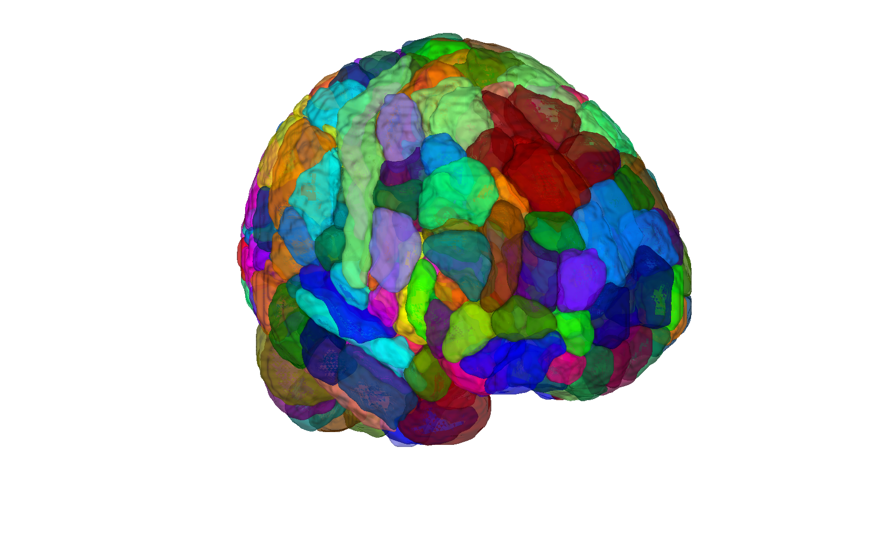
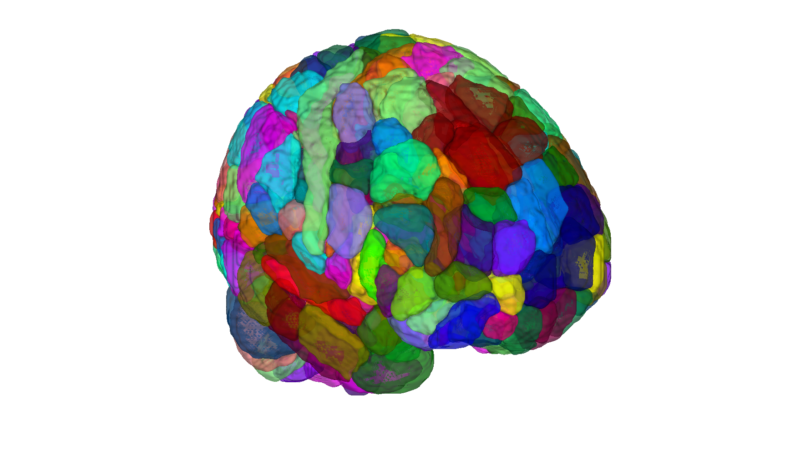

# CANlab combined atlas — 2023 release (CANLab2023)

## Overview

**CANLab2023** is a full-brain mashup atlas combining state-of-the-art
parcellations for each major brain compartment into a single
multi-scale `atlas` object, available in multiple MNI templates and
at coarse and fine granularities. It is the canonical CANlab full-brain
atlas for 2023 and the immediate predecessor of
[`CANLab2024`](../2024_CANLab_atlas).

> See [`README.md`](./README.md) for the **authoritative** description
> of constituent atlases, granularities, reference spaces, licensing,
> CIFTI / grayordinate exports, brainstem strategy, and per-region
> citation map. The README is detailed and load-bearing — do not
> re-read this `contents_description.md` as a substitute.

Constituent atlases (per the README): HCP-MMP1 cortex (Glasser +
CANlab volumetric build); Morel thalamus (license-restricted); Tian
basal ganglia (except GP); CIT168 globus pallidus / amygdala /
midbrain SN-RN-STH; Julich-Brain hippocampal formation; SUIT
cerebellum; Bianciardi brainstem nuclei (license-restricted); Shen
gross brainstem filler; Kragel 2019 PAG.

Available in: MNI152NLin2009cAsym (fmriprep), MNI152NLin6Asym (FSL),
LAS MNI152NLin2009cAsym (qsiprep), and HCP grayordinate (CIFTI). See
[`2023_CANlab_atlas_CIFTI/`](../2023_CANlab_atlas_CIFTI) for the
CIFTI artefacts.

## Primary reference

CANLab2023 is a combined atlas; per-region citations are recorded in
the `references` property of the atlas object and indexed by
`labels_5`. See [`README.md`](./README.md) and the references
section there for the full list. The build process is documented in
[`create_CANLab2023_atlas.m`](./create_CANLab2023_atlas.m); change
history is in [`CHANGES.md`](./CHANGES.md).

## Key images

| Coarse (fmriprep 2 mm, montage) | Fine (fmriprep 2 mm, montage) |
| --- | --- |
|  |  |
|  |  |

The coarse and fine CANLab2023 granularities in the default
fmriprep / 2 mm build. Matching 1 mm and FSL6 builds are also in
`png_images/`; produced by [`visualize_contents.m`](./visualize_contents.m).
Inspection figures live in [`src/`](./src) as part of the build.

## How to load

Use the CANlab Core
[`load_atlas`](https://github.com/canlab/CanlabCore/blob/master/CanlabCore/Data_extraction/load_atlas.m)
keywords. The default (`'canlab2023'`) is coarse, fmriprep, 2 mm:

```matlab
atl = load_atlas('canlab2023');                   % coarse, fmriprep, 2mm (default)
atl = load_atlas('canlab2023_fine');              % fine,   fmriprep, 2mm
atl = load_atlas('canlab2023_fsl6');              % coarse, FSL,      2mm
atl = load_atlas('canlab2023_fine_fsl6_1mm');     % fine,   FSL,      1mm
```

`load_atlas` will rebuild any missing `.mat` from the constituent
atlases via [`create_CANLab2023_atlas.m`](./create_CANLab2023_atlas.m).
Run [`setup_canlab2023.m`](./setup_canlab2023.m) once to put the
build helpers on path.

## File inventory

| File / Folder | Type | What it is |
| --- | --- | --- |
| `CANLab2023_*atlas_object.latest` | text | Sentinel timestamps for the cached builds (8 combos: {fmriprep, FSL} x {fine, coarse} x {1mm, 2mm}). |
| `create_CANLab2023_atlas.m` | MATLAB | **Top-level builder** for all 8 combos. |
| `create_CANLab2023_atlas_cifti.sh` | shell | Builder for the HCP grayordinate / CIFTI version. |
| `setup_canlab2023.m` | MATLAB | Adds build helpers to the MATLAB path. |
| `dilate.m`, `lateralize.m` | MATLAB | Utility helpers used by the builder. |
| `qsiprep/` | dir | qsiprep-space (LAS MNI152NLin2009cAsym) products. |
| `src/` | dir | Build sources, helper scripts, inspection figures. |
| `license/` | dir | Per-constituent licence files. |
| `CHANGES.md` | Markdown | Release change log. |
| `README.md` | Markdown | **Authoritative atlas description.** |
| `visualize_contents.m` | MATLAB | Re-renders `png_images/`. |

## Citations

See the `references` property of any CANLab2023 atlas object for the
full per-region citation map (Glasser 2016, Tian 2020, Pauli 2016,
Pauli 2018, Tyszka & Pauli 2016, Amunts 2020, Diedrichsen 2009 SUIT,
Shen 2013, Bianciardi 2015, Kragel 2019, etc.). The CANlab2024
companion paper draft in
[`2024_CANLab_atlas/docs/canlab2024.pdf`](../2024_CANLab_atlas/docs/canlab2024.pdf)
also documents the construction strategy.
