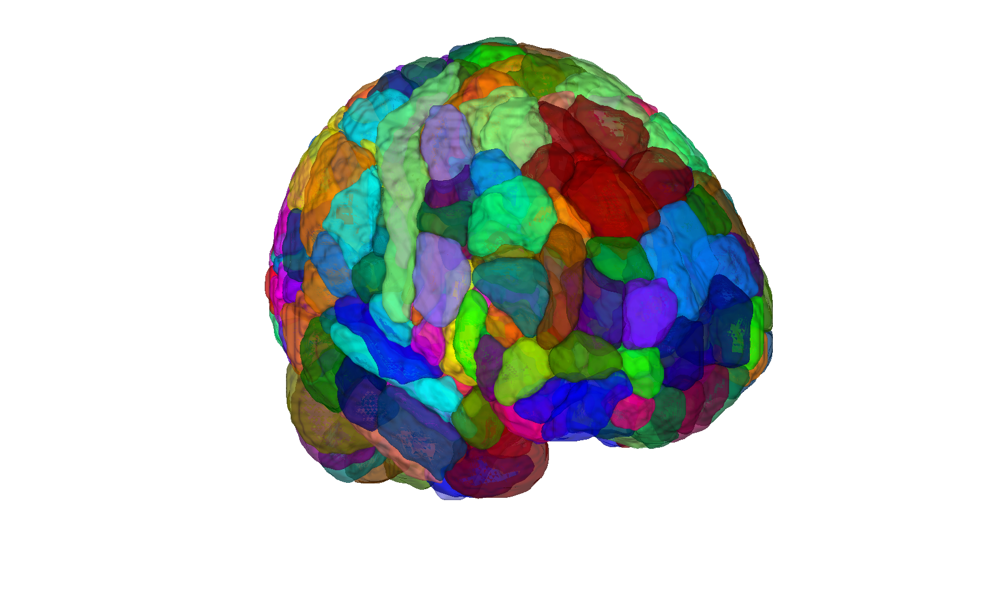
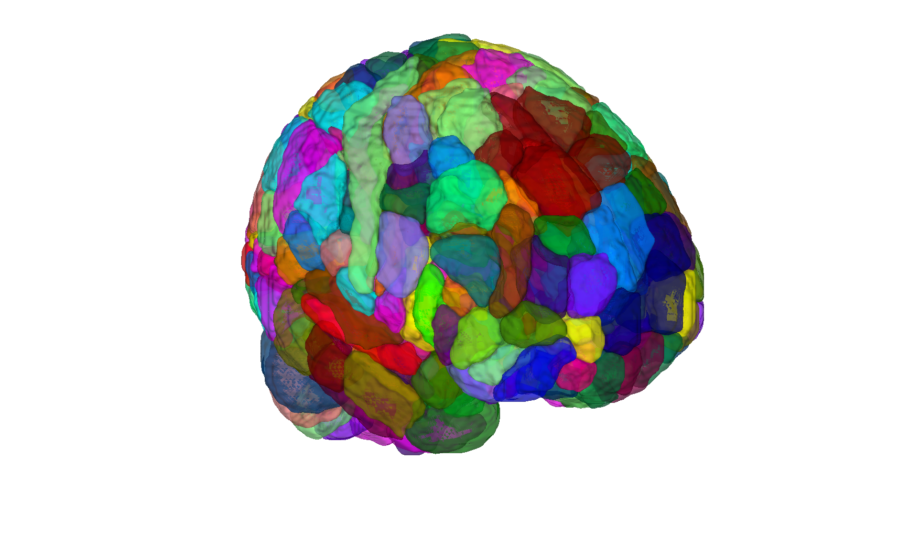

# CANLab2023 — CIFTI / HCP grayordinate version

## Overview

Companion folder to [`2023_CANLab_atlas/`](../2023_CANLab_atlas) that
holds the **HCP grayordinate (CIFTI)** projection of CANLab2023.
The CIFTI build is produced by
[`create_CANLab2023_atlas_cifti.sh`](../2023_CANLab_atlas/create_CANLab2023_atlas_cifti.sh)
in the volumetric sibling folder and lives here so that downstream
CIFTI tooling can locate the `.dlabel.nii` artefacts without
re-running the build.

At the moment this folder is intentionally minimal; the cached CIFTI
artefacts may be added when the build is re-run on the Dartmouth HPC.

For everything else (constituent atlases, granularities, references,
licensing, conventions), see the **authoritative**
[`2023_CANLab_atlas/README.md`](../2023_CANLab_atlas/README.md).

## Primary reference

CANLab2023 is a combined atlas; per-region citations are recorded in
the `references` property of the volumetric atlas object. See the
[`2023_CANLab_atlas/README.md`](../2023_CANLab_atlas/README.md) for
the full list.

## Key images

| Coarse (montage) | Fine (montage) |
| --- | --- |
|  |  |
|  |  |

Volumetric projections of the CIFTI grayordinate CANLab2023 atlas at
coarse and fine granularities. For HCP-style surface renderings,
open the CIFTI `.dlabel.nii` in
[Connectome Workbench](https://www.humanconnectome.org/software/get-connectome-workbench).
PNGs are produced by [`visualize_contents.m`](./visualize_contents.m).

## How to load

The volumetric CANLab2023 builds are what most CanlabCore tooling
uses; load them via the keywords documented in the sibling folder:

```matlab
atl = load_atlas('canlab2023');             % volumetric default
atl = load_atlas('canlab2023_fine_fsl6');   % volumetric fine + FSL space
```

To load a CIFTI `.dlabel.nii` artefact (when present here):

```matlab
ci = cifti_read('CANLab2023_coarse.dlabel.nii');   % requires cifti-matlab on path
```

## File inventory

| File / Folder | Type | What it is |
| --- | --- | --- |
| (currently empty) | — | CIFTI build products will be staged here when generated by `create_CANLab2023_atlas_cifti.sh`. |

## Citations

See [`2023_CANLab_atlas/README.md`](../2023_CANLab_atlas/README.md).
