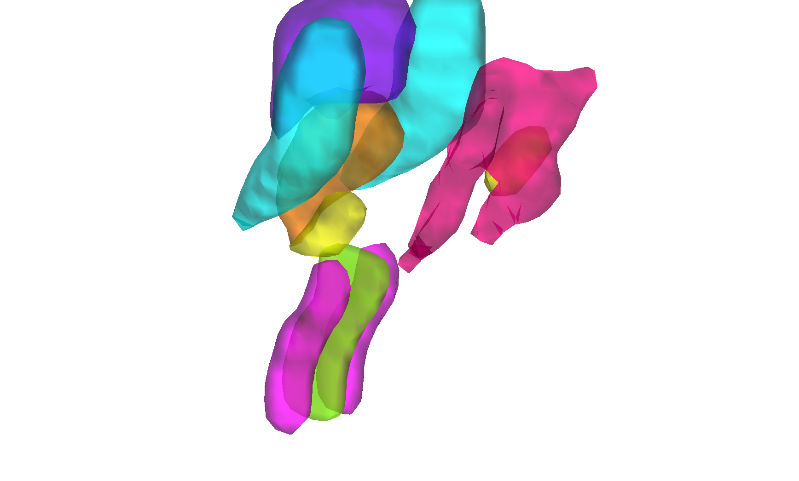

# Harvard Ascending Arousal Network (AAN) brainstem atlas v2.0 (Edlow et al. 2023)

## Overview

The **Harvard AAN brainstem atlas** is built from histology,
immunohistochemistry and ex vivo diffusion tractography in three
postmortem human brains. Its 18 ROIs cover the principal nuclei of
the ascending arousal network (locus coeruleus, laterodorsal
tegmental, parabrachial complex, pedunculopontine tegmental, etc.),
midbrain reticular formation, raphe nuclei, PAG and VTA, and have
been characterised against structural and resting-state connectivity
(DMN). The CANlab redistribution provides two volumetric builds:

- `harvard_aan_v2_MNI152NLin2009cAsym_atlas_object.mat` — fmriprep default space
- `harvard_aan_v2_MNI152NLin6Asym_atlas_object.mat` — FSL default space

Unlike the (license-restricted) Bianciardi atlas, the AAN atlas is
released under **CC0 1.0** and is freely redistributable.

> See [`README.md`](./README.md) for the authoritative methods +
> licensing summary and a region-by-region cross-walk with
> Bianciardi. Outline overlays are in
> [`html/`](./html).

## Primary reference

- Edlow, B. L., & Kinney, H. C. (2023). *Harvard Ascending Arousal
  Network Atlas — Version 2.0.* **Dryad Digital Repository.**
  [doi:10.5061/dryad.zw3r228d2](https://doi.org/10.5061/dryad.zw3r228d2)

Companion biorxiv (Edlow et al. 2023b):
[doi:10.1101/2023.07.13.548265](https://doi.org/10.1101/2023.07.13.548265).
No local PDF is checked in.

## Key images

Pre-rendered figures in [`png_images/`](./png_images):


*Axial + sagittal montage of AAN nuclei in fmriprep default space.*



*3-D isosurface of AAN nuclei in FSL default space.*

Side-by-side comparisons with Bianciardi nuclei are cached in
[`html/`](./html) (e.g., `html/compare_with_bianciardi_0{1,2,3}.png`).
[`visualize_contents.m`](./visualize_contents.m) regenerates the
montage / isosurface PNGs.

## How to load

Use the CANlab Core
[`load_atlas`](https://github.com/canlab/CanlabCore/blob/master/CanlabCore/Data_extraction/load_atlas.m)
keywords:

```matlab
atl = load_atlas('harvard_aan');         % MNI152NLin2009cAsym (fmriprep)
atl = load_atlas('harvard_aan_fsl6');    % MNI152NLin6Asym (FSL)
```

Direct loads:

```matlab
S   = load('harvard_aan_v2_MNI152NLin2009cAsym_atlas_object.mat');
atl = S.atlas_obj;
```

## File inventory

| File / Folder | Type | What it is |
| --- | --- | --- |
| `harvard_aan_v2_MNI152NLin2009cAsym_atlas_object.mat` | MAT (`atlas`) | AAN atlas in fmriprep space. `load_atlas('harvard_aan')`. |
| `harvard_aan_v2_MNI152NLin6Asym_atlas_object.mat` | MAT (`atlas`) | AAN atlas in FSL space. `load_atlas('harvard_aan_fsl6')`. |
| `harvard_aan_v2_*_atlas_regions.{img,hdr,mat}` | Analyze / MAT | Per-region label volumes in each space. |
| `aan_MNI152NLin2009cAsym_create_atlas.m` | MATLAB | Constructor script (fmriprep build). |
| `aan_MNI152NLin6Asym_create_atlas.m` | MATLAB | Constructor script (FSL build). |
| `compare_with_bianciardi.m` | MATLAB | Side-by-side comparison with Bianciardi nuclei. |
| `src/`, `src_to_MNI152NLin2009cAsym/` | dir | Build inputs and transformed source files. |
| `html/` | dir | Static HTML report + side-by-side comparison PNGs. |
| `README.md` | Markdown | **Authoritative methods, comparison, and licence summary.** |
| `png_images/` | dir | Pre-rendered montage / isosurface PNGs. |
| `visualize_contents.m` | MATLAB | Re-renders `png_images/`. |

## Citations

- Edlow BL, Kinney HC. (2023). Harvard Ascending Arousal Network
  Atlas — Version 2.0. *Dryad*.
  [doi:10.5061/dryad.zw3r228d2](https://doi.org/10.5061/dryad.zw3r228d2)
- Edlow BL, Olchanyi M, Freeman HJ, et al. (2023). Sustaining
  wakefulness: brainstem connectivity in human consciousness.
  *bioRxiv* 2023.07.13.548265.
  [doi:10.1101/2023.07.13.548265](https://doi.org/10.1101/2023.07.13.548265)
- Edlow BL, Takahashi E, Wu O, et al. (2012). Neuroanatomic
  connectivity of the human ascending arousal system critical to
  consciousness and its disorders. *J Neuropathol Exp Neurol*
  71:531–546.
  [doi:10.1097/NEN.0b013e3182588293](https://doi.org/10.1097/NEN.0b013e3182588293)
