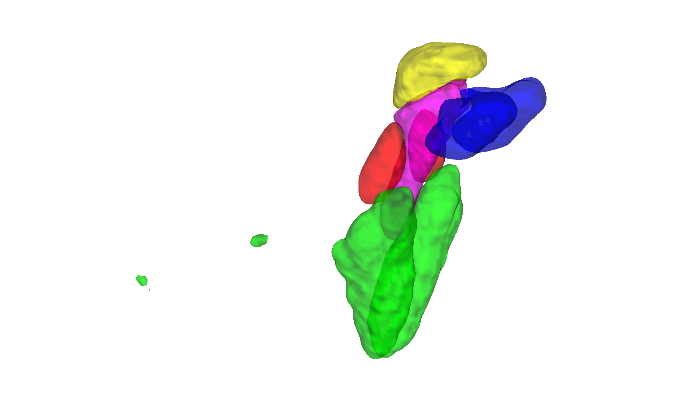

# Levinson / Bari limbic brainstem atlas (Levinson et al. 2023)

## Overview

A probabilistic brainstem atlas of **five limbic-system nuclei**
(Locus Coeruleus, Ventral Tegmental Area, Periaqueductal Gray,
Nucleus Tractus Solitarius, Dorsal Raphe) manually segmented from
T1/T2 (and possibly diffusion) MRI in 200+ HCP participants by the
Bari lab. Masks were reviewed by a neurosurgeon and neuroradiologist
to ensure anatomical plausibility. The atlas has an **open license**
and is preferred over Bianciardi for those five nuclei when
distribution restrictions matter; see the
[`README.md`](./README.md) for caveats (in-vivo contrast cannot
match Bianciardi's specialised T1-TSE for cholinergic nuclei).

Two CANlab builds are provided:

- `levinson_bari_limbic_brainstem_atlas_MNI152NLin2009cAsym_atlas_object.mat` — fmriprep default
- `levinson_bari_limbic_brainstem_atlas_MNI152NLin6Asym_atlas_object.mat` — FSL default

> See [`README.md`](./README.md) for the authoritative methods write-up
> and a region-by-region comparison with Bianciardi.

## Primary reference

- Levinson, S., Miller, M., Iftekhar, A., Justo, M., Arriola, D.,
  Wei, W., Hazany, S., Avecillas-Chasin, J., Kuhn, T., Horn, A.,
  & Bari, A. (2023). *A structural connectivity atlas of limbic
  brainstem nuclei.* **Frontiers in Neuroimaging, 2**, 1041973.
  [doi:10.3389/fnimg.2023.1041973](https://doi.org/10.3389/fnimg.2023.1041973)

No local PDF is checked in. External resources:
<https://drive.google.com/drive/folders/1aC1wDXdrn848xLiHnAf0fqquYiXVDLLC>.

## Key images

Pre-rendered figures in [`png_images/`](./png_images):


*Axial + sagittal montage of the five limbic brainstem nuclei in
fmriprep default space.*



*3-D isosurface in FSL default space.*

Bianciardi outline-overlay comparisons live in
[`html/compare_with_bianciardi_0{1,2,3}.png`](./html).
[`visualize_contents.m`](./visualize_contents.m) regenerates the
montage / isosurface PNGs.

## How to load

Use the CANlab Core
[`load_atlas`](https://github.com/canlab/CanlabCore/blob/master/CanlabCore/Data_extraction/load_atlas.m)
keywords:

```matlab
atl = load_atlas('limbic_brainstem_atlas');         % MNI152NLin2009cAsym (fmriprep)
atl = load_atlas('limbic_brainstem_atlas_fsl6');    % MNI152NLin6Asym (FSL)
```

Direct loads:

```matlab
S   = load('levinson_bari_limbic_brainstem_atlas_MNI152NLin2009cAsym_atlas_object.mat');
atl = S.atlas_obj;
```

## File inventory

| File / Folder | Type | What it is |
| --- | --- | --- |
| `levinson_bari_*_MNI152NLin2009cAsym_atlas_object.mat` | MAT (`atlas`) | Limbic brainstem atlas in fmriprep space. `load_atlas('limbic_brainstem_atlas')`. |
| `levinson_bari_*_MNI152NLin6Asym_atlas_object.mat` | MAT (`atlas`) | Limbic brainstem atlas in FSL space. `load_atlas('limbic_brainstem_atlas_fsl6')`. |
| `levinson_bari_*_atlas_regions.{img,hdr,mat}` | Analyze / MAT | Per-region label volumes in each space. |
| `LBLBA_MNI152NLin2009cAsym_create_atlas.m` | MATLAB | Constructor script (fmriprep build). |
| `LBLBA_MNI152NLin6Asym_create_atlas.m` | MATLAB | Constructor script (FSL build). |
| `compare_with_bianciardi.m` | MATLAB | Side-by-side comparison with Bianciardi nuclei. |
| `src/`, `src_to_MNI152NLin2009cAsym/` | dir | Build inputs and transformed source files. |
| `html/` | dir | Static HTML report + comparison PNGs. |
| `README.md` | Markdown | **Authoritative methods + Bianciardi cross-walk.** |
| `png_images/` | dir | Pre-rendered montage / isosurface PNGs. |
| `visualize_contents.m` | MATLAB | Re-renders `png_images/`. |

## Citations

- Levinson S, Miller M, Iftekhar A, et al. (2023). A structural
  connectivity atlas of limbic brainstem nuclei.
  *Front Neuroimaging* 2:1041973.
  [doi:10.3389/fnimg.2023.1041973](https://doi.org/10.3389/fnimg.2023.1041973)
- Bianciardi M, Strong C, Toschi N, et al. (2015). A probabilistic
  template of human mesopontine tegmental nuclei from in vivo 7T MRI.
  *NeuroImage* 117:67–79.
  [doi:10.1016/j.neuroimage.2015.05.014](https://doi.org/10.1016/j.neuroimage.2015.05.014)
- Edlow BL, Kinney HC. (2023). Harvard Ascending Arousal Network
  Atlas — Version 2.0. *Dryad*.
  [doi:10.5061/dryad.zw3r228d2](https://doi.org/10.5061/dryad.zw3r228d2)
