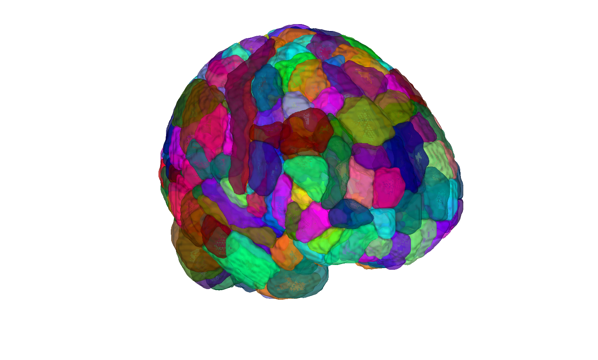
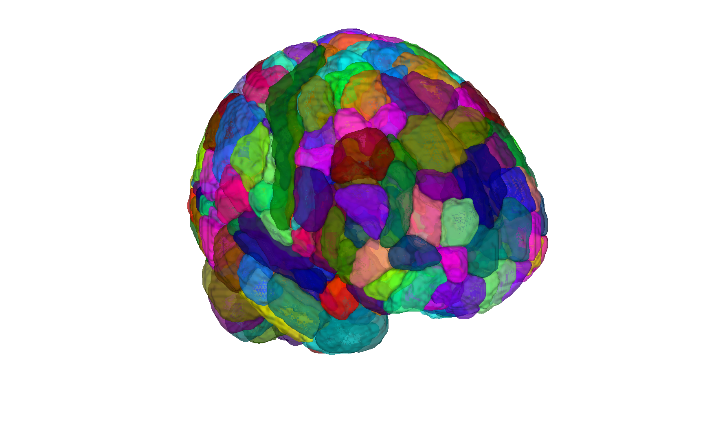

# CANlab combined atlas — 2024 release (CANLab2024)

## Overview

**CANLab2024** is the current CANlab full-brain mashup atlas,
succeeding [`CANLab2023`](../2023_CANLab_atlas). It is provided in
multiple MNI templates and at coarse / fine granularities, and
supplies the canonical full-brain parcellation used by the
**2024 pain-pathways atlas** (`pain_pathways2024_atlas_obj.mat`,
also in this folder; loaded via `load_atlas('painpathways2024')`).

An **openCANLab2024** variant substitutes regions with restrictive
licensing (Bianciardi nuclei) for open alternatives from the Harvard
AAN and Levinson/Bari limbic atlases — see the README for the
substitution table.

> See [`README.md`](./README.md) for the **authoritative** description
> of granularities (labels through labels_5), constituent atlases,
> notable changes vs CANLab2023 (Cartmell NAc core/shell; Iglesias
> hypothalamus; Iglesias thalamus; Levinson/Bari DR/LC/NTS; amygdala
> intercalated-nuclei subdivision; etc.) and the openCANLab2024
> substitutions. The README is detailed and load-bearing; do not
> re-read this `contents_description.md` as a substitute.

A draft methods/companion paper is in
[`docs/canlab2024.pdf`](./docs/canlab2024.pdf).

## Primary reference

CANLab2024 is a combined atlas; per-region citations are recorded in
the `references` property of the atlas object and indexed by
`labels_5`. See [`README.md`](./README.md) and
[`docs/canlab2024.pdf`](./docs/canlab2024.pdf) for the build narrative.
Per-region papers include Glasser 2016, Tian 2020, Cartmell 2019,
Billot 2020 (Iglesias hypothalamus), Iglesias 2018 (thalamus),
Amunts 2020 (Julich), Tyszka & Pauli 2016 (CIT168 amygdala),
Pauli 2018 (CIT168 RL), Diedrichsen 2009 (SUIT), Bianciardi 2015,
Levinson 2023, Edlow 2023, Kragel 2019.

## Key images

| Coarse (fmriprep 2 mm, montage) | Fine (fmriprep 2 mm, montage) |
| --- | --- |
|  |  |
|  |  |

The coarse and fine CANLab2024 granularities in the default
fmriprep / 2 mm build. Open-licence (`opencanlab2024_*`) and
pain-pathway (`painpathways2024_*`) renderings are also in
`png_images/`; produced by [`visualize_contents.m`](./visualize_contents.m).
Manuscript figures are in [`docs/images/`](./docs/images).

## How to load

Use the CANlab Core
[`load_atlas`](https://github.com/canlab/CanlabCore/blob/master/CanlabCore/Data_extraction/load_atlas.m)
keywords. The default (`'canlab2024'`) is coarse, fmriprep, 2 mm:

```matlab
atl = load_atlas('canlab2024');                  % coarse, fmriprep, 2mm (default)
atl = load_atlas('canlab2024_fine');             % fine,   fmriprep, 2mm
atl = load_atlas('canlab2024_fsl6');             % coarse, FSL,      2mm
atl = load_atlas('canlab2024_fine_fsl6_1mm');    % fine,   FSL,      1mm

% Open-license variant (Bianciardi-free)
atl = load_atlas('opencanlab2024');              % coarse, fmriprep, 2mm
atl = load_atlas('opencanlab2024_fine_fsl6');    % fine,   FSL,      2mm

% Pain-pathways subset built from CANLab2024
pp  = load_atlas('painpathways2024');
pp  = load_atlas('painpathways2024_finegrained');
```

`load_atlas` will rebuild missing `.mat` files via
[`create_CANLab2024_atlas.m`](./create_CANLab2024_atlas.m). Run
[`setup_canlab2024.m`](./setup_canlab2024.m) once to put helpers on
path. CIFTI artefacts are also distributed (see file inventory).

## File inventory

| File / Folder | Type | What it is |
| --- | --- | --- |
| `CANLab2024_*atlas_object.latest` | text | Sentinel timestamps for the cached builds (fine/coarse x fmriprep/FSL x 1mm/2mm). |
| `create_CANLab2024_atlas.m` | MATLAB | **Top-level builder.** |
| `create_pain_pathways2024_brainnetwork.m` | MATLAB | Builder for the 2024 pain-pathways subset. |
| `pain_pathways2024_atlas_obj.mat` | MAT (`atlas`) | Pain-pathways atlas object built from CANLab2024. `load_atlas('painpathways2024')`. |
| `setup_canlab2024.m` | MATLAB | Adds helpers to the MATLAB path. |
| `CANLab2024_fsaverage-164k_hemi-{L,R}_coarse.label.gii` | GIfTI | fsaverage 164k cortical labels (coarse, per hemisphere). |
| `openCANLab2024_MNI152NLin6Asym_coarse_2mm.dlabel.nii` | CIFTI | HCP grayordinate label of the openCANLab2024 coarse 2mm build. |
| `src/` | dir | Build sources, helper scripts, per-region overlays. |
| `license/` | dir | Per-constituent licence files. |
| `docs/` | dir | Companion paper draft (`canlab2024.pdf` + LaTeX sources) and manuscript figures (`docs/images/`). |
| `README.md` | Markdown | **Authoritative atlas description.** |
| `visualize_contents.m` | MATLAB | Re-renders `png_images/`. |

## Citations

See [`docs/canlab2024.pdf`](./docs/canlab2024.pdf) and the
`references` property of the atlas object for the full per-region
citation map. Key foundational sources include Glasser et al. 2016,
Tian et al. 2020, Cartmell et al. 2019, Billot et al. 2020,
Iglesias et al. 2018, Amunts et al. 2020, Tyszka & Pauli 2016,
Pauli et al. 2018, Diedrichsen 2009, Bianciardi et al. 2015,
Levinson et al. 2023, Edlow & Kinney 2023, and Kragel et al. 2019.
