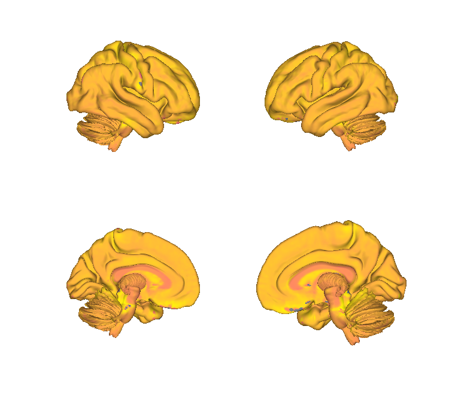
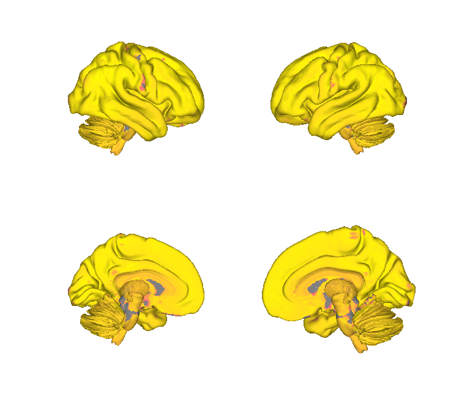
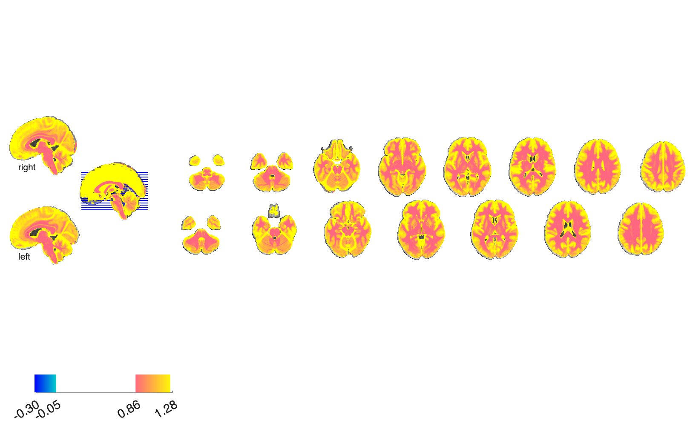
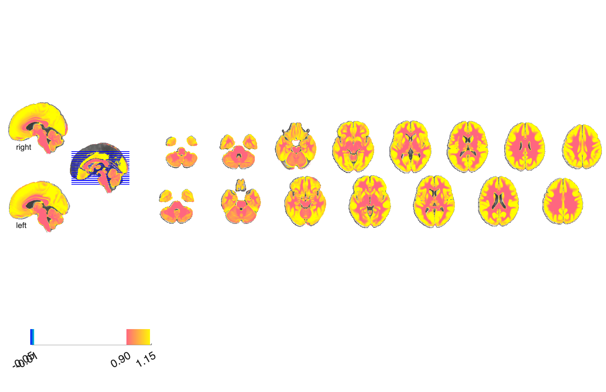

# Mitochondrial energetic-capacity maps (Pourmajidian et al. 2026)

## Overview

A set of **five mitochondrial / oxidative phosphorylation maps** of
the human brain reflecting distinct energy-metabolism pathways:
**Complex I (CI)**, **Complex II (CII)**, **Complex IV (CIV)**,
**Mitochondrial Respiratory Capacity (MRC)**, **Total Respiratory
Capacity (TRC)**, plus **Mitochondrial Density (MitoD)**. Each map
shows regionally-specific distributions and lifespan trajectories
across the human brain (Pourmajidian et al. 2026, *PLoS Biology*).
These are continuous patterns (not labelled atlas parcels), so they
load as `fmri_data` objects and are rendered with
`canlab_render_patterns`.

A bundled MATLAB object [`Mito_Object.mat`](./Mito_Object.mat) packs
all six maps as a single `fmri_data` for convenience.

## Primary reference

- Pourmajidian, M., Hansen, J. Y., Shafiei, G., Mišić, B., & Dagher, A.
  (2026). *Five energy metabolism pathways show distinct regional
  distributions and lifespan trajectories in the human brain.*
  **PLoS Biology, 24**(1), e3003619.

Full citation is mirrored in [`References.txt`](./References.txt).
No local PDF is checked in; see *PLoS Biology* for the published
article.

## Key images

| Mitochondrial Respiratory Capacity (MRC) | Mitochondrial Density (MitoD) |
| --- | --- |
|  |  |
|  |  |

Two representative mitochondrial energetic-capacity maps. The
remaining four — CI, CII, CIV, TRC — and matching isosurfaces are
also in `png_images/`; produced by
[`visualize_contents.m`](./visualize_contents.m).

## How to load

There is no `load_atlas` / `load_image_set` keyword for these maps.
Load any single map directly:

```matlab
ci    = fmri_data('CI.nii');     % Complex I
cii   = fmri_data('CII.nii');    % Complex II
civ   = fmri_data('CIV.nii');    % Complex IV
mrc   = fmri_data('MRC.nii');    % Mitochondrial Respiratory Capacity
trc   = fmri_data('TRC.nii');    % Total Respiratory Capacity
mitoD = fmri_data('MitoD.nii');  % Mitochondrial Density
```

Or load the bundled multi-image object:

```matlab
S   = load('Mito_Object.mat');
obj = S.Mito_Object;             % fmri_data with one volume per pathway
```

Each `.nii` is also distributed as a `.nii.gz` copy (smaller for
quick downloads).

## File inventory

| File | Type | What it is |
| --- | --- | --- |
| `CI.nii` / `CI.nii.gz` | NIfTI | Complex I map. |
| `CII.nii` / `CII.nii.gz` | NIfTI | Complex II map. |
| `CIV.nii` / `CIV.nii.gz` | NIfTI | Complex IV map. |
| `MRC.nii` / `MRC.nii.gz` | NIfTI | Mitochondrial respiratory capacity map. |
| `TRC.nii` / `TRC.nii.gz` | NIfTI | Total respiratory capacity map. |
| `MitoD.nii` / `MitoD.nii.gz` | NIfTI | Mitochondrial density map. |
| `Mito_Object.mat` | MAT (`fmri_data`) | All six maps bundled in one object. |
| `References.txt` | text | Primary citation. |
| `visualize_contents.m` | MATLAB | Renders surface / montage per map into `png_images/`. |

## Citations

- Pourmajidian M, Hansen JY, Shafiei G, Mišić B, Dagher A. (2026).
  Five energy metabolism pathways show distinct regional
  distributions and lifespan trajectories in the human brain.
  *PLoS Biology* 24(1):e3003619.
- Hansen JY, Shafiei G, Markello RD, et al. (2022). Mapping
  neurotransmitter systems to the structural and functional
  organization of the human neocortex. *Nat Neurosci* 25:1569–1581.
  [doi:10.1038/s41593-022-01186-3](https://doi.org/10.1038/s41593-022-01186-3)
