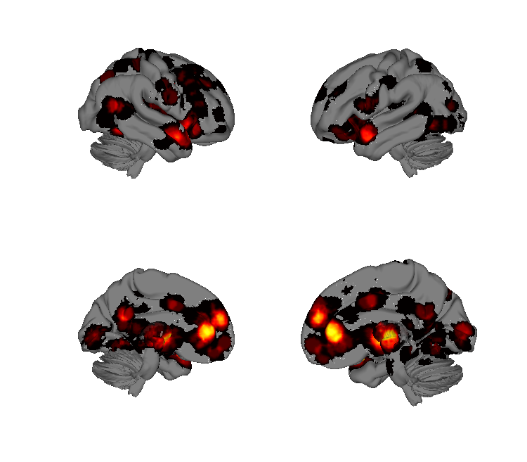
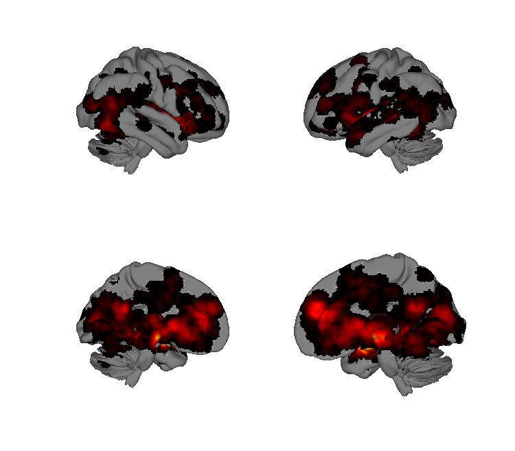
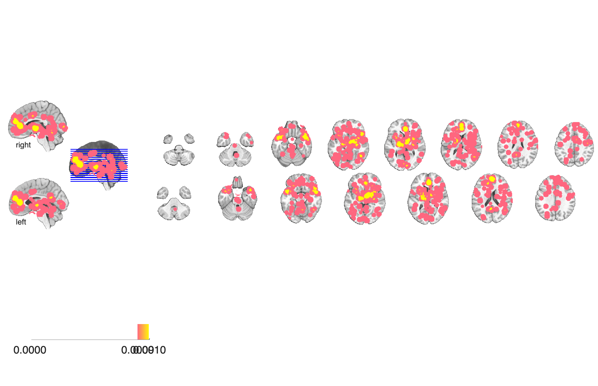
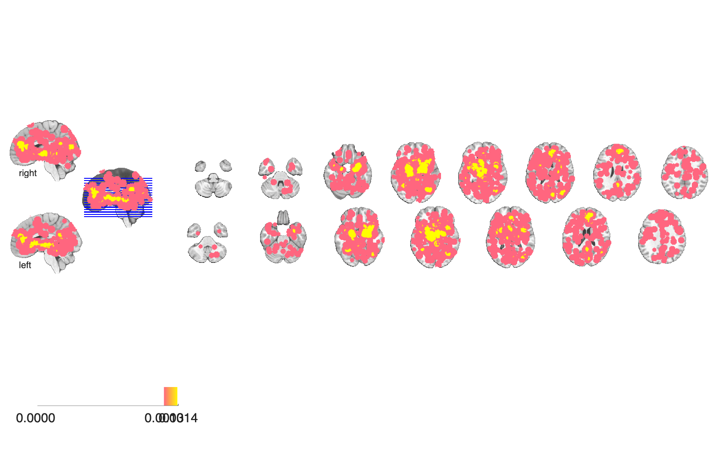

# Emotion meta-analysis, 64 neuroimaging studies (Wager et al. 2003)

## Overview

Multilevel-kernel-density (MKDA) meta-analysis over 64 PET / fMRI emotion
studies, contrasting **approach (appetitive / positive)** vs. **avoidance
(aversive / negative)** emotional states across the brain. The folder
provides voxelwise density images for approach and avoidance separately,
plus the directional contrast maps `av-ap` (avoidance > approach) and
`ap-av` (approach > avoidance) in enlarged-cluster form. These are
historical Analyze (`.hdr` + `.img.gz`) volumes in MNI space.

## Primary reference

Wager, T. D., Phan, K. L., Liberzon, I., & Taylor, S. F. (2003). Valence,
gender, and lateralization of functional brain anatomy in emotion: a
meta-analysis of findings from neuroimaging. *NeuroImage*, 19(3),
513–531. [doi:10.1016/S1053-8119(03)00078-8](https://doi.org/10.1016/S1053-8119(03)00078-8)
· [local PDF](./Wager_2003_Neuroimage.pdf)

## Key images

| Approach-emotion density | Avoidance-emotion density |
| --- | --- |
|  |  |
|  |  |

Activation-density maps for approach-related (e.g., happy, anger) and
avoidance-related (e.g., fear, sad) emotions across the 64-study meta.
The directional contrasts (`*_Approach_gt_Avoidance`,
`*_Avoidance_gt_Approach`) are also in `png_images/`.

## How to load

These maps are not registered in `load_image_set`. Load any volume
directly with CANlab `fmri_data`:

```matlab
av = fmri_data(which('dens_av.hdr'));      % avoidance density
ap = fmri_data(which('dens_ap.hdr'));      % approach density
av_gt_ap = fmri_data(which('av-ap_enl.hdr'));
ap_gt_av = fmri_data(which('ap-av_enl.hdr'));
```

`.img` files are stored gzipped — `fmri_data` reads `.hdr` plus the
gzipped `.img.gz` directly on modern CanlabCore versions; if your local
copy cannot read `.img.gz`, gunzip first.

## File inventory

| File | Type | What it is |
| --- | --- | --- |
| `dens_ap.hdr` / `dens_ap.img.gz` | Analyze | **Approach (appetitive) density** map across 64 studies. |
| `dens_av.hdr` / `dens_av.img.gz` | Analyze | **Avoidance (aversive) density** map across 64 studies. |
| `ap-av_enl.hdr` / `ap-av_enl.img.gz` | Analyze | Approach > Avoidance contrast (enlarged clusters). |
| `av-ap_enl.hdr` / `av-ap_enl.img.gz` | Analyze | Avoidance > Approach contrast (enlarged clusters). |
| `Wager_2003_Neuroimage.pdf` | PDF | Primary reference. |
| `visualize_contents.m` | MATLAB | Regenerates `png_images/` using `canlab_render_patterns`. |

## Citations

- Wager TD, Phan KL, Liberzon I, Taylor SF (2003). Valence, gender, and
  lateralization of functional brain anatomy in emotion: a meta-analysis
  of findings from neuroimaging. *NeuroImage* 19:513–531.
  [doi:10.1016/S1053-8119(03)00078-8](https://doi.org/10.1016/S1053-8119(03)00078-8)
- Wager TD, Lindquist M, Kaplan L (2007). Meta-analysis of functional
  neuroimaging data: current and future directions. *Soc Cogn Affect
  Neurosci* 2:150–158.
  [doi:10.1093/scan/nsm015](https://doi.org/10.1093/scan/nsm015)
