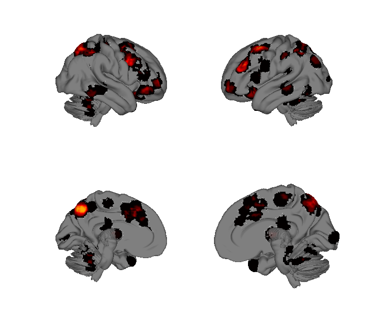
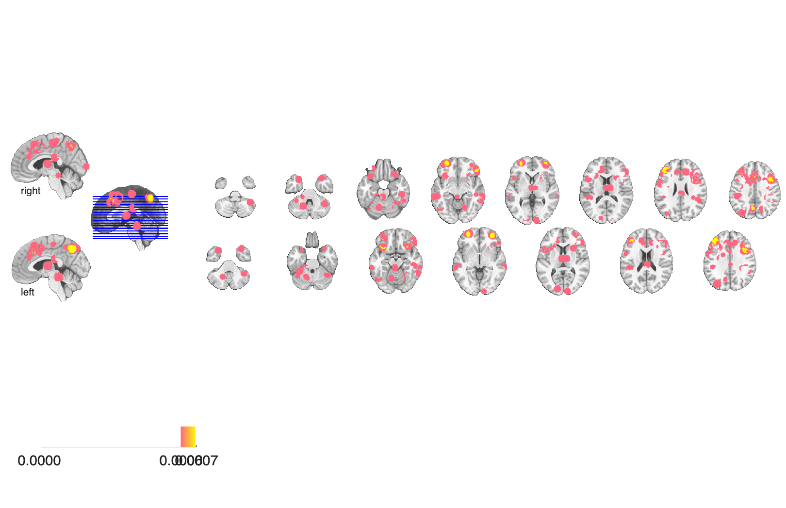

# Working-memory meta-analysis, 60 studies (Wager & Smith 2003)

## Overview

Multilevel-kernel-density (MKDA) meta-analysis of 60 PET / fMRI
working-memory studies, with a focus on the contrast between
**executive** (manipulation / updating / interference) demands and
**non-executive (storage)** demands. The folder ships density maps for
non-executive WM and the executive-minus-non-executive contrast (both
unthresholded and thresholded) in historical Analyze format.

## Primary reference

Wager, T. D., & Smith, E. E. (2003). Neuroimaging studies of working
memory: a meta-analysis. *Cognitive, Affective, & Behavioral
Neuroscience*, 3(4), 255–274.
[doi:10.3758/CABN.3.4.255](https://doi.org/10.3758/CABN.3.4.255)
· [local PDF](./Wager_2003_CogAffBehNeurosci.pdf)

## Key images

| Executive WM > non-executive (cortical surface) | Executive WM > non-executive (montage) |
| --- | --- |
|  |  |

The main executive-vs-storage contrast across the 60 working-memory
studies. The thresholded contrast (`*_thresh`) and the non-executive
density baseline (`WagerSmith2003_NonExec_density_*`) are also in
`png_images/`.

## How to load

Not registered in `load_image_set` — load directly:

```matlab
noexec = fmri_data(which('dens_noexec.hdr'));        % non-executive WM density
exec_noexec = fmri_data(which('dens_exec-noexec.hdr'));   % unthresh contrast
exec_noexec_thr = fmri_data(which('dens_exec-noexec_thr.hdr')); % thresholded
```

## File inventory

| File | Type | What it is |
| --- | --- | --- |
| `dens_noexec.hdr` / `dens_noexec.img.gz` | Analyze | Density map of non-executive (storage) WM tasks. |
| `dens_exec-noexec.hdr` / `dens_exec-noexec.img.gz` | Analyze | Executive minus non-executive density contrast (unthresholded). |
| `dens_exec-noexec_thr.hdr` / `dens_exec-noexec_thr.img.gz` | Analyze | Thresholded executive vs. non-executive density contrast. |
| `Wager_2003_CogAffBehNeurosci.pdf` | PDF | Primary reference. |
| `visualize_contents.m` | MATLAB | Regenerates `png_images/`. |

## Citations

- Wager TD, Smith EE (2003). Neuroimaging studies of working memory: a
  meta-analysis. *Cogn Affect Behav Neurosci* 3:255–274.
  [doi:10.3758/CABN.3.4.255](https://doi.org/10.3758/CABN.3.4.255)
- Owen AM, McMillan KM, Laird AR, Bullmore E (2005). N-back working
  memory paradigm: a meta-analysis of normative functional neuroimaging
  studies. *Hum Brain Mapp* 25:46–59.
  [doi:10.1002/hbm.20131](https://doi.org/10.1002/hbm.20131)
