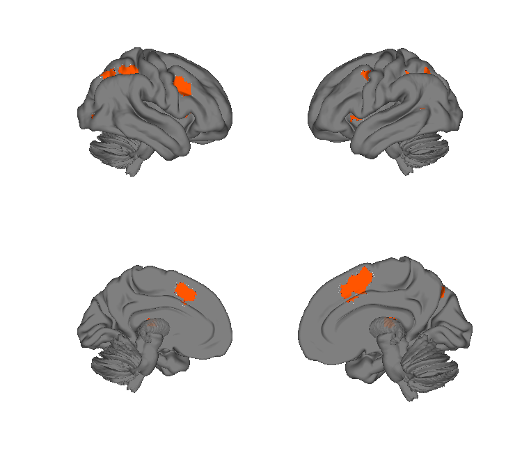
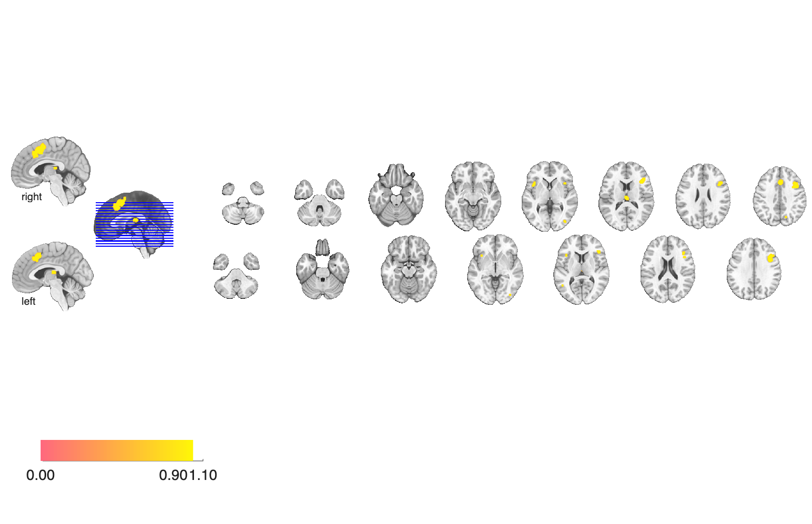

# Attention-switching meta-analysis, 31 studies (Wager et al. 2004)

## Overview

Coordinate-based meta-analysis of 31 PET / fMRI studies of
**attention/task switching**, using multilevel kernel density (MKDA) to
identify a consensus network for switching attention between object
features, locations, and task rules. The folder contains a single
thresholded cluster map summarising the cross-study consensus.

## Primary reference

Wager, T. D., Jonides, J., & Reading, S. (2004). Neuroimaging studies of
shifting attention: a meta-analysis. *NeuroImage*, 22(4), 1679–1693.
[doi:10.1016/j.neuroimage.2004.03.052](https://doi.org/10.1016/j.neuroimage.2004.03.052)
· [local PDF](./Wager_2004_Neuroimage.pdf)

## Key images

| Attention-switching clusters — cortical surface | Attention-switching clusters — axial montage |
| --- | --- |
|  |  |

Consensus activation clusters across 31 task-switching / mixing
studies. The matching isosurface is at
`png_images/Wager2004_AttentionSwitching_clusters_isosurface.png`.

## How to load

Not registered in `load_image_set`. Load directly:

```matlab
swc = fmri_data(which('switch_clusters_mix_final.hdr'));
```

## File inventory

| File | Type | What it is |
| --- | --- | --- |
| `switch_clusters_mix_final.hdr` / `.img.gz` | Analyze | Final thresholded cross-study attention-switching cluster map (mixed paradigms). |
| `Wager_2004_Neuroimage.pdf` | PDF | Primary reference. |
| `visualize_contents.m` | MATLAB | Regenerates `png_images/`. |

## Citations

- Wager TD, Jonides J, Reading S (2004). Neuroimaging studies of
  shifting attention: a meta-analysis. *NeuroImage* 22:1679–1693.
  [doi:10.1016/j.neuroimage.2004.03.052](https://doi.org/10.1016/j.neuroimage.2004.03.052)
- Kim C, Cilles SE, Johnson NF, Gold BT (2012). Domain general and
  domain preferential brain regions associated with different types of
  task switching: a meta-analysis. *Hum Brain Mapp* 33:130–142.
  [doi:10.1002/hbm.21199](https://doi.org/10.1002/hbm.21199)
