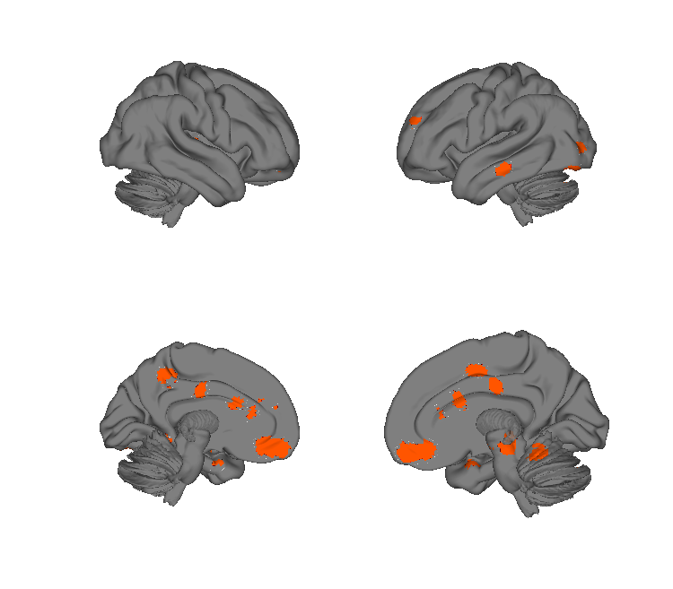
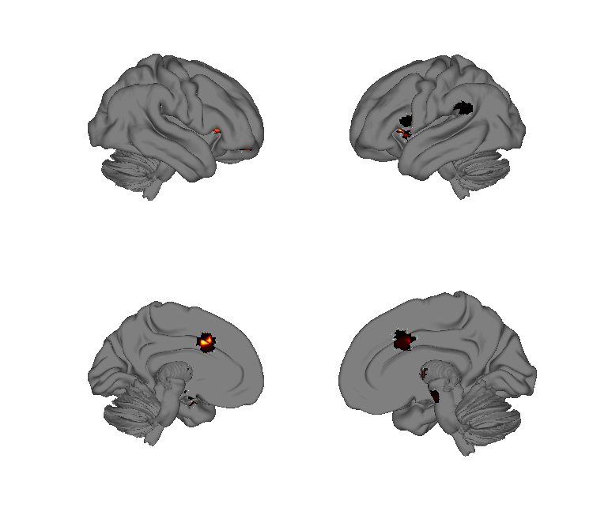
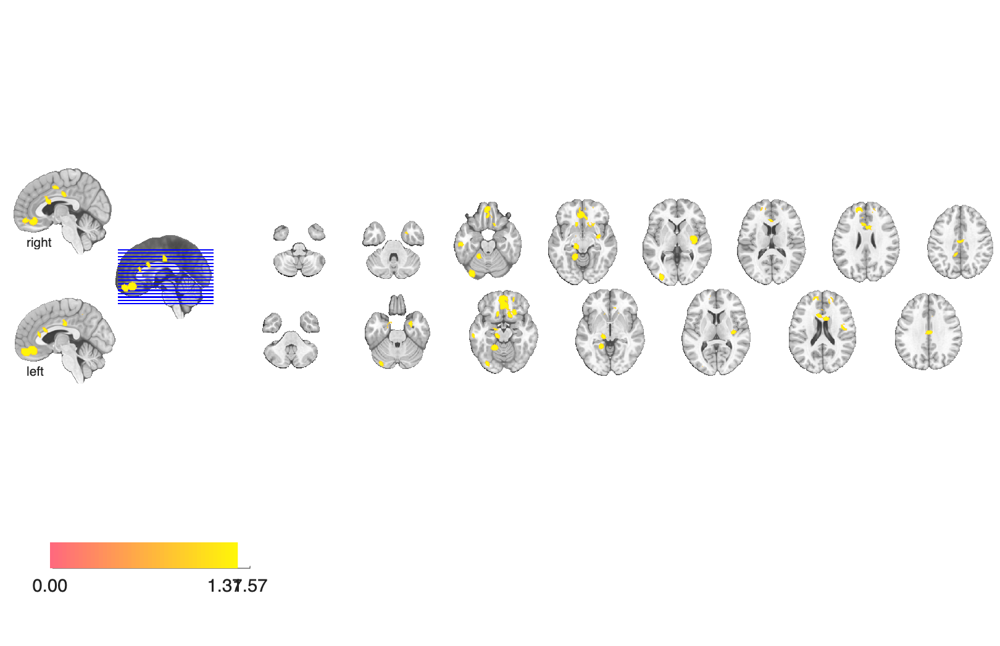
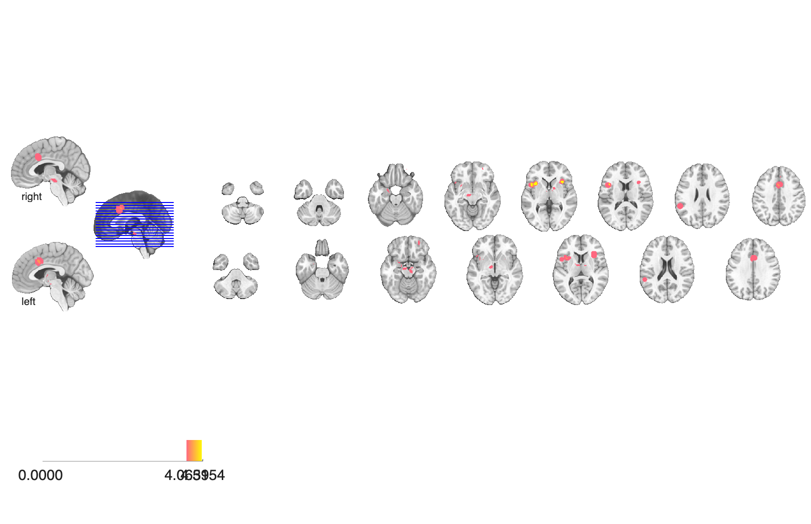

# Anxiety-disorders meta-analysis (Etkin & Wager 2007, AJP)

## Overview

Cross-disorder coordinate-based meta-analysis of fMRI / PET studies of
**PTSD, social anxiety disorder, and specific phobia**, combined with a
meta-analysis of healthy-subject **fear conditioning**, to identify
shared and disorder-specific patterns of hyperactivation. The folder
contains two consensus statistic maps: a chi-square / pooled-effect map
of disorder hyperactivation (`chi2p_map_UNC_p005`, p < .005
uncorrected) and the fear-conditioning consensus map
(`Fear_conditioning_p005`).

## Primary reference

Etkin, A., & Wager, T. D. (2007). Functional neuroimaging of anxiety: a
meta-analysis of emotional processing in PTSD, social anxiety disorder,
and specific phobia. *American Journal of Psychiatry*, 164(10),
1476–1488. [doi:10.1176/appi.ajp.2007.07030504](https://doi.org/10.1176/appi.ajp.2007.07030504)
· [local PDF](./Etkin_2007_AmJPsychiatry.pdf)

## Key images

| Anxiety disorders (chi² *p* < 0.005) | Fear conditioning (*p* < 0.005) |
| --- | --- |
|  |  |
|  |  |

Group differences across anxiety-disorder studies (left) versus
healthy fear-conditioning meta-analytic activations (right) — together
the basis of the paper's argument that anxiety-disorder activations
overlap with normal fear-circuit engagement.

## How to load

Not registered in `load_image_set`. Load directly:

```matlab
anx  = fmri_data(which('chi2p_map_UNC_p005.hdr'));     % anxiety disorders
fear = fmri_data(which('Fear_conditioning_p005.hdr')); % fear conditioning
```

## File inventory

| File | Type | What it is |
| --- | --- | --- |
| `chi2p_map_UNC_p005.hdr` / `.img.gz` | Analyze | Cross-disorder anxiety hyperactivation chi-square consensus map, p < .005 uncorrected. |
| `Fear_conditioning_p005.hdr` / `.img.gz` | Analyze | Healthy-subject fear-conditioning consensus map, p < .005. |
| `Etkin_2007_AmJPsychiatry.pdf` | PDF | Primary reference. |
| `visualize_contents.m` | MATLAB | Regenerates `png_images/`. |

## Citations

- Etkin A, Wager TD (2007). Functional neuroimaging of anxiety: a
  meta-analysis of emotional processing in PTSD, social anxiety
  disorder, and specific phobia. *Am J Psychiatry* 164:1476–1488.
  [doi:10.1176/appi.ajp.2007.07030504](https://doi.org/10.1176/appi.ajp.2007.07030504)
- Fullana MA, Harrison BJ, Soriano-Mas C, et al. (2016). Neural
  signatures of human fear conditioning: an updated and extended
  meta-analysis of fMRI studies. *Mol Psychiatry* 21:500–508.
  [doi:10.1038/mp.2015.88](https://doi.org/10.1038/mp.2015.88)
