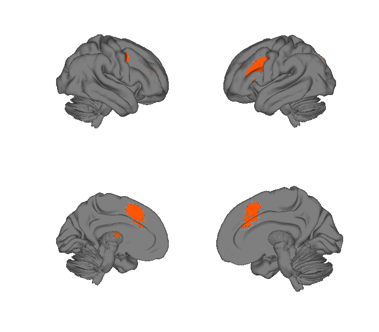
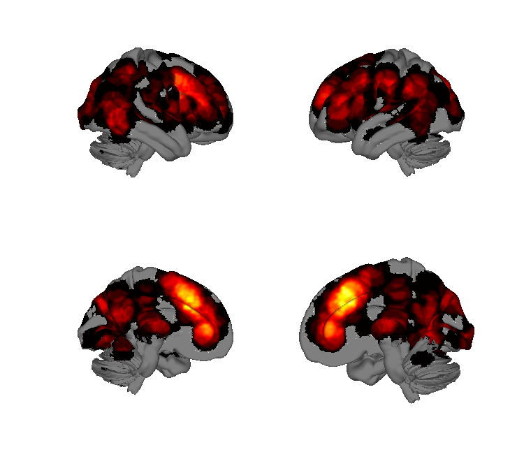
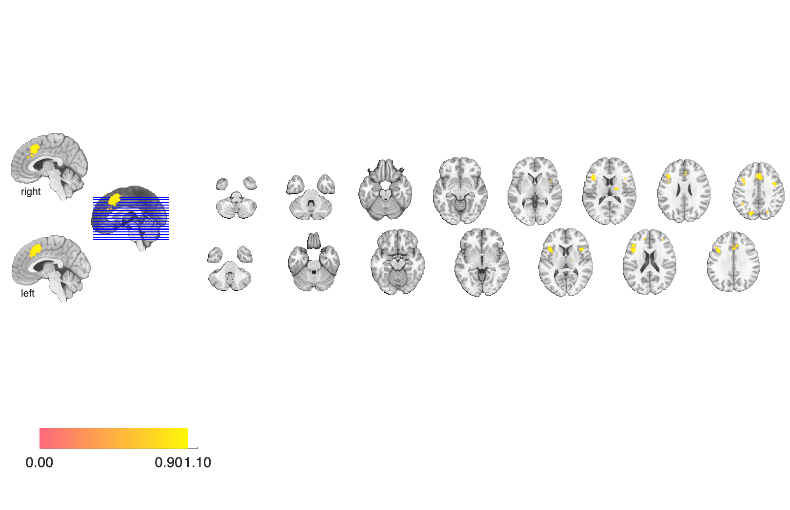
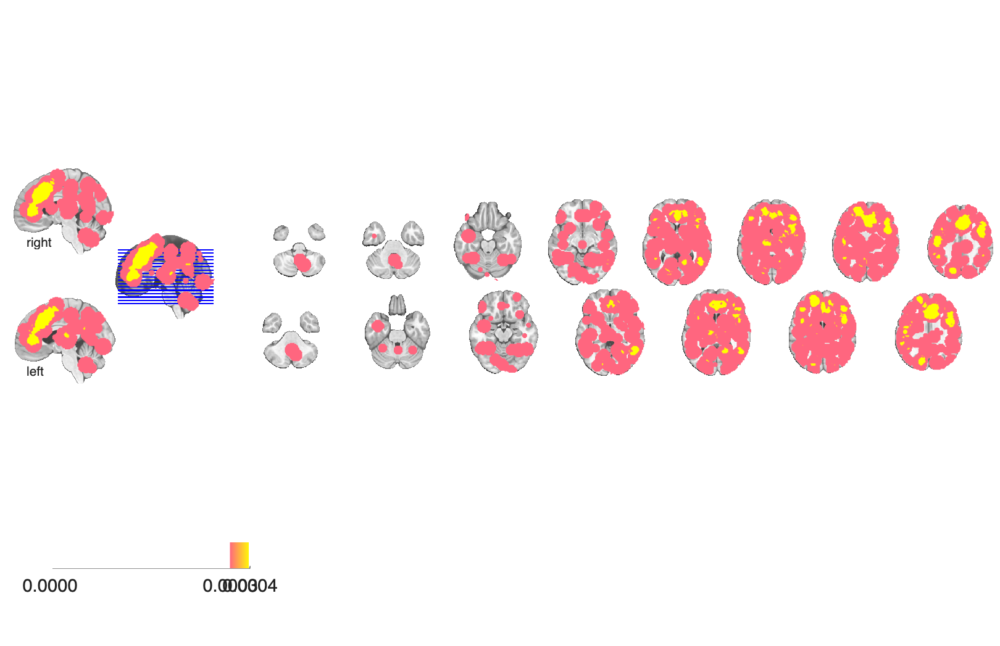

# Response-inhibition meta-analysis, 47 studies (Nee, Wager & Jonides 2007)

## Overview

Multilevel-kernel-density (MKDA) meta-analysis of 47 fMRI / PET studies
of **cognitive inhibition / interference resolution** across four
paradigm families: Stroop, flanker, go/no-go, and stimulus-response
compatibility (SRC). The folder ships paradigm-specific consensus density
maps (kernel-bandwidth 15 mm) and a combined inhibition / interference
density map.

## Primary reference

Nee, D. E., Wager, T. D., & Jonides, J. (2007). Interference resolution:
insights from a meta-analysis of neuroimaging tasks. *Cognitive,
Affective, & Behavioral Neuroscience*, 7(1), 1–17.
[doi:10.3758/CABN.7.1.1](https://doi.org/10.3758/CABN.7.1.1)
· [local PDF](./Nee_2007_CogAffBehNeurosci.pdf)

## Key images

| Combined inhibition meta | Stroop only |
| --- | --- |
|  |  |
|  |  |

The pooled cross-paradigm inhibition map (left) versus the
Stroop-specific paradigm density (right). Flanker, Go/No-go, and SRC
paradigm maps are also rendered into `png_images/`.

## How to load

Not registered in `load_image_set`. Load directly:

```matlab
inhib   = fmri_data(which('inhib_idens15_enl.hdr')); % combined inhibition
stroop  = fmri_data(which('stroop15.hdr'));
flanker = fmri_data(which('flanker15.hdr'));
gng     = fmri_data(which('gng15.hdr'));
src     = fmri_data(which('src15.hdr'));
```

## File inventory

| File | Type | What it is |
| --- | --- | --- |
| `inhib_idens15_enl.hdr` / `.img.gz` | Analyze | **Combined inhibition / interference** density map across all 4 paradigm families (15 mm kernel, enlarged clusters). |
| `stroop15.hdr` / `.img.gz` | Analyze | Stroop-paradigm density map (15 mm kernel). |
| `flanker15.hdr` / `.img.gz` | Analyze | Flanker-paradigm density map. |
| `gng15.hdr` / `.img.gz` | Analyze | Go/no-go density map. |
| `src15.hdr` / `.img.gz` | Analyze | Stimulus-response compatibility density map. |
| `Nee_2007_CogAffBehNeurosci.pdf` | PDF | Primary reference. |
| `visualize_contents.m` | MATLAB | Regenerates `png_images/`. |

## Citations

- Nee DE, Wager TD, Jonides J (2007). Interference resolution: insights
  from a meta-analysis of neuroimaging tasks. *Cogn Affect Behav
  Neurosci* 7:1–17.
  [doi:10.3758/CABN.7.1.1](https://doi.org/10.3758/CABN.7.1.1)
- Swick D, Ashley V, Turken U (2011). Are the neural correlates of
  stopping and not going identical? Quantitative meta-analysis of two
  response inhibition tasks. *NeuroImage* 56:1655–1665.
  [doi:10.1016/j.neuroimage.2011.02.070](https://doi.org/10.1016/j.neuroimage.2011.02.070)
