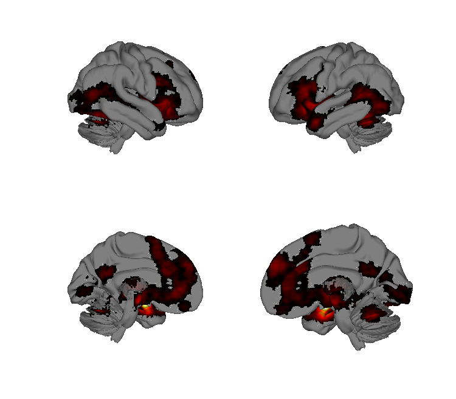
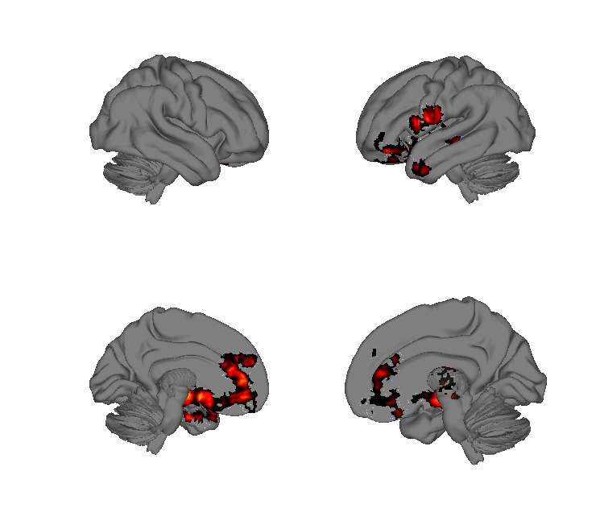
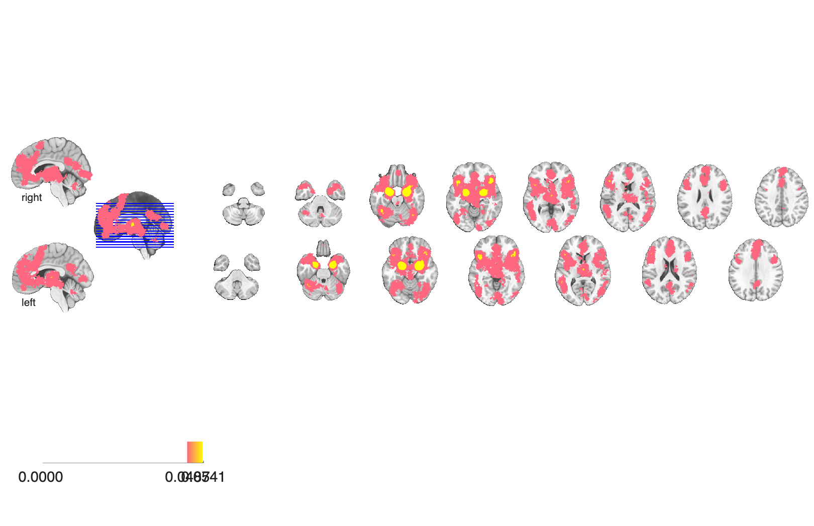
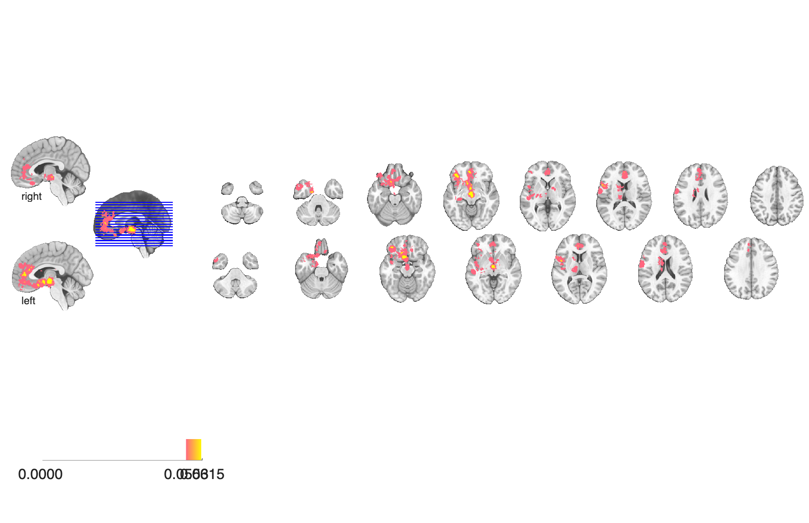

# Emotion meta-analysis, 163 studies (Kober et al. 2008)

## Overview

Large-scale multilevel-kernel-density (MKDA) meta-analysis of 163 PET /
fMRI emotion studies, including paradigm and valence sub-analyses. The
folder contains FWE-corrected (height / extent / combined) consensus
maps for: (i) the overall emotion-activation analysis, (ii) the
experienced-minus-perceived (`Mode_Exp-Per`) contrast separately for
positive and negative emotion, and (iii) the negative-minus-positive
valence contrast in both directions. All maps are MNI-space Analyze
files (`.hdr` + `.img.gz`).

## Primary reference

Kober, H., Barrett, L. F., Joseph, J., Bliss-Moreau, E., Lindquist, K.,
& Wager, T. D. (2008). Functional grouping and cortical-subcortical
interactions in emotion: a meta-analysis of neuroimaging studies.
*NeuroImage*, 42(2), 998–1031.
[doi:10.1016/j.neuroimage.2008.03.059](https://doi.org/10.1016/j.neuroimage.2008.03.059)
· [local PDF](./Kober_2008_Neuroimage.pdf)

## Key images

| Overall emotion activation (FWE) | Negative > Positive valence (FWE) |
| --- | --- |
|  |  |
|  |  |

The aggregate emotion-activation consensus map (left) and the
negative-vs-positive valence contrast (right). The positive-greater-
than-negative contrast and the experienced-vs-perceived (Mode) maps
for each valence are also in `png_images/`.

## How to load

Not registered in `load_image_set`. Load directly:

```matlab
emo_all     = fmri_data(which('EMOActivation_FWE_all.hdr'));
neg_gt_pos  = fmri_data(which('Valence_Neg-Pos_Neg_FWE_all.hdr'));
pos_gt_neg  = fmri_data(which('Valence_Neg-Pos_Pos_FWE_all.hdr'));
exp_neg     = fmri_data(which('Mode_Exp-Per_Neg_FWE_all.hdr'));
exp_pos     = fmri_data(which('Mode_Exp-Per_Pos_FWE_all.hdr'));
```

For each base map name, `_FWE_height`, `_FWE_extent`, and `_FWE_all`
provide three FWE thresholding flavours.

## File inventory

| File | Type | What it is |
| --- | --- | --- |
| `EMOActivation_FWE_{height,extent,all}.hdr/.img.gz` | Analyze | Overall emotion-activation consensus map at three FWE thresholds. |
| `Valence_Neg-Pos_Neg_FWE_{height,extent,all}.hdr/.img.gz` | Analyze | Negative > Positive valence contrast (FWE thresholded). |
| `Valence_Neg-Pos_Pos_FWE_{height,extent,all}.hdr/.img.gz` | Analyze | Positive > Negative valence contrast (FWE thresholded). |
| `Mode_Exp-Per_Neg_FWE_{height,extent,all}.hdr/.img.gz` | Analyze | Experienced > Perceived contrast within negative emotion (FWE thresholded). |
| `Mode_Exp-Per_Pos_FWE_{height,extent,all}.hdr/.img.gz` | Analyze | Experienced > Perceived contrast within positive emotion (FWE thresholded). |
| `Kober_2008_Neuroimage.pdf` | PDF | Primary reference. |
| `visualize_contents.m` | MATLAB | Regenerates `png_images/`. |

## Citations

- Kober H, Barrett LF, Joseph J, Bliss-Moreau E, Lindquist K, Wager TD
  (2008). Functional grouping and cortical-subcortical interactions in
  emotion: a meta-analysis of neuroimaging studies. *NeuroImage*
  42:998–1031.
  [doi:10.1016/j.neuroimage.2008.03.059](https://doi.org/10.1016/j.neuroimage.2008.03.059)
- Lindquist KA, Wager TD, Kober H, Bliss-Moreau E, Barrett LF (2012).
  The brain basis of emotion: a meta-analytic review. *Behav Brain Sci*
  35:121–143.
  [doi:10.1017/S0140525X11000446](https://doi.org/10.1017/S0140525X11000446)
