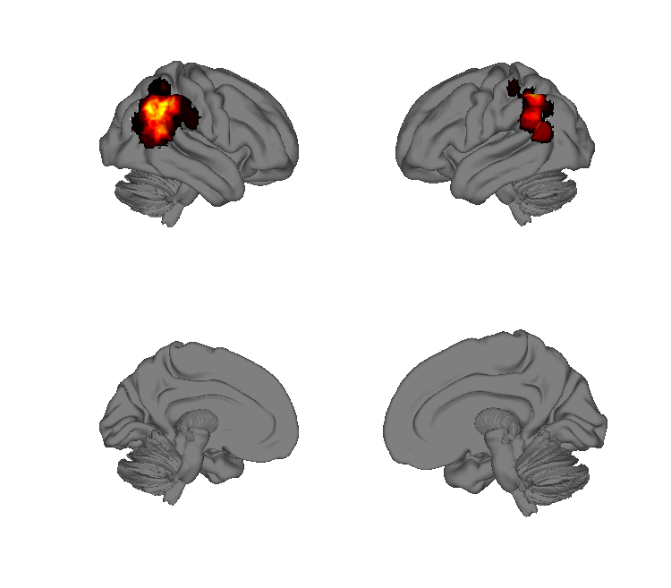
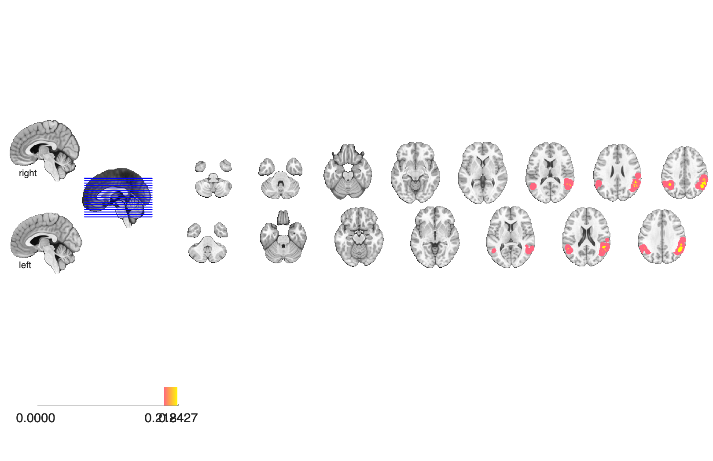

# Agency meta-analysis (Miele, Wager, Mitchell & Metcalfe 2011)

## Overview

MKDA coordinate-based meta-analysis of fMRI studies that dissociate the
neural correlates of **judgments of agency** from related self / action
monitoring processes. Distributed with the MKDA pipeline output:
`SETUP.mat` (analysis setup), `MC_Info.mat` (Monte-Carlo null), the
study database (`Agency_meta_database.mat` / `.txt` / `.xlsx`), and the
voxelwise FWE-corrected consensus maps.

## Primary reference

Miele, D. B., Wager, T. D., Mitchell, J. P., & Metcalfe, J. (2011).
Dissociating neural correlates of action monitoring and metacognition of
agency. *Journal of Cognitive Neuroscience*, 23(11), 3620–3636.
[doi:10.1162/jocn_a_00052](https://doi.org/10.1162/jocn_a_00052)
· [local PDF](./Miele-2011-Dissociating_neural_correlates_of_a.pdf)

## Key images

| Activation proportion | FWE consensus (all) |
| --- | --- |
|  |  |
|  |  |

The raw study-proportion map (left) and the FWE-corrected consensus-
activation map (right) for the sense-of-agency literature. The
FWE-height and FWE-extent variants are also rendered into
`png_images/`.

## How to load

Not registered in `load_image_set`. Load directly:

```matlab
prop  = fmri_data(which('Activation_proportion.hdr'));
fwe_h = fmri_data(which('Activation_FWE_height.hdr'));
fwe_e = fmri_data(which('Activation_FWE_extent.hdr'));
fwe_a = fmri_data(which('Activation_FWE_all.hdr'));
```

The MKDA pipeline objects are also recoverable:

```matlab
load(which('SETUP.mat'));        % analysis setup
load(which('MC_Info.mat'));      % Monte-Carlo null
load(which('Agency_meta_database.mat'));   % study database
load(which('Activation_clusters.mat'));    % CANlab region/clusters
```

## File inventory

| File | Type | What it is |
| --- | --- | --- |
| `Activation_proportion.hdr` / `.img.gz` | Analyze | Proportion-of-studies density map (unthresholded). |
| `Activation_FWE_height.hdr` / `.img.gz` | Analyze | Voxelwise height-threshold FWE-corrected consensus map. |
| `Activation_FWE_extent.hdr` / `.img.gz` | Analyze | Cluster-extent FWE-corrected consensus map. |
| `Activation_FWE_all.hdr` / `.img.gz` | Analyze | Combined height + extent FWE-corrected consensus map. |
| `Activation_clusters.mat` | MAT | CANlab `region` / cluster object for the activation map. |
| `MC_Info.mat` | MAT | Monte-Carlo null distribution used for FWE correction. |
| `SETUP.mat` | MAT | MKDA analysis setup structure. |
| `Agency_meta_database.mat` / `.txt` / `.xlsx` | MAT / text / XLSX | Study database (coordinates + study metadata). |
| `ANALYSIS_INFORMATION.txt` | text | Notes on the MKDA analysis options. |
| `Miele-2011-Dissociating_neural_correlates_of_a.pdf` | PDF | Primary reference. |
| `visualize_contents.m` | MATLAB | Regenerates `png_images/`. |

## Citations

- Miele DB, Wager TD, Mitchell JP, Metcalfe J (2011). Dissociating
  neural correlates of action monitoring and metacognition of agency.
  *J Cogn Neurosci* 23:3620–3636.
  [doi:10.1162/jocn_a_00052](https://doi.org/10.1162/jocn_a_00052)
- Sperduti M, Delaveau P, Fossati P, Nadel J (2011). Different brain
  structures related to self- and external-agency attribution: a brief
  review and meta-analysis. *Brain Struct Funct* 216:151–157.
  [doi:10.1007/s00429-010-0298-1](https://doi.org/10.1007/s00429-010-0298-1)
