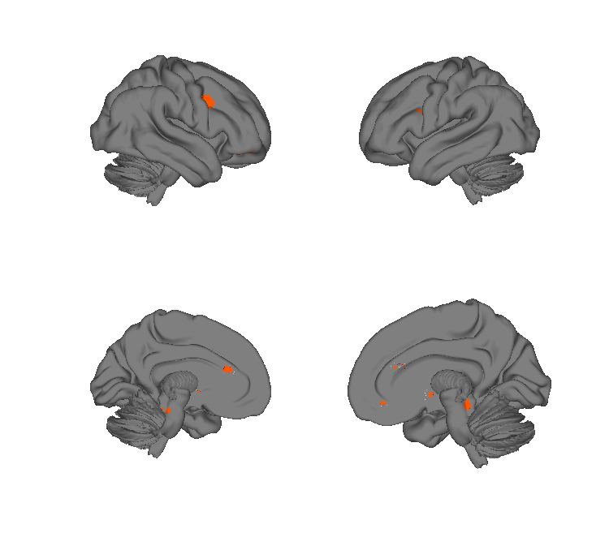
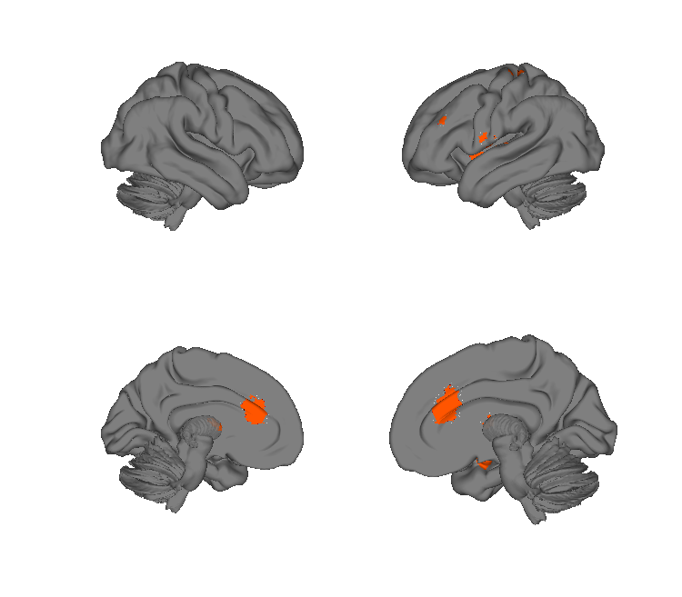
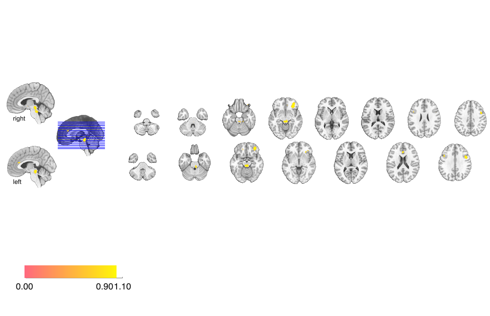
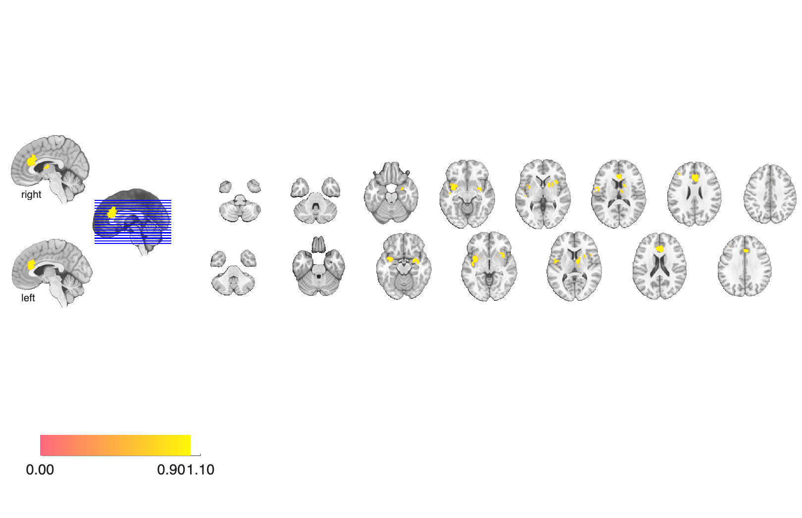

# Placebo meta-analysis masks (Meissner et al. 2011)

## Overview

Convergence masks from a coordinate-based meta-analysis of fMRI / PET
placebo studies, summarising voxels in which **at least 3 studies report
a placebo effect within a 10-mm or 15-mm radius**. Provided as separate
masks for **placebo-induced increases** and **placebo-induced decreases**.

## Primary reference

Meissner, K., Bingel, U., Colloca, L., Wager, T. D., Watson, A., &
Flaten, M. A. (2011). The placebo effect: advances from different
methodological approaches. *Journal of Neuroscience*, 31(45),
16117–16124.
[doi:10.1523/JNEUROSCI.4099-11.2011](https://doi.org/10.1523/JNEUROSCI.4099-11.2011)
· [local PDF](./Meissner_2011_JNeuro.pdf)

## Key images

| Placebo increases (≥ 3 studies, 10 mm) | Placebo decreases (≥ 3 studies, 10 mm) |
| --- | --- |
|  |  |
|  |  |

Convergence masks where placebo elicited consistent BOLD increases
(left) or decreases (right) in at least 3 of the studies pooled,
with a 10 mm convergence kernel. A 15 mm increases variant is also
in `png_images/`.

## How to load

Not registered in `load_image_set`. Load directly:

```matlab
inc10 = fmri_data(which('placebo_increases_at_least_3_studies_in_10_mm.hdr'));
inc15 = fmri_data(which('placebo_increases_at_least_3_studies_in_15_mm.hdr'));
dec10 = fmri_data(which('placebo_decreases_at_least_3_studies_in_10_mm.hdr'));
```

## File inventory

| File | Type | What it is |
| --- | --- | --- |
| `placebo_increases_at_least_3_studies_in_10_mm.hdr` / `.img.gz` | Analyze | Voxels where >=3 studies report a placebo-induced **increase** within 10 mm. |
| `placebo_increases_at_least_3_studies_in_15_mm.hdr` / `.img.gz` | Analyze | Same, with a 15 mm kernel. |
| `placebo_decreases_at_least_3_studies_in_10_mm.hdr` / `.img.gz` | Analyze | Voxels where >=3 studies report a placebo-induced **decrease** within 10 mm. |
| `Meissner_2011_JNeuro.pdf` | PDF | Primary reference. |
| `visualize_contents.m` | MATLAB | Regenerates `png_images/`. |

## Citations

- Meissner K, Bingel U, Colloca L, Wager TD, Watson A, Flaten MA (2011).
  The placebo effect: advances from different methodological approaches.
  *J Neurosci* 31:16117–16124.
  [doi:10.1523/JNEUROSCI.4099-11.2011](https://doi.org/10.1523/JNEUROSCI.4099-11.2011)
- Atlas LY, Wager TD (2014). A meta-analysis of brain mechanisms of
  placebo analgesia. *Handb Exp Pharmacol* 225:37–69.
  [doi:10.1007/978-3-662-44519-8_3](https://doi.org/10.1007/978-3-662-44519-8_3)
