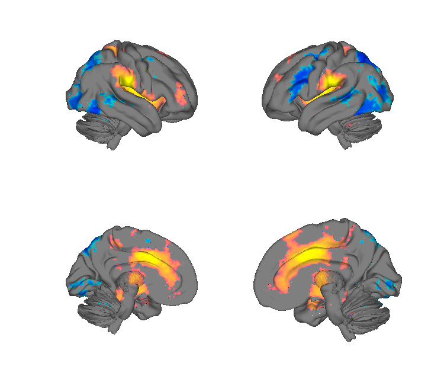
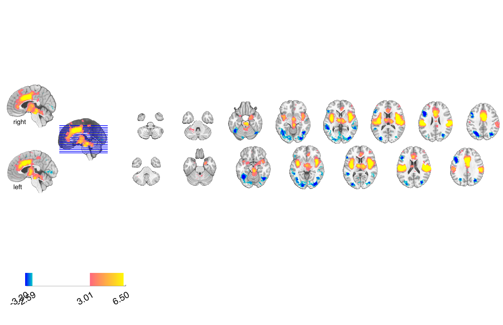

# Neurosynth original maps — pain & pain-vs-emotion (Yarkoni et al. 2011)

## Overview

A small set of **Neurosynth reverse-inference z-maps** from the original
Yarkoni et al. 2011 release, focused on the term **pain** and the
contrast **pain – emotion**. Each map is provided unthresholded and at
FDR q < 0.05. These are illustrative term maps; the much larger
525-term Neurosynth feature set is available through CanlabCore via
`load_image_set('neurosynth')`.

## Primary reference

Yarkoni, T., Poldrack, R. A., Nichols, T. E., Van Essen, D. C., & Wager,
T. D. (2011). Large-scale automated synthesis of human functional
neuroimaging data. *Nature Methods*, 8(8), 665–670.
[doi:10.1038/nmeth.1635](https://doi.org/10.1038/nmeth.1635)
· [local PDF](./Yarkoni_2011_NatureMethods.pdf)

## Key images

| Cortical surface | Axial montage |
| --- | --- |
|  |  |

The Neurosynth "pain" reverse-inference z-map, FDR q<0.05 thresholded
(`pain_2s_z_val_FDR_05.hdr`). The matching isosurface is in
`png_images/Yarkoni2011_Pain_z_FDR05_isosurface.png`; rendered by
[`visualize_contents.m`](./visualize_contents.m).

## How to load

The full Neurosynth 525-term feature set is registered in `load_image_set`:

```matlab
[obj, terms] = load_image_set('neurosynth');
% see also: load_image_set('neurosynth_topics_forwardinference')
%           load_image_set('neurosynth_topics_reverseinference')
```

To load the maps in *this* folder directly:

```matlab
pain      = fmri_data(which('pain_2s_z_val.hdr'));
pain_fdr  = fmri_data(which('pain_2s_z_val_FDR_05.hdr'));
painemo   = fmri_data(which('pain-emotion_2s_z_val.hdr'));
painemo_f = fmri_data(which('pain-emotion_2s_z_val_FDR_05.hdr'));
```

## File inventory

| File | Type | What it is |
| --- | --- | --- |
| `pain_2s_z_val.hdr` / `.img.gz` | Analyze | Two-sided reverse-inference z-map for the term **pain**, unthresholded. |
| `pain_2s_z_val_FDR_05.hdr` / `.img` / `.img.gz` | Analyze | Same, FDR q < 0.05 thresholded. |
| `pain-emotion_2s_z_val.hdr` / `.img.gz` | Analyze | Reverse-inference z-map for **pain – emotion**, unthresholded. |
| `pain-emotion_2s_z_val_FDR_05.hdr` / `.img.gz` | Analyze | Same, FDR q < 0.05 thresholded. |
| `Yarkoni_2011_NatureMethods.pdf` | PDF | Primary reference. |
| `visualize_contents.m` | MATLAB | Regenerates `png_images/`. |

## Citations

- Yarkoni T, Poldrack RA, Nichols TE, Van Essen DC, Wager TD (2011).
  Large-scale automated synthesis of human functional neuroimaging data.
  *Nat Methods* 8:665–670.
  [doi:10.1038/nmeth.1635](https://doi.org/10.1038/nmeth.1635)
- Yarkoni T, Poldrack RA (2014). Neurosynth: a new platform for
  large-scale automated synthesis of human functional neuroimaging data.
  Companion topic-modeling release (54 topics).
