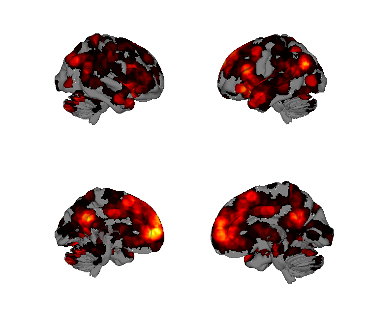
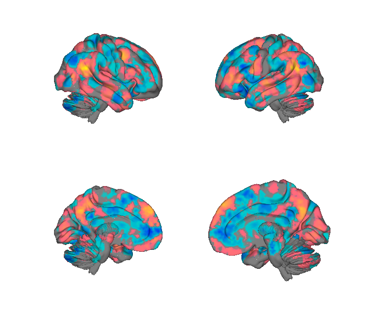
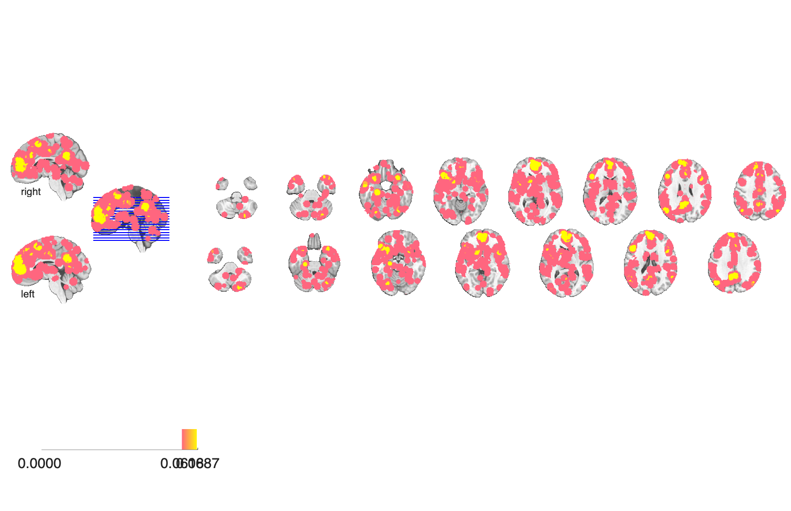
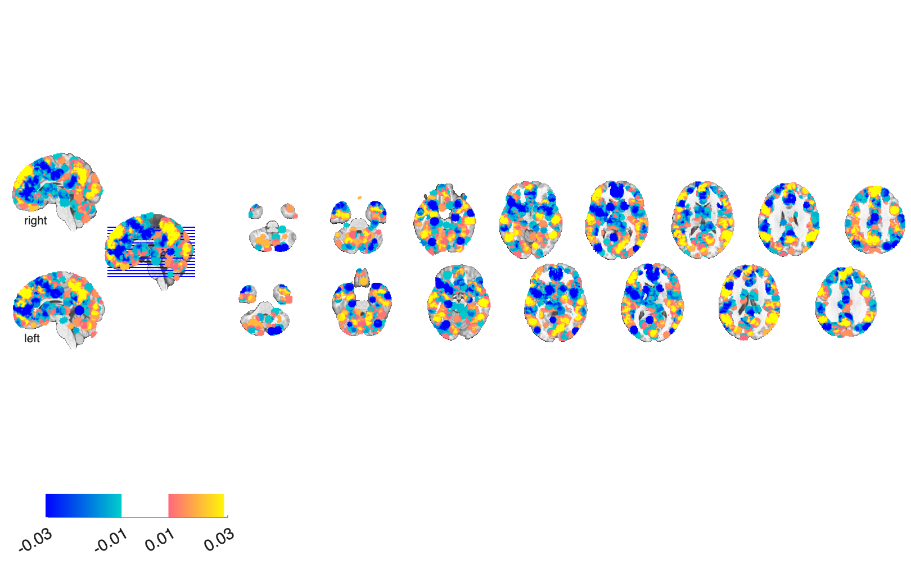

# Self vs. other (SOMA) meta-analysis (Denny et al. 2012)

## Overview

MKDA coordinate-based meta-analysis of fMRI studies contrasting
**self-referential** and **other-referential** mental processing,
including the dorsal/ventral mPFC dissociation between self- and
other-related judgments. The folder contains the MKDA pipeline outputs
(`SETUP.mat`, `MC_Info.mat`, study database `RunMeta090809.mat/.txt`)
plus three voxelwise consensus maps for `self`, `anyother`, and the
`SelfOthe_Other-Self` contrast, and an overall activation-proportion
map.

## Primary reference

Denny, B. T., Kober, H., Wager, T. D., & Ochsner, K. N. (2012). A
meta-analysis of functional neuroimaging studies of self- and
other-judgments reveals a spatial gradient for mentalizing in medial
prefrontal cortex. *Journal of Cognitive Neuroscience*, 24(8),
1742–1752.
[doi:10.1162/jocn_a_00233](https://doi.org/10.1162/jocn_a_00233)
· [local PDF](./Denny_2011_JCogNeuro.pdf)

## Key images

| Self-referential | Other - Self contrast |
| --- | --- |
|  |  |
|  |  |

The self-referential meta-activation map (left) — anchored on mPFC —
versus the *other-minus-self* contrast (right) showing TPJ and
lateral-PFC engagement greater for thinking about others than oneself.
The any-other and overall activation-proportion maps are also in
`png_images/`.

## How to load

Not registered in `load_image_set`. Load directly:

```matlab
self        = fmri_data(which('self.hdr'));
anyother    = fmri_data(which('anyother.hdr'));
other_self  = fmri_data(which('SelfOthe_Other-Self.hdr'));
prop        = fmri_data(which('Activation_proportion.hdr'));

load(which('SETUP.mat'));
load(which('MC_Info.mat'));
load(which('RunMeta090809.mat'));   % study database
```

## File inventory

| File | Type | What it is |
| --- | --- | --- |
| `self.hdr` / `.img.gz` | Analyze | Self-referential MKDA consensus map. |
| `anyother.hdr` / `.img.gz` | Analyze | Other-referential ("any other") MKDA consensus map. |
| `SelfOthe_Other-Self.hdr` / `.img.gz` | Analyze | Other > Self directional contrast. |
| `Activation_proportion.hdr` / `.img.gz` | Analyze | Activation proportion (density) across all studies in the database. |
| `MC_Info.mat` | MAT | Monte-Carlo null distribution for FWE correction. |
| `SETUP.mat` | MAT | MKDA analysis setup structure. |
| `RunMeta090809.mat` / `.txt` | MAT / text | SOMA study database (coordinates + study metadata). |
| `plot_points_on_slices_script.m` | MATLAB | Helper to plot study coordinates on slices. |
| `ANALYSIS_INFORMATION.txt`, `DESIGN_REPORT.txt` | text | Notes on the MKDA analysis. |
| `Denny_2011_JCogNeuro.pdf` | PDF | Primary reference. |
| `visualize_contents.m` | MATLAB | Regenerates `png_images/`. |

## Citations

- Denny BT, Kober H, Wager TD, Ochsner KN (2012). A meta-analysis of
  functional neuroimaging studies of self- and other-judgments reveals a
  spatial gradient for mentalizing in medial prefrontal cortex. *J Cogn
  Neurosci* 24:1742–1752.
  [doi:10.1162/jocn_a_00233](https://doi.org/10.1162/jocn_a_00233)
- Murray RJ, Schaer M, Debbané M (2012). Degrees of separation: a
  quantitative neuroimaging meta-analysis investigating self-specificity
  and shared neural activation between self- and other-reflection.
  *Neurosci Biobehav Rev* 36:1043–1059.
  [doi:10.1016/j.neubiorev.2011.12.013](https://doi.org/10.1016/j.neubiorev.2011.12.013)
