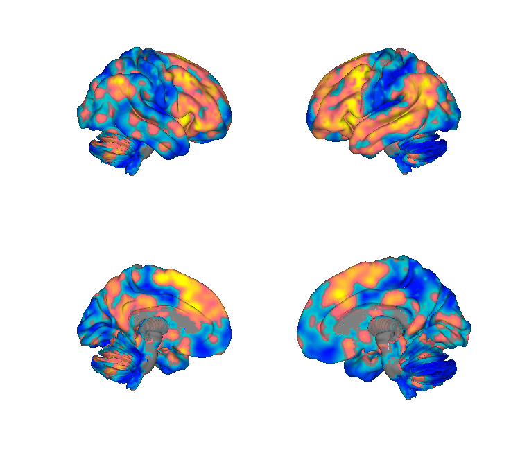
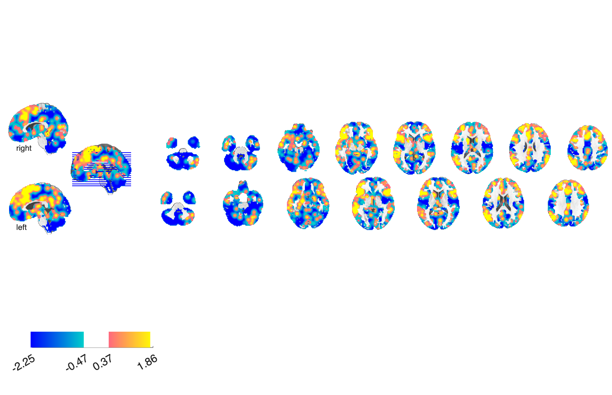

# Cognitive-reappraisal meta-analysis (Buhle, Silvers et al. 2014)

## Overview

Coordinate-based MKDA meta-analysis of fMRI studies of **cognitive
reappraisal of emotion**, identifying a consensus prefrontal /
parietal control network engaged when participants regulate emotional
responses. The folder contains the MKDA pipeline objects (`SETUP.mat`,
`MC_Info.mat`, `Activation_clusters.mat`), three FWE-thresholded
activation maps (height / extent / combined), an unthresholded
activation-proportion map, and a packaged "Emotion Regulation Meta"
NIfTI plus a z-rescaled and thresholded variant.

## Primary reference

Buhle, J. T., Silvers, J. A., Wager, T. D., Lopez, R., Onyemekwu, C.,
Kober, H., Weber, J., & Ochsner, K. N. (2014). Cognitive reappraisal of
emotion: a meta-analysis of human neuroimaging studies. *Cerebral
Cortex*, 24(11), 2981–2990.
[doi:10.1093/cercor/bht154](https://doi.org/10.1093/cercor/bht154)
· [local PDF](./Buhle_2014_CerebralCortex.pdf)

## Key images

| Cortical surface | Axial montage |
| --- | --- |
|  |  |

The thresholded emotion-regulation (reappraisal) meta-analysis map.
The unthresholded variant (`BuhleSilvers2014_EmoReg_Meta_*`) and
matching isosurfaces are also in `png_images/`; rendered by
[`visualize_contents.m`](./visualize_contents.m).

## How to load

Not registered in `load_image_set`. Load directly:

```matlab
emo_reg     = fmri_data(which('Buhle_Silvers_2014_Emotion_Regulation_Meta.nii.gz'));
emo_reg_th  = fmri_data(which('Buhle_Silvers_2014_Emotion_Regulation_Meta_thresh.hdr'));
emo_reg_z   = fmri_data(which('Buhle_Silvers_2014_Emotion_Regulation_Meta_z_rescaled_.hdr'));
fwe_height  = fmri_data(which('Activation_FWE_height.hdr'));
fwe_extent  = fmri_data(which('Activation_FWE_extent.hdr'));
```

## File inventory

| File | Type | What it is |
| --- | --- | --- |
| `Buhle_Silvers_2014_Emotion_Regulation_Meta.nii.gz` | NIfTI | Packaged "Emotion Regulation Meta" consensus map. |
| `Buhle_Silvers_2014_Emotion_Regulation_Meta_thresh.hdr/.img` | Analyze | Thresholded version of the above. |
| `Buhle_Silvers_2014_Emotion_Regulation_Meta_z_rescaled_.hdr/.img.gz` | Analyze | Z-rescaled version of the consensus map. |
| `Activation_FWE_height.hdr/.img.gz` | Analyze | Height-threshold FWE-corrected MKDA map. |
| `Activation_FWE_extent.hdr/.img.gz` | Analyze | Cluster-extent FWE-corrected MKDA map. |
| `Activation_FWE_all.hdr/.img.gz` | Analyze | Combined height + extent FWE-corrected map. |
| `Activation_proportion.hdr/.img.gz` | Analyze | Unthresholded activation proportion (density) map. |
| `Activation_clusters.mat` | MAT | `region` / cluster object for the activation map. |
| `MC_Info.mat` | MAT | Monte-Carlo null distribution. |
| `SETUP.mat` | MAT | MKDA analysis setup. |
| `Buhle_2014_CerebralCortex.pdf` | PDF | Primary reference. |
| `visualize_contents.m` | MATLAB | Regenerates `png_images/`. |

## Citations

- Buhle JT, Silvers JA, Wager TD, et al. (2014). Cognitive reappraisal
  of emotion: a meta-analysis of human neuroimaging studies. *Cereb
  Cortex* 24:2981–2990.
  [doi:10.1093/cercor/bht154](https://doi.org/10.1093/cercor/bht154)
- Kohn N, Eickhoff SB, Scheller M, Laird AR, Fox PT, Habel U (2014).
  Neural network of cognitive emotion regulation — an ALE meta-analysis
  and MACM analysis. *NeuroImage* 87:345–355.
  [doi:10.1016/j.neuroimage.2013.11.001](https://doi.org/10.1016/j.neuroimage.2013.11.001)
