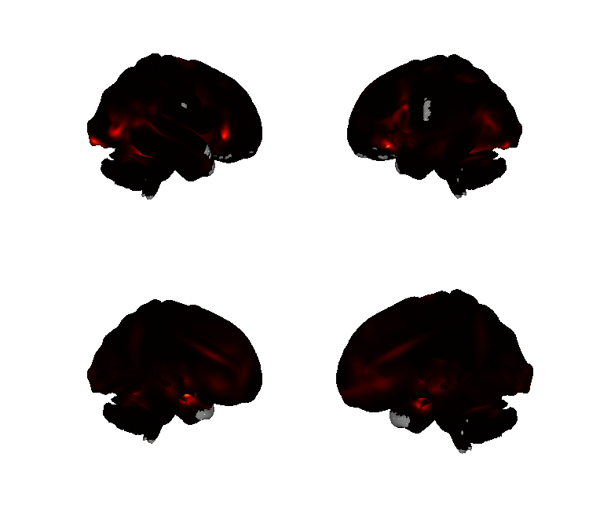
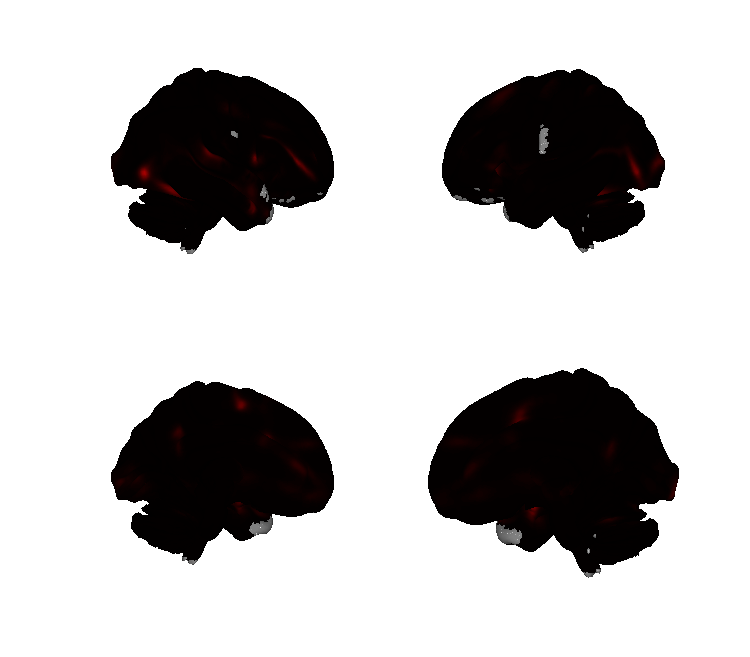
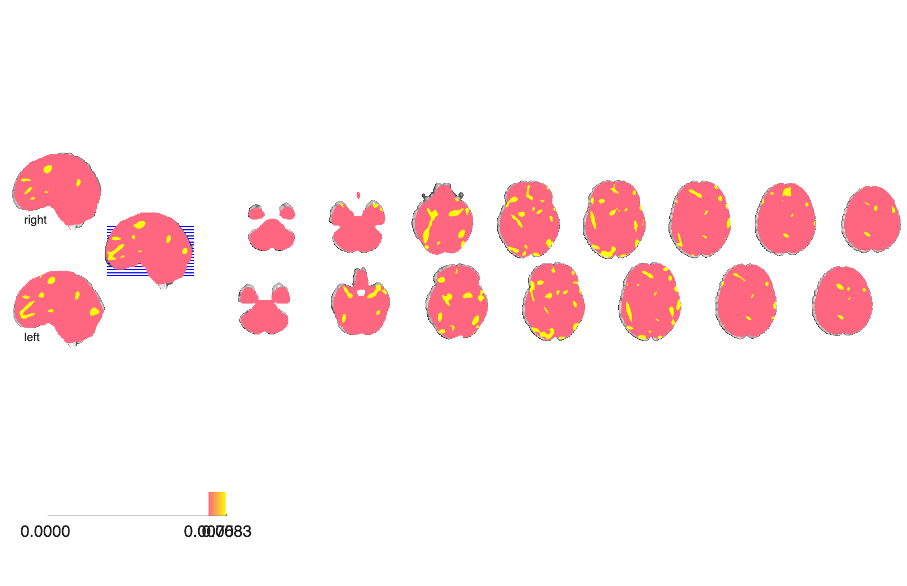

# Bayesian five-emotion meta-analysis (Wager, Kang et al. 2015, PLoS Comp Biol)

## Overview

Bayesian spatial point-process (**BSPP**) meta-analysis of fMRI emotion
studies, yielding **category-specific consensus maps for five basic
emotions**: anger, disgust, fear, happiness, and sadness. The folder
contains the five posterior consensus NIfTIs (one per emotion), the
MKDA-style analysis setup, and the underlying coordinate database
(`Emotion_Meta_DB_5Emotions_3_30_13.mat`, 30 March 2013 snapshot).

## Primary reference

Wager, T. D., Kang, J., Johnson, T. D., Nichols, T. E., Satpute, A. B.,
& Barrett, L. F. (2015). A Bayesian model of category-specific
emotional brain responses. *PLoS Computational Biology*, 11(4),
e1004066.
[doi:10.1371/journal.pcbi.1004066](https://doi.org/10.1371/journal.pcbi.1004066)
· [local PDF](./Wager_2015_PlosCompBiology.PDF)

## Key images

Two representative posterior consensus maps (all five emotion
categories are rendered into `png_images/`):

| Fear | Happy |
| --- | --- |
|  |  |
|  |  |

The remaining three categories — Anger, Disgust, Sad — are rendered
with the same surface / montage / isosurface trio in `png_images/`;
generated by [`visualize_contents.m`](./visualize_contents.m).

## How to load

Registered in `load_image_set` (see
[CanlabCore `load_image_set.m`](https://github.com/canlab/CanlabCore/blob/master/CanlabCore/Data_extraction/load_image_set.m))
under the keywords `'emometa'`, `'emotionmeta'`, and `'2015emotionmeta'`:

```matlab
[obj, networknames, imagenames] = load_image_set('emometa');
% networknames = {'Anger' 'Disgust' 'Fear' 'Happy' 'Sad'}
```

Or load any single emotion directly:

```matlab
anger = fmri_data(which('Wager_Kang_PlosCB_emometa_2015_anger.nii.gz'));
```

## File inventory

| File | Type | What it is |
| --- | --- | --- |
| `Wager_Kang_PlosCB_emometa_2015_anger.nii.gz` | NIfTI | BSPP posterior consensus map for **anger**. |
| `Wager_Kang_PlosCB_emometa_2015_disgust.nii.gz` | NIfTI | BSPP consensus for **disgust**. |
| `Wager_Kang_PlosCB_emometa_2015_fear.nii.gz` | NIfTI | BSPP consensus for **fear**. |
| `Wager_Kang_PlosCB_emometa_2015_happy.nii.gz` | NIfTI | BSPP consensus for **happiness**. |
| `Wager_Kang_PlosCB_emometa_2015_sad.nii.gz` | NIfTI | BSPP consensus for **sadness**. |
| `Emotion_Meta_DB_5Emotions_3_30_13.mat` | MAT | 5-emotion coordinate database (March 2013 snapshot). |
| `SETUP.mat` | MAT | MKDA-style analysis setup. |
| `Wager_2015_PlosCompBiology.PDF` | PDF | Primary reference. |
| `visualize_contents.m` | MATLAB | Regenerates `png_images/`. |

## Citations

- Wager TD, Kang J, Johnson TD, Nichols TE, Satpute AB, Barrett LF
  (2015). A Bayesian model of category-specific emotional brain
  responses. *PLoS Comput Biol* 11:e1004066.
  [doi:10.1371/journal.pcbi.1004066](https://doi.org/10.1371/journal.pcbi.1004066)
- Lindquist KA, Wager TD, Kober H, Bliss-Moreau E, Barrett LF (2012).
  The brain basis of emotion: a meta-analytic review. *Behav Brain Sci*
  35:121–143.
  [doi:10.1017/S0140525X11000446](https://doi.org/10.1017/S0140525X11000446)
