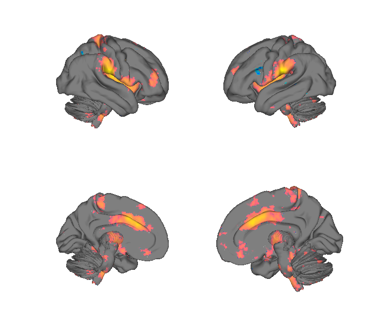
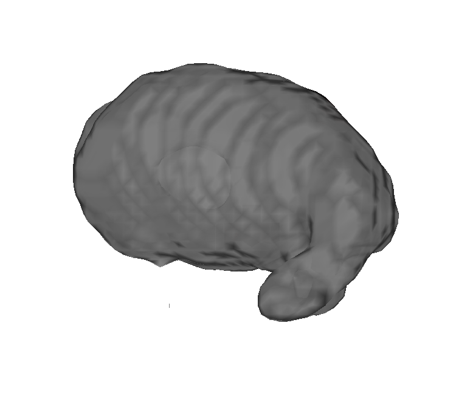
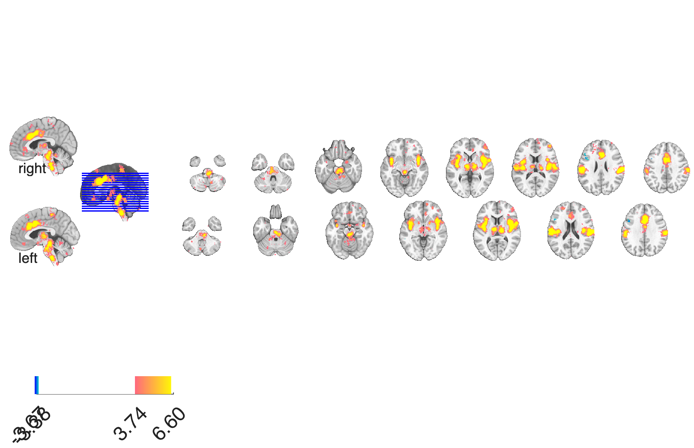
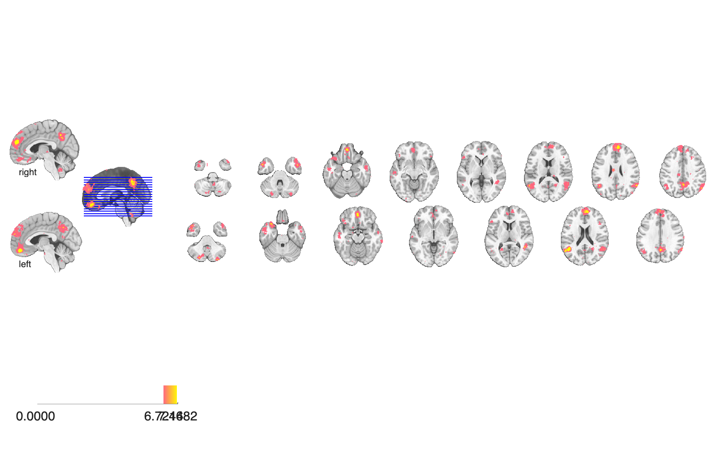

# Neurosynth social-affective term maps (CANlab curated, 2016)

## Overview

A CANlab-curated subset of **Neurosynth reverse-inference z-maps**
(`pFgA_z`, FDR q < 0.01) covering 23 social-cognitive, affective, and
cognitive-control terms most relevant to CANlab projects. Useful as
**a priori** masks or comparison reference maps for emotion, social
cognition, cognitive control, and pain analyses.

Terms covered (all `*_pFgA_z_FDR_0.01.nii.gz`): `anxiety`, `autonomic`,
`cognitive_control`, `emotion`, `emotion_regulation`, `episodic_memory`,
`executive`, `fear`, `future`, `goal_directed`, `inhibition`,
`mentalizing`, `pain`, `prospective`, `punishment`, `reward`, `self`,
`semantic_memory`, `social_interaction`, `social`, `stop_signal`,
`theory_mind`, `working_memory`.

## Primary reference

Yarkoni, T., Poldrack, R. A., Nichols, T. E., Van Essen, D. C., & Wager,
T. D. (2011). Large-scale automated synthesis of human functional
neuroimaging data. *Nature Methods*, 8(8), 665–670.
[doi:10.1038/nmeth.1635](https://doi.org/10.1038/nmeth.1635)

(No paper PDF is included in this folder — it is a CANlab-curated subset
of the Neurosynth term database, not a standalone publication.)

## Key images

Two representative reverse-inference term maps (all 23 terms are
rendered into `png_images/`):

| Pain | Mentalizing |
| --- | --- |
|  |  |
|  |  |

The remaining 21 terms — anxiety, autonomic, cognitive_control,
emotion, emotion_regulation, episodic_memory, executive, fear,
future, goal_directed, inhibition, prospective, punishment, reward,
self, etc. — follow the same surface / montage / isosurface trio in
`png_images/`; rendered by [`visualize_contents.m`](./visualize_contents.m).

## How to load

These individual NIfTIs are not addressed by name in `load_image_set`,
but the full 525-term Neurosynth feature set and the topic maps are:

```matlab
[obj, terms] = load_image_set('neurosynth');
[obj, terms] = load_image_set('neurosynth_topics_reverseinference');
```

To load a specific term in this folder:

```matlab
pain = fmri_data(which('pain_pFgA_z_FDR_0.01.nii.gz'));
mtl  = fmri_data(which('mentalizing_pFgA_z_FDR_0.01.nii.gz'));
```

## File inventory

23 term maps, each named `<term>_pFgA_z_FDR_0.01.nii.gz`:

| Group | Terms |
| --- | --- |
| Affect / emotion | `anxiety`, `emotion`, `emotion_regulation`, `fear` |
| Pain & punishment | `pain`, `punishment` |
| Reward / motivation | `reward`, `goal_directed` |
| Cognitive control | `cognitive_control`, `executive`, `inhibition`, `stop_signal`, `working_memory` |
| Memory | `episodic_memory`, `semantic_memory` |
| Self / social | `self`, `social`, `social_interaction`, `mentalizing`, `theory_mind` |
| Time | `future`, `prospective` |
| Autonomic | `autonomic` |

| File | Type | What it is |
| --- | --- | --- |
| `<term>_pFgA_z_FDR_0.01.nii.gz` (×23) | NIfTI | Neurosynth reverse-inference z-map for `<term>`, FDR q < 0.01. |
| `visualize_contents.m` | MATLAB | Regenerates `png_images/`. |

## Citations

- Yarkoni T, Poldrack RA, Nichols TE, Van Essen DC, Wager TD (2011).
  Large-scale automated synthesis of human functional neuroimaging data.
  *Nat Methods* 8:665–670.
  [doi:10.1038/nmeth.1635](https://doi.org/10.1038/nmeth.1635)
- Neurosynth website: <https://neurosynth.org>
