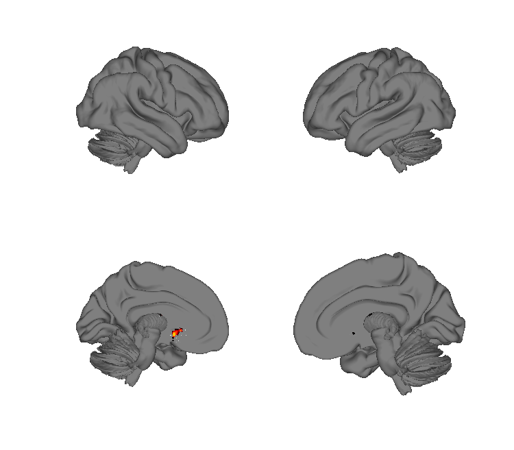
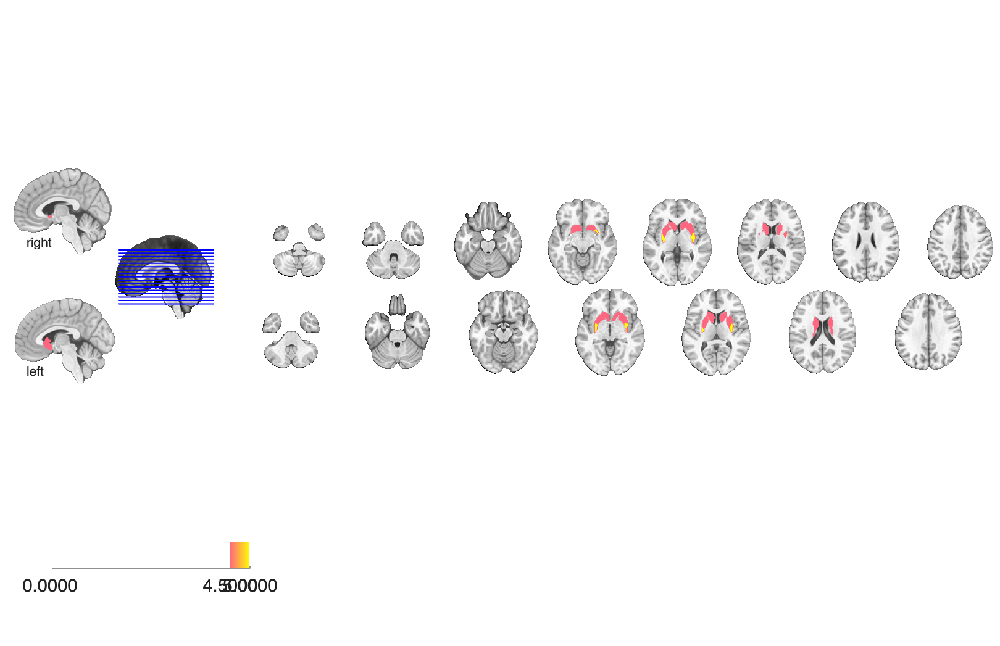
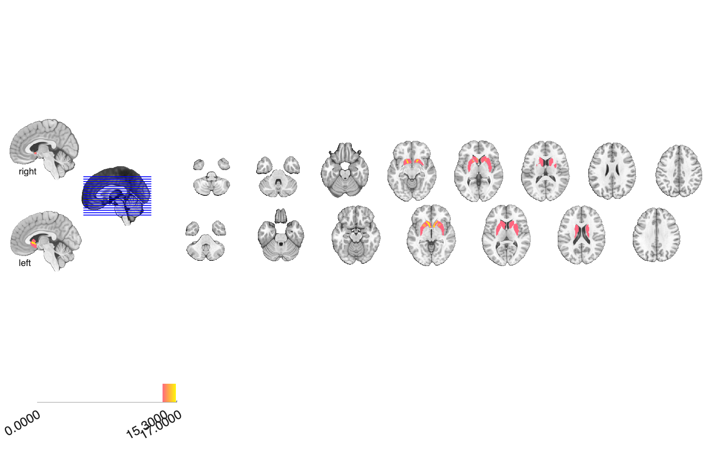

# Striatal meta-analytic parcellation (Pauli et al. 2016)

## Overview

A **meta-analytic parcellation of the human striatum** based on
co-activation with non-striatal brain regions, derived from Neurosynth
data. The repository provides two solutions: a coarse **5-cluster**
parcellation (Pa anterior putamen, Pp posterior putamen, Ca anterior
caudate, Cp posterior caudate, VS ventral striatum) and a finer
**17-cluster** parcellation. Each striatal cluster has a paired
**cortical co-activation probability map** capturing its associated
cortical network.

See [`README.md`](./README.md) for the authoritative author write-up.

## Primary reference

Pauli, W. M., O'Reilly, R. C., Yarkoni, T., & Wager, T. D. (2016).
Regional specialization within the human striatum for diverse
psychological functions. *Proceedings of the National Academy of
Sciences*, 113(7), 1907–1912.
[doi:10.1073/pnas.1507610113](https://doi.org/10.1073/pnas.1507610113)
· [local PDF](./Pauli_2016_PNAS.pdf)

## Key images

| 5-cluster striatum | 17-cluster striatum |
| --- | --- |
|  |  |
|  |  |

The two striatal granularities. The five cortical co-activation
networks (`Pauli2016_cortex_Ca / Cp / Pa / Pp / VS`) and matching
isosurfaces are also in `png_images/`; rendered by
[`visualize_contents.m`](./visualize_contents.m). Pre-rendered
author figures remain in `striatum/png_images/` for reference.

## How to load

Registered in `load_image_set` under several keywords:

```matlab
[obj, names] = load_image_set('bgloops');           % alias 'pauli'   : 5-cluster striatal
[obj, names] = load_image_set('bgloops17');         % alias 'pauli17' : 17-cluster striatal
[obj, names] = load_image_set('bgloops_cortex');    % alias 'pauli_cortex' : 5 cortical co-activation maps
[obj, names] = load_image_set('pauli_subcortical'); % subcortical version of the 17-cluster solution
```

The 5-cluster striatal names returned are
`{'Post. Caudate (Cp)' 'Ant. Putamen (Pa)' 'Ant. Caudate (Ca)' 'Ventral
striatum (VS)' 'Post. Putamen (PP)'}`. There is also a CANlab atlas
object in [`striatum/Pauli2016_striatum_atlas_object.mat`](./striatum/Pauli2016_striatum_atlas_object.mat).

## File inventory

| File | Type | What it is |
| --- | --- | --- |
| `striatum/Pauli_bg_cluster_mask_5.nii(.gz)` | NIfTI | **5-cluster striatal parcellation** (integer-coded; loaded by `'bgloops'`). |
| `striatum/Pauli_bg_cluster_mask_5_p.nii.gz` | NIfTI | Per-voxel cluster-assignment probability for the 5-cluster solution. |
| `striatum/Pauli_bg_cluster_mask_5_prob.hdr/.img(.gz)` | Analyze | Probabilistic 4-D version of the 5-cluster solution. |
| `striatum/Pauli_bg_cluster_mask_17.nii.gz` | NIfTI | 17-cluster striatal parcellation. |
| `striatum/Pauli_bg_cluster_mask_3.nii.gz`, `_7.nii.gz` | NIfTI | Alternative 3- and 7-cluster solutions. |
| `striatum/Pauli2016_striatum_atlas_object.mat` | MAT (`atlas`) | CANlab `atlas` object of the striatal parcellation. |
| `striatum/Pauli2016_striatum_atlas_regions.mat` | MAT (`region`) | `region` object form of the parcellation. |
| `cortical/Pauli_bg_nb_param_rank_fst_{Ca,Cp,Pa,Pp,VS}.nii.gz` | NIfTI | Cortical co-activation probability maps for each of the 5 striatal clusters (loaded by `'bgloops_cortex'`). |
| `cortical/Pauli_bg_nb_param_rank_fst_0_null.nii.gz` | NIfTI | Null / background co-activation reference. |
| `scripts/pauli2016_create_atlas_object.m` | MATLAB | Builds the CANlab atlas object from the NIfTIs. |
| `scripts/pauli2016_plot_bucknerlab_similarity.m` | MATLAB | Plots similarity between Pauli cortical maps and Buckner-lab networks. |
| `2016_Pauli_PNAS_striatal_parcellation.pptx` | PPTX | Author slide deck of figures. |
| `README.md` | text | Author readme (folder structure + citation). |
| `Pauli_2016_PNAS.pdf` | PDF | Primary reference. |
| `visualize_contents.m` | MATLAB | Regenerates `png_images/`. |

## Citations

- Pauli WM, O'Reilly RC, Yarkoni T, Wager TD (2016). Regional
  specialization within the human striatum for diverse psychological
  functions. *PNAS* 113:1907–1912.
  [doi:10.1073/pnas.1507610113](https://doi.org/10.1073/pnas.1507610113)
- Pauli WM, Nili AN, Tyszka JM (2018). A high-resolution probabilistic
  in vivo atlas of human subcortical brain nuclei. *Sci Data* 5:180063.
  [doi:10.1038/sdata.2018.63](https://doi.org/10.1038/sdata.2018.63)
