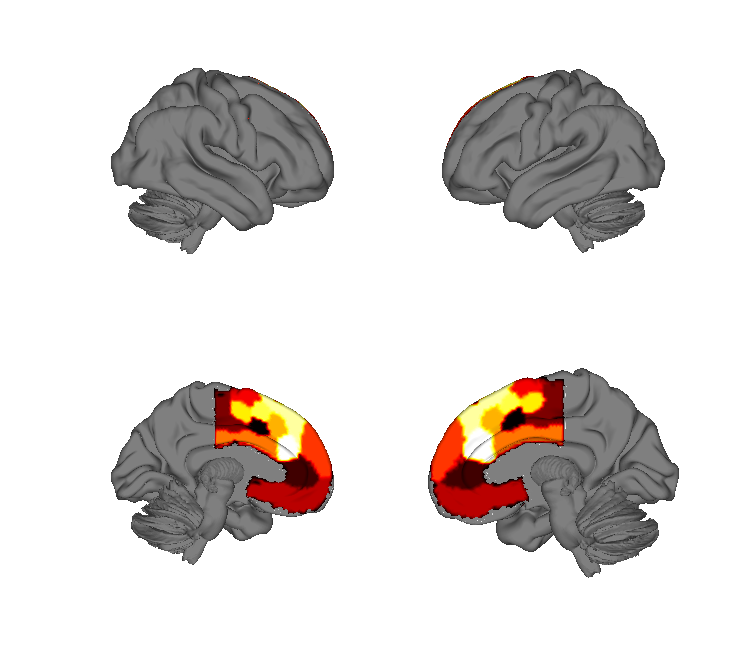
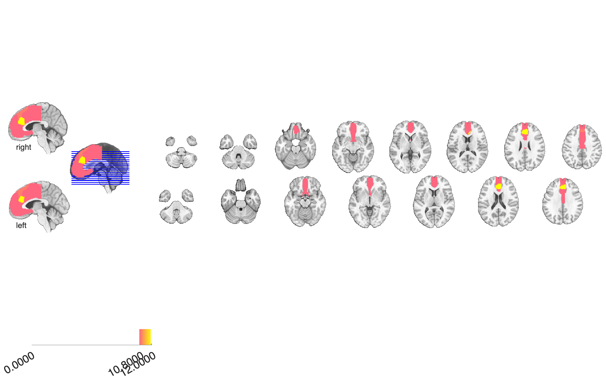

# Neurosynth medial frontal-cortex parcellation (de la Vega et al. 2016)

## Overview

A **12-cluster k-means parcellation of the medial frontal cortex (MFC)**
derived from Neurosynth term-coactivation patterns. The parcellation
captures functional gradients along the anterior–posterior and
dorsal–ventral axes of the medial wall, separating regions preferentially
associated with cognitive control, valuation, social cognition, and
motor function.

## Primary reference

de la Vega, A., Chang, L. J., Banich, M. T., Wager, T. D., & Yarkoni, T.
(2016). Large-scale meta-analysis of human medial frontal cortex
reveals tripartite functional organization. *Journal of Neuroscience*,
36(24), 6553–6562.
[doi:10.1523/JNEUROSCI.4402-15.2016](https://doi.org/10.1523/JNEUROSCI.4402-15.2016)
· [local PDF](./delaVega_2016_JNeuro.pdf)

## Key images

| Cortical surface | Axial montage |
| --- | --- |
|  |  |

The k=12 medial-frontal-cortex Neurosynth co-activation parcellation.
The matching isosurface is in
`png_images/delaVega2016_MFC_kmeans12_isosurface.png`; rendered by
[`visualize_contents.m`](./visualize_contents.m).

## How to load

Not registered as a dedicated `load_image_set` keyword. Load as an
integer-coded parcellation (`atlas` or `fmri_data`):

```matlab
% As integer-coded fmri_data
mfc = fmri_data(which('delaVega_JN_2016_neurosynth-mfc_kmeans_12.nii.gz'));

% As a CANlab atlas (treats nonzero integer values as parcel labels)
mfc_atl = atlas(which('delaVega_JN_2016_neurosynth-mfc_kmeans_12.nii.gz'));
```

The companion **whole-cortex** 70-cluster parcellation from de la Vega
et al. 2017 is in
[`../2017_delaVega_Neurosynth_cortical_parcellation/`](../2017_delaVega_Neurosynth_cortical_parcellation).

## File inventory

| File | Type | What it is |
| --- | --- | --- |
| `delaVega_JN_2016_neurosynth-mfc_kmeans_12.nii.gz` | NIfTI | 12-cluster k-means MFC parcellation (integer-coded). |
| `delaVega_2016_JNeuro.pdf` | PDF | Primary reference. |
| `visualize_contents.m` | MATLAB | Regenerates `png_images/`. |

## Citations

- de la Vega A, Chang LJ, Banich MT, Wager TD, Yarkoni T (2016).
  Large-scale meta-analysis of human medial frontal cortex reveals
  tripartite functional organization. *J Neurosci* 36:6553–6562.
  [doi:10.1523/JNEUROSCI.4402-15.2016](https://doi.org/10.1523/JNEUROSCI.4402-15.2016)
- de la Vega A, Yarkoni T, Wager TD, Banich MT (2018). Large-scale
  meta-analysis suggests low regional modularity in lateral frontal
  cortex. *Cereb Cortex* 28:3414–3428.
  [doi:10.1093/cercor/bhx204](https://doi.org/10.1093/cercor/bhx204)
