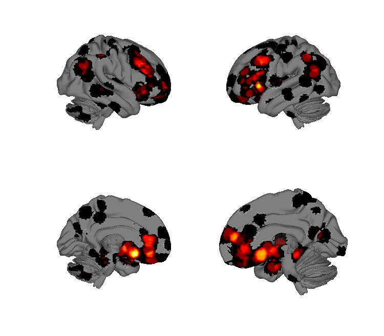
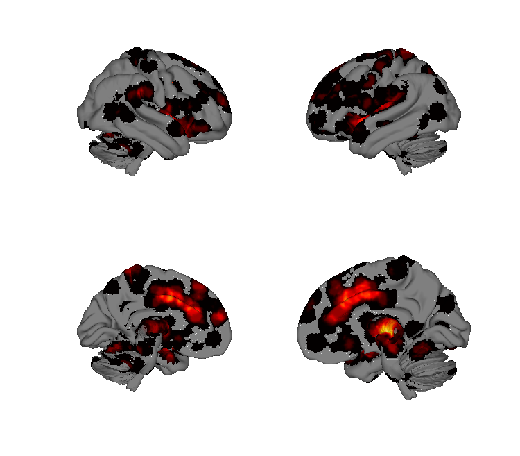
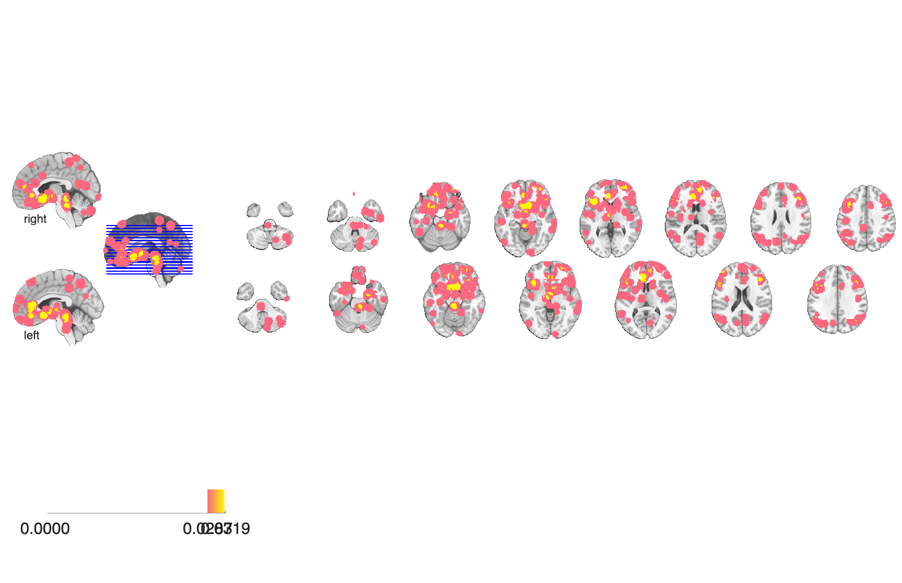
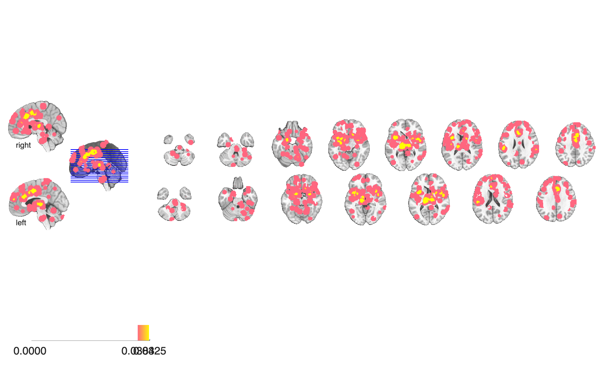

# Placebo review meta-analytic maps (Ashar, Chang & Wager 2017)

## Overview

MKDA meta-analytic maps assembled for the **Annual Review of Clinical
Psychology** review on placebo effects. The folder contains a
**core appraisal network** mask (the conserved cortical-midline / vmPFC
appraisal network) plus three full MKDA outputs as subfolders:

- `Placebo_increases/` — voxels showing **increased activation under
  placebo** across studies.
- `Placebo_decreases/` — voxels showing **decreased activation under
  placebo** across studies.
- `Experience_imagery_recall_Neg-Pos/` — negative-vs-positive valence
  contrast across emotion experience / imagery / recall paradigms.

See [`README.md`](./README.md) — the headline figures in the paper use
the `Activation_proportion.img` files in each subfolder.

## Primary reference

Ashar, Y. K., Chang, L. J., & Wager, T. D. (2017). Brain mechanisms of
the placebo effect: an affective appraisal account. *Annual Review of
Clinical Psychology*, 13, 73–98.
[doi:10.1146/annurev-clinpsy-021815-093015](https://doi.org/10.1146/annurev-clinpsy-021815-093015)
· [local PDF](./Ashar_2017_AnnRevClinPsychol.pdf)

## Key images

| Placebo increases | Placebo decreases |
| --- | --- |
|  |  |
|  |  |

Activation-proportion maps for regions showing placebo-driven
increases vs. decreases across the literature. The core appraisal
network (`Ashar2017_CoreAppraisalNetwork_*`) and the
negative-vs-positive valence contrast (`Ashar2017_NegVsPos_Valence_*`)
are also in `png_images/`; rendered by
[`visualize_contents.m`](./visualize_contents.m).

## How to load

Not registered in `load_image_set`. Load directly:

```matlab
core    = fmri_data(which('core_appraisal_network.nii'));

% From each subfolder (assumes that folder is on the MATLAB path):
plac_inc = fmri_data(fullfile(fileparts(which('Ashar_2017_AnnRevClinPsychol.pdf')), ...
                              'Placebo_increases', 'Activation_proportion.img'));
plac_dec = fmri_data(fullfile(fileparts(which('Ashar_2017_AnnRevClinPsychol.pdf')), ...
                              'Placebo_decreases', 'Activation_proportion.img'));
neg_pos  = fmri_data(fullfile(fileparts(which('Ashar_2017_AnnRevClinPsychol.pdf')), ...
                              'Experience_imagery_recall_Neg-Pos', 'Valence_Neg-Pos.img'));
```

## File inventory

| File | Type | What it is |
| --- | --- | --- |
| `core_appraisal_network.nii` (+ `.nii.gz`) | NIfTI | **Core appraisal network mask** used in the review figures. |
| `Placebo_increases/` | dir | Full MKDA output for placebo-induced **increases**: `Activation_proportion.img`, `Activation_FWE_{height,extent,all}.img`, `activation_top_5_percent.img`, `Activation_clusters.mat`, `DB.mat`, `MC_Info.mat`, `SETUP.mat`. |
| `Placebo_decreases/` | dir | Full MKDA output for placebo-induced **decreases** (same file layout). |
| `Experience_imagery_recall_Neg-Pos/` | dir | MKDA output for the negative-vs-positive valence contrast across experience/imagery/recall paradigms: `Valence_Neg-Pos.img` + per-direction FWE maps + `positive.img`, `negative.img`, `Activation_proportion.img`, MKDA pipeline `.mat` files, and a `Figures/` subdir with `.fig` and Analyze files. |
| `README.md` | text | Author readme on which file is shown in the paper. |
| `Ashar_2017_AnnRevClinPsychol.pdf` | PDF | Primary reference. |
| `visualize_contents.m` | MATLAB | Regenerates `png_images/`. |

## Citations

- Ashar YK, Chang LJ, Wager TD (2017). Brain mechanisms of the placebo
  effect: an affective appraisal account. *Annu Rev Clin Psychol*
  13:73–98.
  [doi:10.1146/annurev-clinpsy-021815-093015](https://doi.org/10.1146/annurev-clinpsy-021815-093015)
- Atlas LY, Wager TD (2014). A meta-analysis of brain mechanisms of
  placebo analgesia. *Handb Exp Pharmacol* 225:37–69.
  [doi:10.1007/978-3-662-44519-8_3](https://doi.org/10.1007/978-3-662-44519-8_3)
