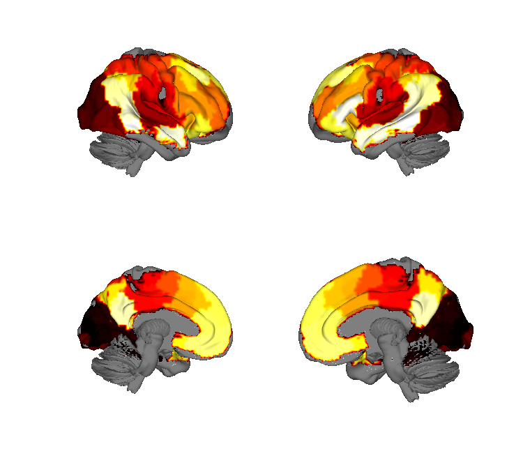
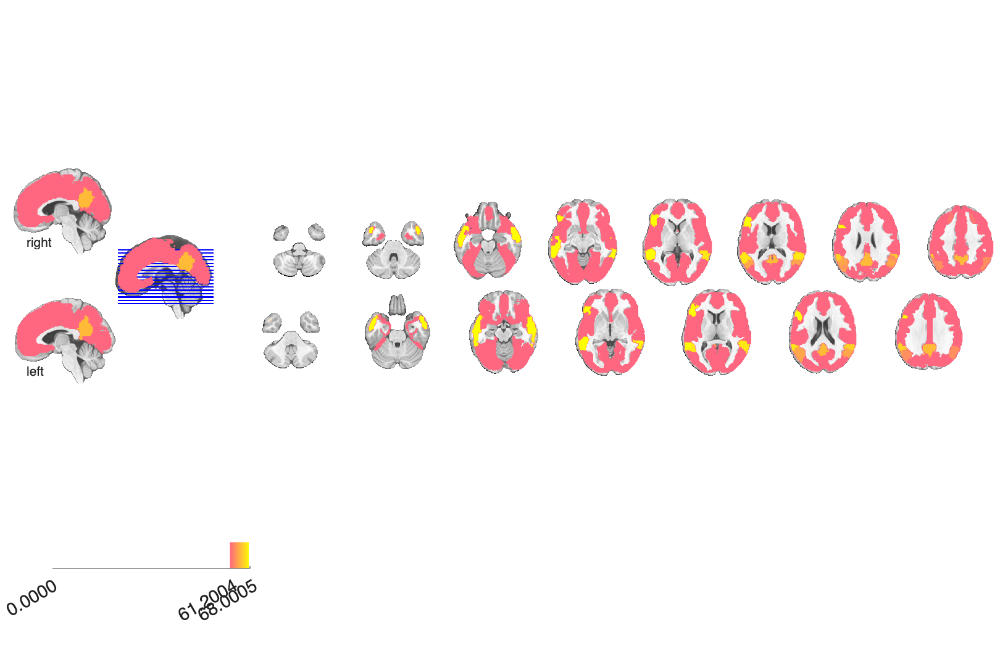

# Neurosynth cortical parcellation (de la Vega et al. 2017)

## Overview

A **whole-cortex meta-analytic parcellation** derived from Neurosynth
term-coactivation patterns by de la Vega et al. (2017), packaged as
both a multi-region NIfTI and a CANlab `atlas` object. The folder also
includes a focused **lateral frontal cortex (LFC)** parcellation
(`lfc_5` and `lfc_70`) used to study regional modularity within
prefrontal cortex.

## Primary reference

de la Vega, A., Yarkoni, T., Wager, T. D., & Banich, M. T. (2018).
Large-scale meta-analysis suggests low regional modularity in lateral
frontal cortex. *Cerebral Cortex*, 28(10), 3414–3428.
[doi:10.1093/cercor/bhx204](https://doi.org/10.1093/cercor/bhx204)
· [local PDF](./delaVega_2017_CerebralCortex.pdf)

## Key images

| Cortical surface | Axial montage |
| --- | --- |
|  |  |

The 70-cluster whole-brain Neurosynth co-activation parcellation.
Companion lateral-frontal-cortex parcellations (`delaVega2017_LFC_5`
and `delaVega2017_LFC_70`), the merged atlas regions, and the
matching isosurfaces are also in `png_images/`; rendered by
[`visualize_contents.m`](./visualize_contents.m).

## How to load

Not registered in `load_image_set`. Load the CANlab atlas / region
objects directly:

```matlab
% Atlas object (with labels)
S = load(which('delaVega2017_neurosynth_atlas_object.mat'));
atl = S.atlas_obj;        % or whichever variable name was saved

% Region (clusters) version
R = load(which('delaVega2017_neurosynth_atlas_regions.mat'));

% Raw integer-coded NIfTI
parc = atlas(which('delaVega2017_neurosynth_atlas_regions.hdr'));

% Lateral frontal cortex subparcellations
lfc70 = fmri_data(which('lfc_70.nii.gz'));
lfc5  = fmri_data(which('lfc_5.nii.gz'));
wb70  = fmri_data(which('wb_70.nii.gz'));
```

## Construction scripts

| File | What it does |
| --- | --- |
| `delavega_create_atlas_object.m` | Builds the CANlab `atlas` object (`delaVega2017_neurosynth_atlas_object.mat`) from the Neurosynth-derived integer NIfTI. |
| `delavega_create_atlas_object.asv` | MATLAB autosave backup of the above. |

## File inventory

| File | Type | What it is |
| --- | --- | --- |
| `delaVega2017_neurosynth_atlas_object.mat` | MAT (`atlas`) | CANlab `atlas` object for the whole-cortex parcellation. |
| `delaVega2017_neurosynth_atlas_regions.mat` | MAT (`region`) | `region` / cluster object form of the parcellation. |
| `delaVega2017_neurosynth_atlas_regions.hdr/.img` | Analyze | Integer-coded NIfTI source for the parcellation. |
| `wb_70.nii(.gz)` | NIfTI | Whole-brain 70-cluster parcellation. |
| `lfc_70.nii.gz` | NIfTI | Lateral frontal cortex 70-cluster subparcellation. |
| `lfc_5.nii.gz` | NIfTI | Lateral frontal cortex 5-cluster subparcellation. |
| `delavega_create_atlas_object.m` (+ `.asv`) | MATLAB | Atlas-object construction script. |
| `delaVega_2017_CerebralCortex.pdf` | PDF | Primary reference. |
| `png_images/` | dir | Pre-rendered figures (regenerated by `visualize_contents.m`). |
| `visualize_contents.m` | MATLAB | Regenerates `png_images/`. |

## Citations

- de la Vega A, Yarkoni T, Wager TD, Banich MT (2018). Large-scale
  meta-analysis suggests low regional modularity in lateral frontal
  cortex. *Cereb Cortex* 28:3414–3428.
  [doi:10.1093/cercor/bhx204](https://doi.org/10.1093/cercor/bhx204)
- de la Vega A, Chang LJ, Banich MT, Wager TD, Yarkoni T (2016).
  Large-scale meta-analysis of human medial frontal cortex reveals
  tripartite functional organization. *J Neurosci* 36:6553–6562.
  [doi:10.1523/JNEUROSCI.4402-15.2016](https://doi.org/10.1523/JNEUROSCI.4402-15.2016)
