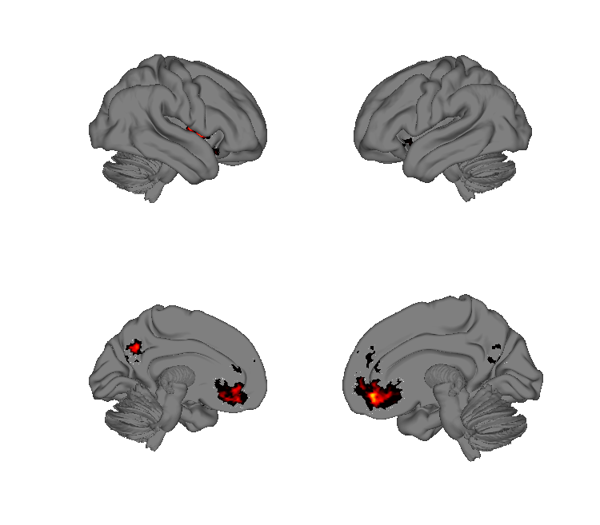
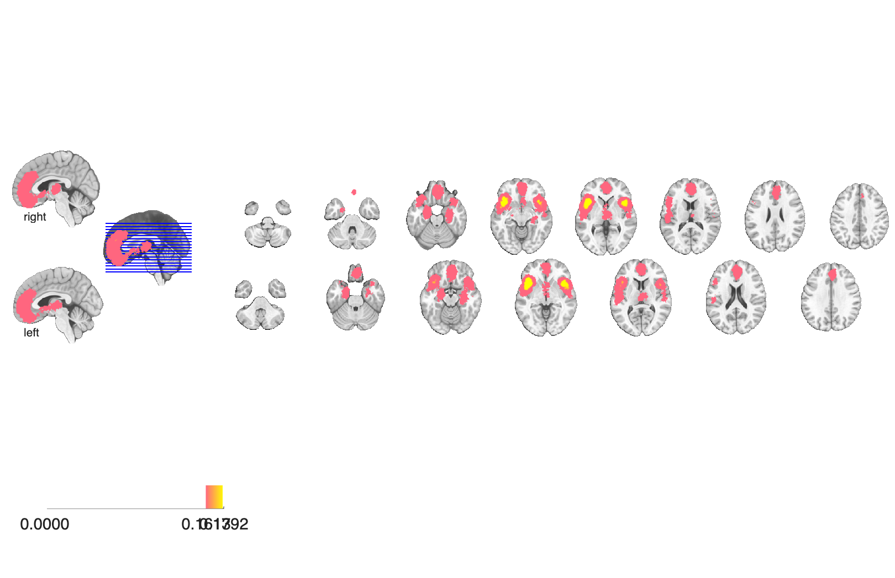
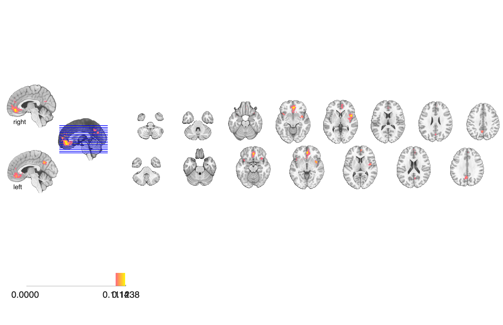
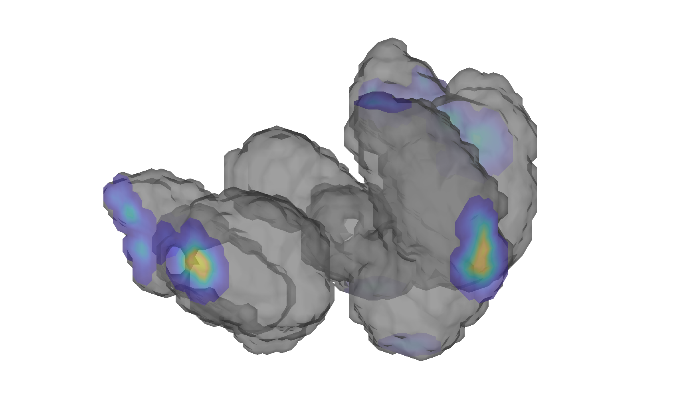

# Common networks of psychopathology (Sha et al. 2018, Biol Psychiatry)

## Overview

MKDA coordinate-based meta-analysis of resting-state connectivity and
VBM studies across psychiatric disorders, identifying **common
dysfunction of three large-scale neurocognitive networks** — default
mode (DMN), frontoparietal (FPN), and salience (SN) — and gray-matter
volume (VBM) changes. For each network the folder provides
**hyper-connectivity (`_Inc`), hypo-connectivity (`_Dec`)**, and the
**pooled (`_Pool`)** map, each at two FWE thresholds (`_FWE_height` =
height-based P < 0.05; `_FWE_extent_stringent` = extent-based P < 0.001).

See [`README.txt`](./README.txt) for the authoritative author write-up.

## Primary reference

Sha, Z., Wager, T. D., Mechelli, A., & He, Y. (2019). Common dysfunction
of large-scale neurocognitive networks across psychiatric disorders.
*Biological Psychiatry*, 85(5), 379–388.
[doi:10.1016/j.biopsych.2018.11.011](https://doi.org/10.1016/j.biopsych.2018.11.011)
· [local PDF](./Sha_2018_Biol_Psych_Common_Networks.pdf)

## Key images

| DMN — pooled FWE-height | VBM — pooled FWE-height |
| --- | --- |
|  |  |
|  |  |

The default-mode-network functional-connectivity meta-map and the
voxel-based morphometry meta-map, both pooled across disorders and
FWE-height-thresholded. Increase/decrease splits for DMN, plus pooled
FPN and SN maps, are also in `png_images/`; rendered by
[`visualize_contents.m`](./visualize_contents.m). The bundled
`html_summary_report/` contains the author's published HTML summary.

## How to load

Not registered in `load_image_set`. Load directly (use the MATLAB
`fullfile` form because the maps are nested in subdirectories):

```matlab
root = fileparts(which('Sha_2018_Biol_Psych_Common_Networks.pdf'));

DMN_pool   = fmri_data(fullfile(root, 'MKDA_Maps', 'SB_FC', 'DMN', 'DMN_Pool', 'DMN_Pool_FWE_height.nii.gz'));
DMN_inc    = fmri_data(fullfile(root, 'MKDA_Maps', 'SB_FC', 'DMN', 'DMN_Inc',  'DMN_Inc_FWE_height.nii.gz'));
DMN_dec    = fmri_data(fullfile(root, 'MKDA_Maps', 'SB_FC', 'DMN', 'DMN_Dec',  'DMN_Dec_FWE_height.nii.gz'));
FPN_pool   = fmri_data(fullfile(root, 'MKDA_Maps', 'SB_FC', 'FPN', 'FPN_Pool', 'FPN_Pool_FWE_height.nii.gz'));
SN_pool    = fmri_data(fullfile(root, 'MKDA_Maps', 'SB_FC', 'SN',  'SN_Pool',  'SN_Pool_FWE_height.nii.gz'));
VBM        = fmri_data(fullfile(root, 'MKDA_Maps', 'VBM', 'VBM_FWE_height.nii.gz'));
```

`_FWE_extent_stringent.nii.gz` is the stringent (extent-based P < 0.001)
alternative threshold for each map.

## Construction scripts

| File | What it does |
| --- | --- |
| `scripts/sha_2018_visualize_maps.m` | Visualises the Sha 2018 maps (used by the published HTML report). |
| `scripts/publish_sha_2018_maps.m` | Wraps `sha_2018_visualize_maps.m` with MATLAB `publish` to regenerate the `html_summary_report/` HTML output. |

## File inventory

| File / dir | Type | What it is |
| --- | --- | --- |
| `MKDA_Maps/SB_FC/DMN/{DMN_Pool,DMN_Inc,DMN_Dec}/*.nii.gz` | NIfTI | Default-mode network: pooled, hyperconn (`_Inc`), hypoconn (`_Dec`) — `_FWE_height` and `_FWE_extent_stringent` per directory. |
| `MKDA_Maps/SB_FC/FPN/{FPN_Pool,FPN_Inc,FPN_Dec}/*.nii.gz` | NIfTI | Frontoparietal network: same three contrast directions × 2 thresholds. |
| `MKDA_Maps/SB_FC/SN/{SN_Pool,SN_Inc,SN_Dec}/*.nii.gz` | NIfTI | Salience network: same three contrasts × 2 thresholds. |
| `MKDA_Maps/VBM/VBM_FWE_{height,extent_stringent}.nii.gz` | NIfTI | Gray-matter (VBM) meta-analytic maps, two FWE thresholds. |
| `scripts/sha_2018_visualize_maps.m` | MATLAB | Author's visualisation script. |
| `scripts/publish_sha_2018_maps.m` | MATLAB | `publish` wrapper. |
| `html_summary_report/` | dir | Pre-built HTML report (open the `.html` in a browser). |
| `README.txt` | text | Author readme (file naming conventions). |
| `Sha_2018_Biol_Psych_Common_Networks.pdf` | PDF | Primary reference. |
| `Sha_2018_BP.pptx` | PPTX | Author slide deck. |
| `visualize_contents.m` | MATLAB | Regenerates `png_images/`. |

## Citations

- Sha Z, Wager TD, Mechelli A, He Y (2019). Common dysfunction of
  large-scale neurocognitive networks across psychiatric disorders.
  *Biol Psychiatry* 85:379–388.
  [doi:10.1016/j.biopsych.2018.11.011](https://doi.org/10.1016/j.biopsych.2018.11.011)
- Goodkind M, Eickhoff SB, Oathes DJ, et al. (2015). Identification of a
  common neurobiological substrate for mental illness. *JAMA Psychiatry*
  72:305–315.
  [doi:10.1001/jamapsychiatry.2014.2206](https://doi.org/10.1001/jamapsychiatry.2014.2206)
